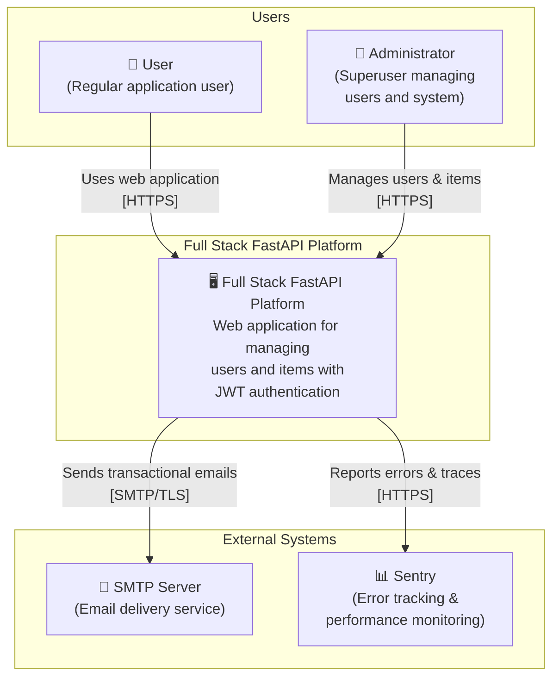
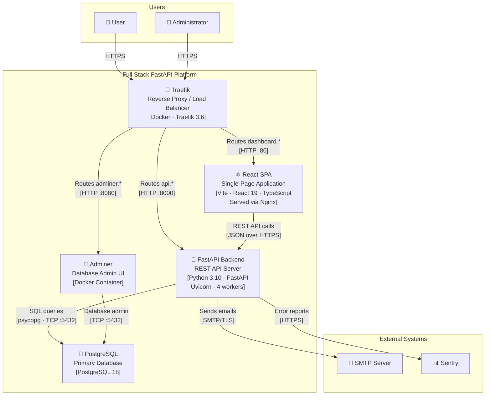
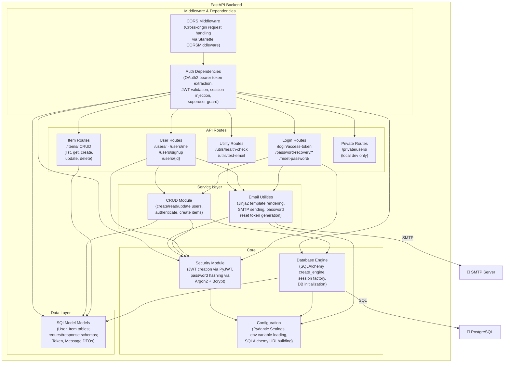
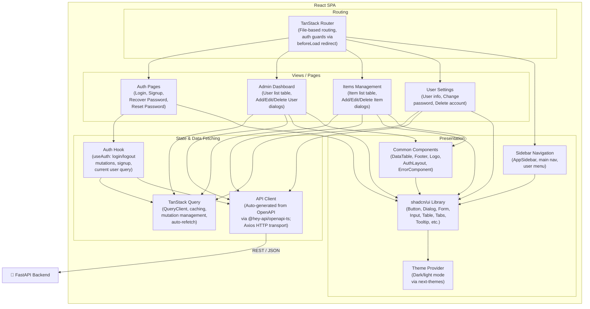

# C4 Architecture Model — Full Stack FastAPI Platform

## L1: System Context



---

## L2: Container



---

## L3: FastAPI Backend



---

## L3: React SPA



---

## Containment Map

```text
%% ── L1 top-level groups ─────────────────────────────────────────
users              CONTAINS [user, admin_user]
platform_boundary  CONTAINS [traefik, spa, fastapi_backend, pg, adminer]
external           CONTAINS [smtp, sentry]

%% ── L2→L3 internal containment ──────────────────────────────────
fastapi_backend    CONTAINS [middleware, routes, services, core, data]
  middleware       CONTAINS [cors_mw, auth_dep]
  routes           CONTAINS [login_routes, user_routes, item_routes, util_routes, private_routes]
  services         CONTAINS [crud_layer, email_utils]
  core             CONTAINS [security_core, config_core, db_engine]
  data             CONTAINS [models_layer]

spa                CONTAINS [routing, state_mgmt, views, presentation]
  routing          CONTAINS [tanstack_router]
  state_mgmt       CONTAINS [tanstack_query, api_client, auth_hook]
  views            CONTAINS [login_views, admin_views, item_views, settings_views]
  presentation     CONTAINS [sidebar_nav, common_components, ui_lib, theme_provider]
```

---

## Stable ID Reference

| ID | Name | Level(s) | Kind |
|----|------|----------|------|
| `user` | User | L1, L2 | actor |
| `admin_user` | Administrator | L1, L2 | actor |
| `platform_boundary` | Full Stack FastAPI Platform | L1, L2 | boundary |
| `traefik` | Traefik Reverse Proxy | L2 | container |
| `spa` | React SPA | L2, L3-scope | container |
| `fastapi_backend` | FastAPI Backend | L2, L3-scope | container |
| `pg` | PostgreSQL | L2, L3-backend | storage |
| `adminer` | Adminer DB Admin | L2 | container |
| `smtp` | SMTP Server | L1, L2, L3-backend | integration |
| `sentry` | Sentry | L1, L2 | integration |
| `cors_mw` | CORS Middleware | L3-backend | boundary |
| `auth_dep` | Auth Dependencies | L3-backend | boundary |
| `login_routes` | Login Routes | L3-backend | router |
| `user_routes` | User Routes | L3-backend | router |
| `item_routes` | Item Routes | L3-backend | router |
| `util_routes` | Utility Routes | L3-backend | router |
| `private_routes` | Private Routes | L3-backend | router |
| `crud_layer` | CRUD Module | L3-backend | service_layer |
| `email_utils` | Email Utilities | L3-backend | integration |
| `security_core` | Security Module | L3-backend | service_layer |
| `config_core` | Configuration | L3-backend | service_layer |
| `db_engine` | Database Engine | L3-backend | data_access |
| `models_layer` | SQLModel Models | L3-backend | storage |
| `tanstack_router` | TanStack Router | L3-spa | router |
| `tanstack_query` | TanStack Query | L3-spa | service_layer |
| `api_client` | API Client | L3-spa | integration |
| `auth_hook` | Auth Hook | L3-spa | service_layer |
| `login_views` | Auth Pages | L3-spa | boundary |
| `admin_views` | Admin Dashboard | L3-spa | boundary |
| `item_views` | Items Management | L3-spa | boundary |
| `settings_views` | User Settings | L3-spa | boundary |
| `sidebar_nav` | Sidebar Navigation | L3-spa | boundary |
| `common_components` | Common Components | L3-spa | boundary |
| `ui_lib` | shadcn/ui Library | L3-spa | boundary |
| `theme_provider` | Theme Provider | L3-spa | service_layer |
