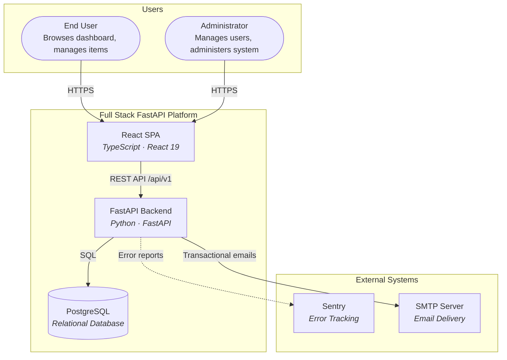
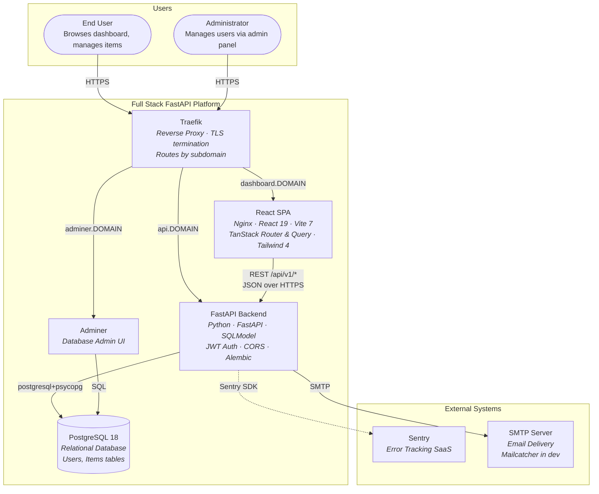
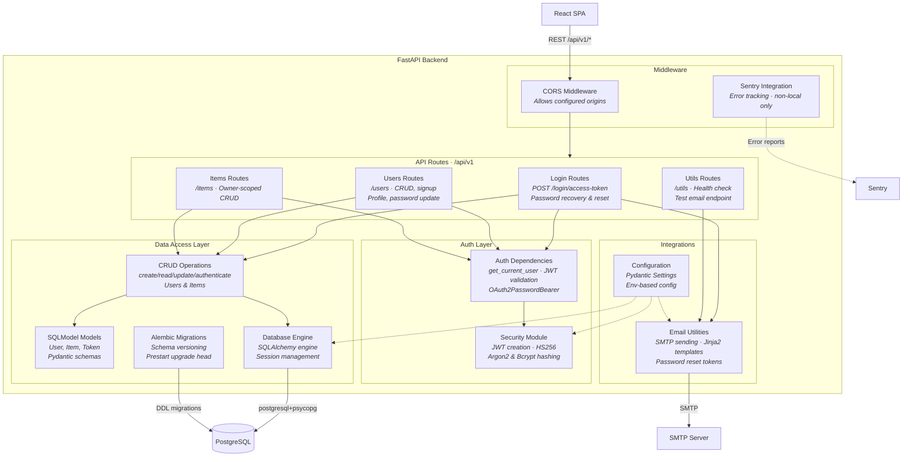
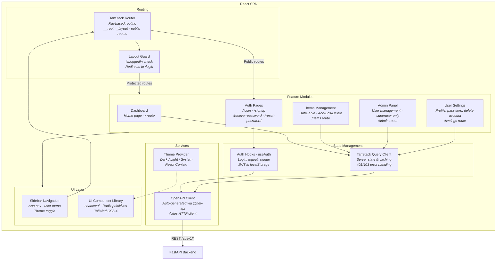

# C4 Architecture Model – Full Stack FastAPI Platform

> Auto-generated C4 model covering L1 (System Context), L2 (Container),
> and L3 (Component) diagrams for the Full Stack FastAPI template.

---

## L1: System Context



---

## L2: Container Diagram



---

## L3: FastAPI Backend



---

## L3: React SPA



---

## Containment Map

```text
%% ══════════════════════════════════════════════════════════════════
%% CONTAINMENT MAP
%% ══════════════════════════════════════════════════════════════════

%% ── L1 top-level groups ─────────────────────────────────────────
users              CONTAINS [user, admin_user]
system_boundary    CONTAINS [traefik, spa, fastapi_api, pg, adminer]
external           CONTAINS [sentry, smtp]

%% ── L2 → L3 internal containment ───────────────────────────────
fastapi_api        CONTAINS [middleware, routes, auth_layer, data_layer, integrations]
  middleware       CONTAINS [cors_mw, sentry_mw]
  routes           CONTAINS [login_routes, users_routes, items_routes, utils_routes]
  auth_layer       CONTAINS [auth_deps, core_security]
  data_layer       CONTAINS [crud_layer, models_layer, core_db, alembic]
  integrations     CONTAINS [email_utils, core_config]

spa                CONTAINS [routing, state_mgmt, features, services_layer, ui_layer]
  routing          CONTAINS [tanstack_router, layout_guard]
  state_mgmt       CONTAINS [query_client, auth_hooks]
  features         CONTAINS [dashboard_feature, items_feature, admin_feature, settings_feature, auth_pages]
  services_layer   CONTAINS [api_client, theme_provider]
  ui_layer         CONTAINS [sidebar, ui_components]
```
