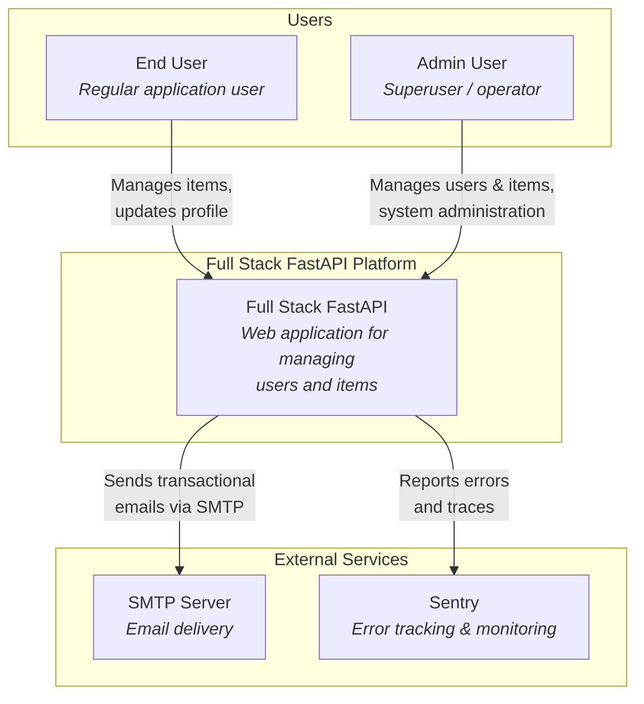
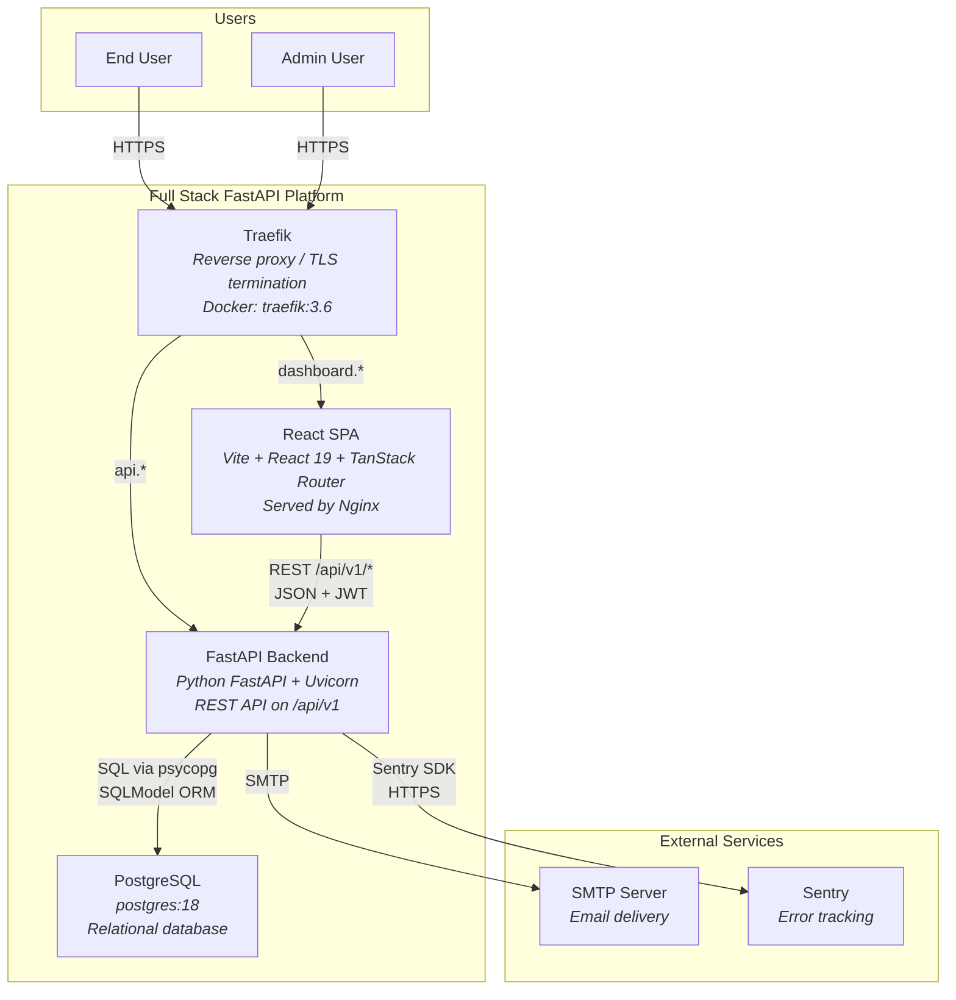
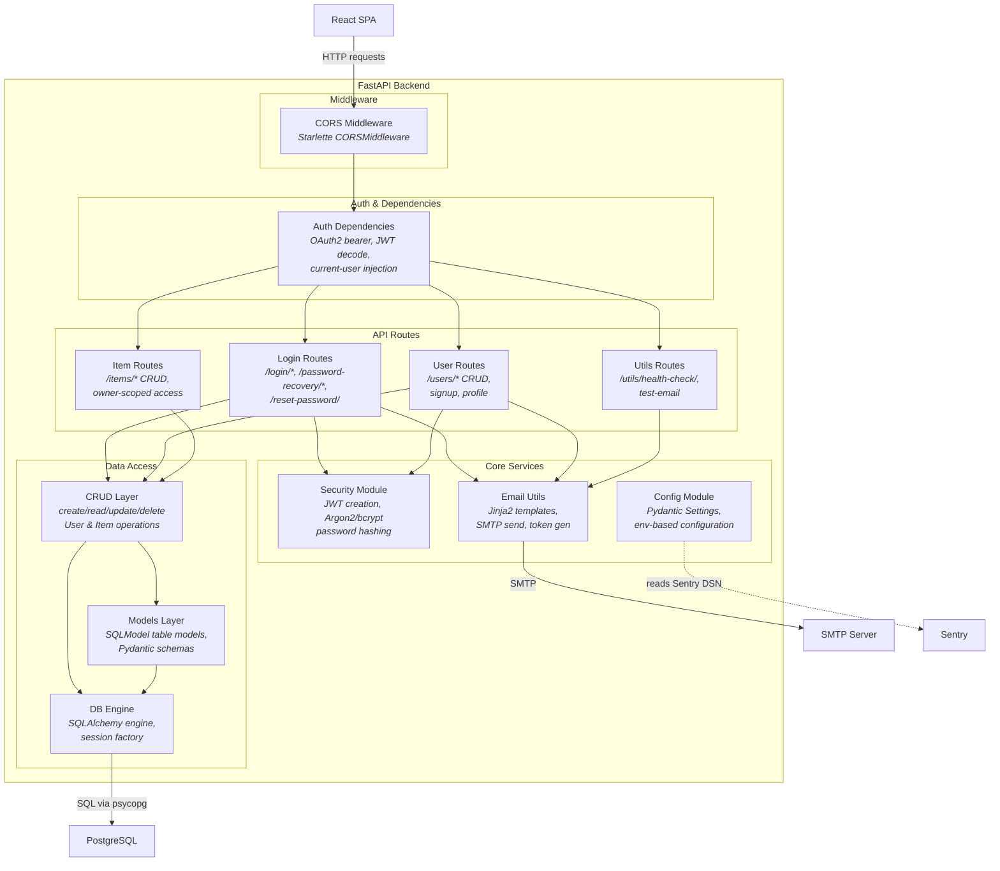
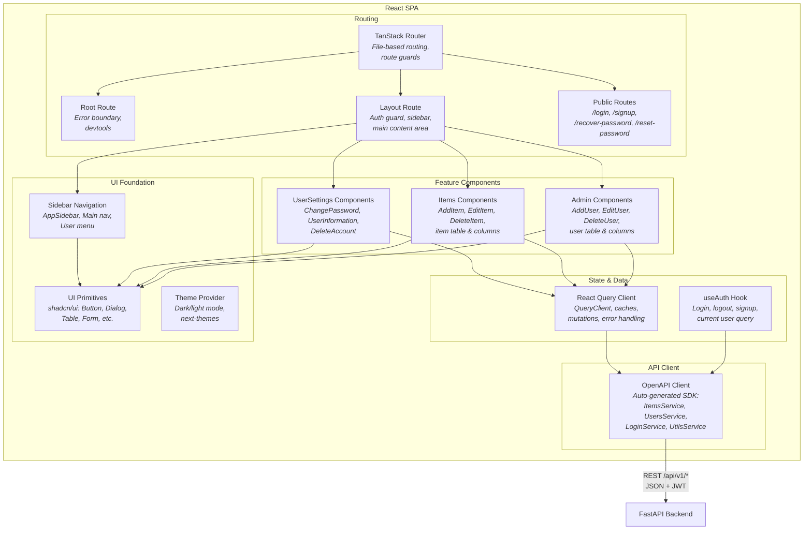
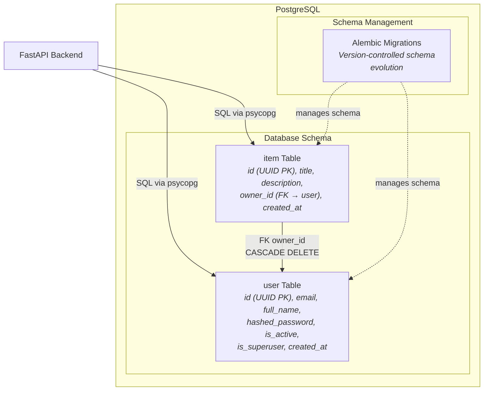
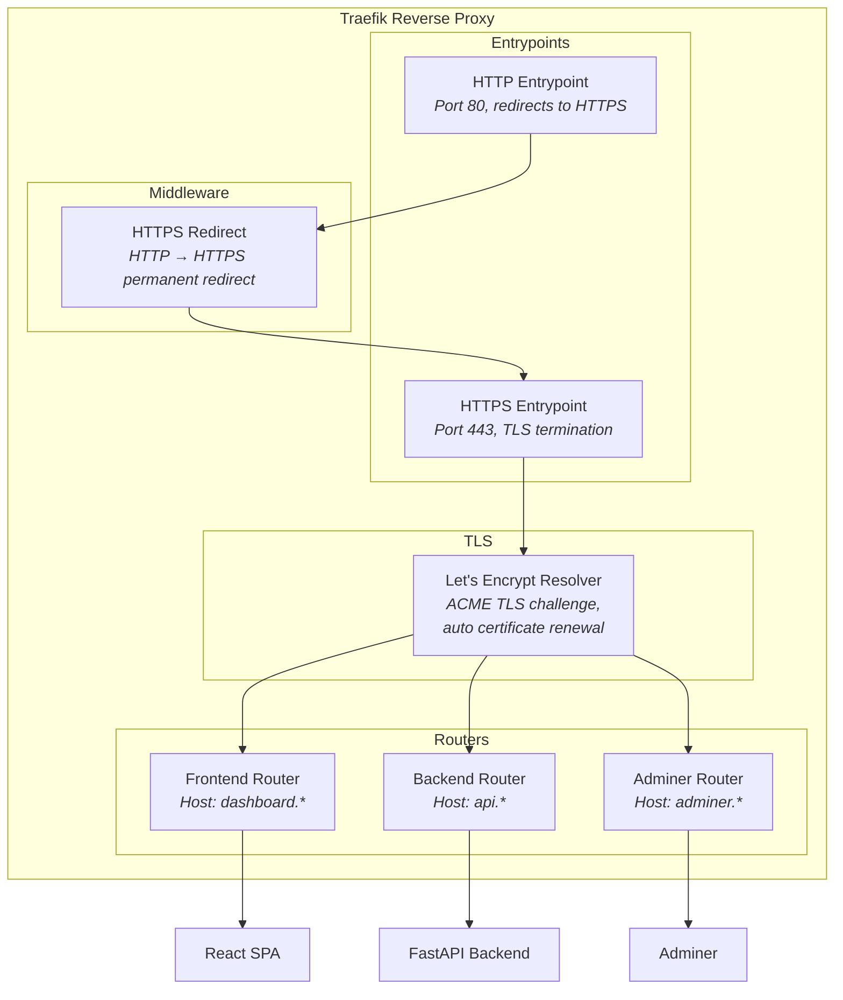

# C4 Architecture Model — Full Stack FastAPI Template

> Auto-generated C4 model covering L1 (System Context), L2 (Container),
> and L3 (Component) diagrams with a complete containment map.

---

## L1: System Context



---

## L2: Container Diagram



---

## L3: FastAPI Backend — Component Diagram



---

## L3: React SPA — Component Diagram



---

## L3: PostgreSQL — Component Diagram



---

## L3: Traefik — Component Diagram



---

## Containment Map

```text
%% ── L1 top-level groups ──────────────────────────────────────────────
users              CONTAINS [end_user, admin_user]
system_boundary    CONTAINS [traefik, spa, fastapi_backend, pg]
external           CONTAINS [smtp, sentry]

%% ── L2 → L3 internal containment ────────────────────────────────────

%% FastAPI Backend (L3)
fastapi_backend    CONTAINS [middleware, auth, routes, services, data_access]
  middleware       CONTAINS [cors_mw]
  auth             CONTAINS [auth_deps]
  routes           CONTAINS [login_routes, user_routes, item_routes, utils_routes]
  services         CONTAINS [security_mod, email_utils, config_mod]
  data_access      CONTAINS [crud_layer, models_layer, db_engine]

%% React SPA (L3)
spa                CONTAINS [routing, state, api_layer, features, ui]
  routing          CONTAINS [tanstack_router, root_route, layout_route, public_routes]
  state            CONTAINS [query_client, auth_hook]
  api_layer        CONTAINS [api_client]
  features         CONTAINS [admin_components, items_components, settings_components]
  ui               CONTAINS [sidebar_nav, ui_primitives, theme_provider]

%% PostgreSQL (L3)
pg                 CONTAINS [schemas, migrations]
  schemas          CONTAINS [user_table, item_table]
  migrations       CONTAINS [alembic]

%% Traefik (L3)
traefik            CONTAINS [entrypoints, routers, tls, mw]
  entrypoints      CONTAINS [http_ep, https_ep]
  routers          CONTAINS [frontend_router, backend_router, adminer_router]
  tls              CONTAINS [le_resolver]
  mw               CONTAINS [https_redirect]
```
