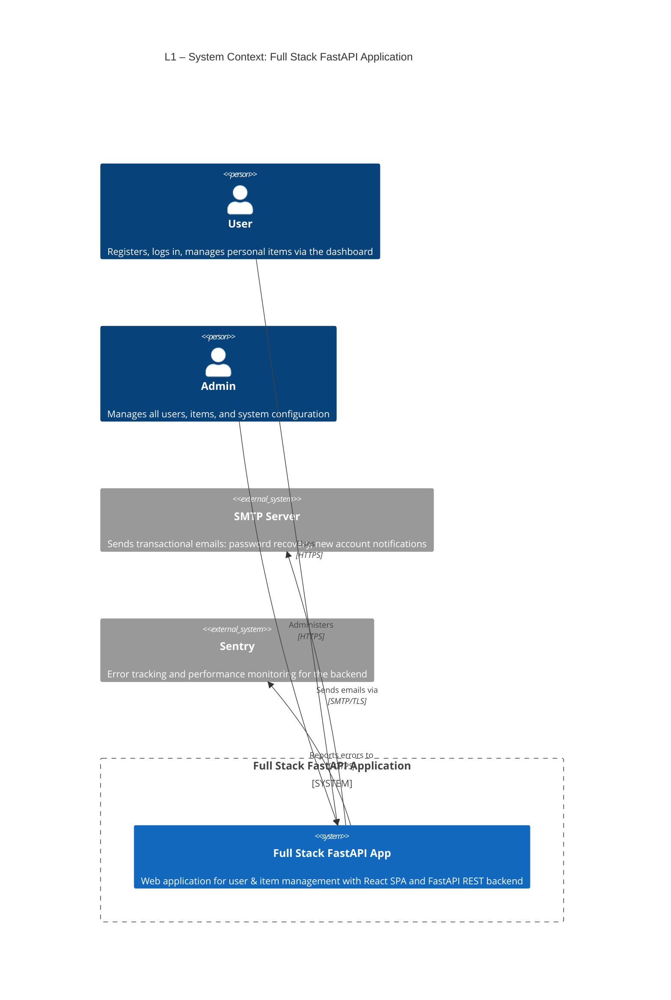
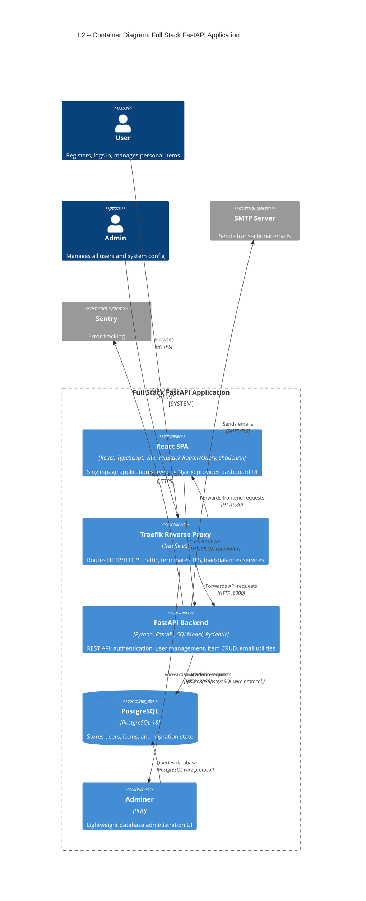
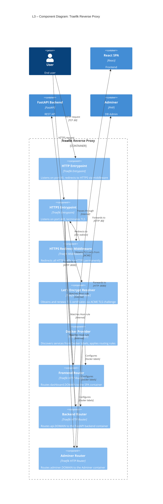

# C4 Architecture Model — Full Stack FastAPI Template

> Auto-generated C4 model covering L1 (System Context), L2 (Container),
> and L3 (Component) diagrams for every container with internal structure.

---

## L1: System Context



---

## L2: Container Diagram



---

## L3: FastAPI Backend — Component Diagram

```mermaid
C4Component
  %% SCOPE: urn:c4:container:fastapi_backend
  title L3 – Component Diagram: FastAPI Backend

  %% ── Parent container boundary ────────────────────────────
  Container_Boundary(fastapi_backend, "FastAPI Backend") {

    %% KIND: boundary
    Component(cors_mw, "CORS Middleware", "Starlette CORSMiddleware", "Enforces cross-origin request policies for the SPA")

    %% KIND: router
    Component(api_router, "API Router", "FastAPI APIRouter", "Top-level /api/v1 router; mounts all sub-routers")

    %% KIND: router
    Component(login_routes, "Login Routes", "FastAPI APIRouter", "OAuth2 token login, token test, password recovery & reset")

    %% KIND: router
    Component(users_routes, "Users Routes", "FastAPI APIRouter", "User CRUD, self-service profile, signup, admin user management")

    %% KIND: router
    Component(items_routes, "Items Routes", "FastAPI APIRouter", "Item CRUD scoped by ownership or superuser access")

    %% KIND: router
    Component(utils_routes, "Utils Routes", "FastAPI APIRouter", "Health check, test email endpoints")

    %% KIND: service_layer
    Component(auth_deps, "Auth Dependencies", "FastAPI Depends", "OAuth2 bearer token extraction, JWT validation, current-user resolution, superuser guard")

    %% KIND: service_layer
    Component(security_mod, "Security Module", "PyJWT, pwdlib", "JWT creation/validation, Argon2/Bcrypt password hashing & verification")

    %% KIND: service_layer
    Component(config, "Configuration", "Pydantic Settings", "Loads env vars, builds DB URI, manages CORS origins, email & secret settings")

    %% KIND: data_access
    Component(crud_layer, "CRUD Layer", "SQLModel Session", "Create/read/update/delete operations for User and Item models")

    %% KIND: data_access
    Component(models_layer, "Models", "SQLModel", "User, Item DB tables; Pydantic schemas for API request/response validation")

    %% KIND: storage
    Component(db_engine, "DB Engine", "SQLAlchemy create_engine", "Connection pool to PostgreSQL; session factory")

    %% KIND: integration
    Component(email_utils, "Email Utilities", "emails, Jinja2", "Renders HTML email templates, sends via SMTP; generates password-reset tokens")

    %% KIND: data_access
    Component(alembic_mgr, "Alembic Migrations", "Alembic", "Schema version control and migration runner for PostgreSQL")
  }

  %% ── External elements (from L2) ──────────────────────────
  Container(spa, "React SPA", "React", "Frontend application")
  ContainerDb(pg, "PostgreSQL", "PostgreSQL 18", "Persistent data store")
  System_Ext(smtp_server, "SMTP Server", "Sends emails")
  System_Ext(sentry, "Sentry", "Error tracking")

  %% ── Relationships ─────────────────────────────────────────
  Rel(spa, cors_mw, "HTTP requests pass through", "HTTP/JSON")
  Rel(cors_mw, api_router, "Forwards allowed requests", "Internal")

  Rel(api_router, login_routes, "Mounts", "/login, /password-recovery, /reset-password")
  Rel(api_router, users_routes, "Mounts", "/users")
  Rel(api_router, items_routes, "Mounts", "/items")
  Rel(api_router, utils_routes, "Mounts", "/utils")

  Rel(login_routes, auth_deps, "Resolves current user", "Depends()")
  Rel(login_routes, crud_layer, "Authenticates user", "Function call")
  Rel(login_routes, security_mod, "Creates access token", "Function call")
  Rel(login_routes, email_utils, "Sends recovery email", "Function call")

  Rel(users_routes, auth_deps, "Resolves & guards user", "Depends()")
  Rel(users_routes, crud_layer, "Manages users", "Function call")
  Rel(users_routes, email_utils, "Sends new-account email", "Function call")

  Rel(items_routes, auth_deps, "Resolves current user", "Depends()")
  Rel(items_routes, models_layer, "Validates & queries items", "SQLModel")

  Rel(utils_routes, auth_deps, "Superuser guard", "Depends()")
  Rel(utils_routes, email_utils, "Sends test email", "Function call")

  Rel(auth_deps, security_mod, "Decodes JWT", "Function call")
  Rel(auth_deps, db_engine, "Opens session", "Session(engine)")
  Rel(auth_deps, config, "Reads settings", "Import")

  Rel(security_mod, config, "Reads SECRET_KEY", "Import")

  Rel(crud_layer, security_mod, "Hashes/verifies passwords", "Function call")
  Rel(crud_layer, models_layer, "Operates on models", "SQLModel")

  Rel(db_engine, pg, "Connects", "psycopg")
  Rel(db_engine, config, "Reads SQLALCHEMY_DATABASE_URI", "Import")

  Rel(alembic_mgr, pg, "Runs migrations", "psycopg")
  Rel(alembic_mgr, models_layer, "Reads model metadata", "Import")

  Rel(email_utils, smtp_server, "Sends email", "SMTP/TLS")
  Rel(email_utils, security_mod, "Generates reset token", "Function call")
  Rel(email_utils, config, "Reads SMTP/email settings", "Import")
```



---

## L3: React SPA — Component Diagram

```mermaid
C4Component
  %% SCOPE: urn:c4:container:spa
  title L3 – Component Diagram: React SPA

  %% ── Parent container boundary ────────────────────────────
  Container_Boundary(spa, "React SPA") {

    %% KIND: router
    Component(tanstack_router, "TanStack Router", "TanStack Router", "File-based routing: login, signup, dashboard, items, admin, settings, password recovery/reset")

    %% KIND: service_layer
    Component(query_client, "React Query Client", "TanStack React Query", "Server-state cache, mutation management, automatic auth-error redirect")

    %% KIND: integration
    Component(api_client, "API Client", "hey-api/openapi-ts", "Auto-generated typed SDK: ItemsService, LoginService, UsersService, UtilsService")

    %% KIND: service_layer
    Component(auth_hook, "Auth Hook", "React Hook", "Login/logout/signup mutations, current-user query, token management in localStorage")

    %% KIND: boundary
    Component(theme_provider, "Theme Provider", "next-themes", "Dark/light mode toggle with localStorage persistence")

    %% KIND: boundary
    Component(auth_pages, "Auth Pages", "React Components", "Login, Signup, Recover Password, Reset Password page routes")

    %% KIND: boundary
    Component(dashboard_pages, "Dashboard Pages", "React Components", "Dashboard index, Items list, Admin panel, Settings page routes within authenticated layout")

    %% KIND: boundary
    Component(admin_components, "Admin Components", "React Components", "AddUser, EditUser, DeleteUser dialogs, user data table columns, UserActionsMenu")

    %% KIND: boundary
    Component(items_components, "Items Components", "React Components", "AddItem, EditItem, DeleteItem dialogs, item data table columns, ItemActionsMenu")

    %% KIND: boundary
    Component(settings_components, "UserSettings Components", "React Components", "UserInformation form, ChangePassword form, DeleteAccount with confirmation dialog")

    %% KIND: boundary
    Component(common_components, "Common Components", "React Components", "AuthLayout, DataTable, ErrorComponent, Footer, Logo, NotFound, Appearance toggle")

    %% KIND: boundary
    Component(sidebar_components, "Sidebar Components", "React Components", "AppSidebar, Main content wrapper, User avatar/menu")

    %% KIND: boundary
    Component(ui_lib, "UI Library", "shadcn/ui, Radix, Tailwind CSS", "Button, Dialog, Form, Input, Table, Tabs, Tooltip, Select, and other base UI primitives")
  }

  %% ── External elements (from L2) ──────────────────────────
  Container(fastapi_backend, "FastAPI Backend", "FastAPI", "REST API")
  Person(user, "User", "End user")
  Person(admin_user, "Admin", "System administrator")

  %% ── Relationships ─────────────────────────────────────────
  Rel(user, tanstack_router, "Navigates pages", "Browser")
  Rel(admin_user, tanstack_router, "Navigates admin pages", "Browser")

  Rel(tanstack_router, auth_pages, "Renders", "Route match")
  Rel(tanstack_router, dashboard_pages, "Renders", "Route match (authenticated)")

  Rel(dashboard_pages, admin_components, "Includes", "Import")
  Rel(dashboard_pages, items_components, "Includes", "Import")
  Rel(dashboard_pages, settings_components, "Includes", "Import")
  Rel(dashboard_pages, sidebar_components, "Uses layout from", "Import")

  Rel(auth_pages, common_components, "Uses AuthLayout", "Import")
  Rel(dashboard_pages, common_components, "Uses DataTable, Footer", "Import")

  Rel(admin_components, ui_lib, "Built with", "Import")
  Rel(items_components, ui_lib, "Built with", "Import")
  Rel(settings_components, ui_lib, "Built with", "Import")
  Rel(common_components, ui_lib, "Built with", "Import")
  Rel(sidebar_components, ui_lib, "Built with", "Import")

  Rel(auth_pages, auth_hook, "Login/signup", "Hook call")
  Rel(dashboard_pages, auth_hook, "Reads current user, logout", "Hook call")
  Rel(settings_components, auth_hook, "Reads user info", "Hook call")

  Rel(auth_hook, api_client, "Calls LoginService, UsersService", "Function call")
  Rel(admin_components, api_client, "Calls UsersService", "Function call")
  Rel(items_components, api_client, "Calls ItemsService", "Function call")
  Rel(settings_components, api_client, "Calls UsersService", "Function call")

  Rel(auth_hook, query_client, "Uses mutations & queries", "React Query")
  Rel(admin_components, query_client, "Uses mutations & queries", "React Query")
  Rel(items_components, query_client, "Uses mutations & queries", "React Query")

  Rel(api_client, fastapi_backend, "HTTP requests", "REST/JSON via /api/v1")
  Rel(query_client, api_client, "Executes requests through", "Function call")
```



---

## L3: Traefik Reverse Proxy — Component Diagram



---

## Containment Map

```text
%% ════════════════════════════════════════════════════════════
%% CONTAINMENT MAP — every subgraph → child across all levels
%% ════════════════════════════════════════════════════════════

%% ── L1 top-level groups ─────────────────────────────────────
users                    CONTAINS [user, admin_user]
fastapi_fullstack_boundary CONTAINS [spa, fastapi_backend, pg, traefik, adminer]
external                 CONTAINS [smtp_server, sentry]

%% ── L2 → L3 : FastAPI Backend ──────────────────────────────
fastapi_backend CONTAINS [cors_mw, api_router, login_routes, users_routes, items_routes, utils_routes, auth_deps, security_mod, config, crud_layer, models_layer, db_engine, email_utils, alembic_mgr]
  api_router    CONTAINS [login_routes, users_routes, items_routes, utils_routes]

%% ── L2 → L3 : React SPA ────────────────────────────────────
spa CONTAINS [tanstack_router, query_client, api_client, auth_hook, theme_provider, auth_pages, dashboard_pages, admin_components, items_components, settings_components, common_components, sidebar_components, ui_lib]
  tanstack_router   CONTAINS [auth_pages, dashboard_pages]
  dashboard_pages   CONTAINS [admin_components, items_components, settings_components]

%% ── L2 → L3 : Traefik Reverse Proxy ────────────────────────
traefik CONTAINS [http_entrypoint, https_entrypoint, https_redirect_mw, le_resolver, docker_provider, frontend_router, backend_router, adminer_router]
  https_entrypoint CONTAINS [frontend_router, backend_router, adminer_router]
```

---

## Node ID Cross-Reference

| Stable ID            | L1 | L2 | L3 Scope             | Description                              |
|----------------------|----|----|----------------------|------------------------------------------|
| `user`               | x  | x  | spa, traefik         | Regular end-user                         |
| `admin_user`         | x  | x  | spa                  | Administrator / superuser                |
| `fastapi_fullstack`  | x  | —  | —                    | The system (L1 only)                     |
| `spa`                | —  | x  | spa (boundary)       | React SPA container                      |
| `fastapi_backend`    | —  | x  | fastapi_backend (boundary) | FastAPI backend container          |
| `pg`                 | —  | x  | fastapi_backend      | PostgreSQL database                      |
| `traefik`            | —  | x  | traefik (boundary)   | Traefik reverse proxy                    |
| `adminer`            | —  | x  | traefik              | Adminer DB admin tool                    |
| `smtp_server`        | x  | x  | fastapi_backend      | External SMTP server                     |
| `sentry`             | x  | x  | fastapi_backend      | External error tracking                  |
