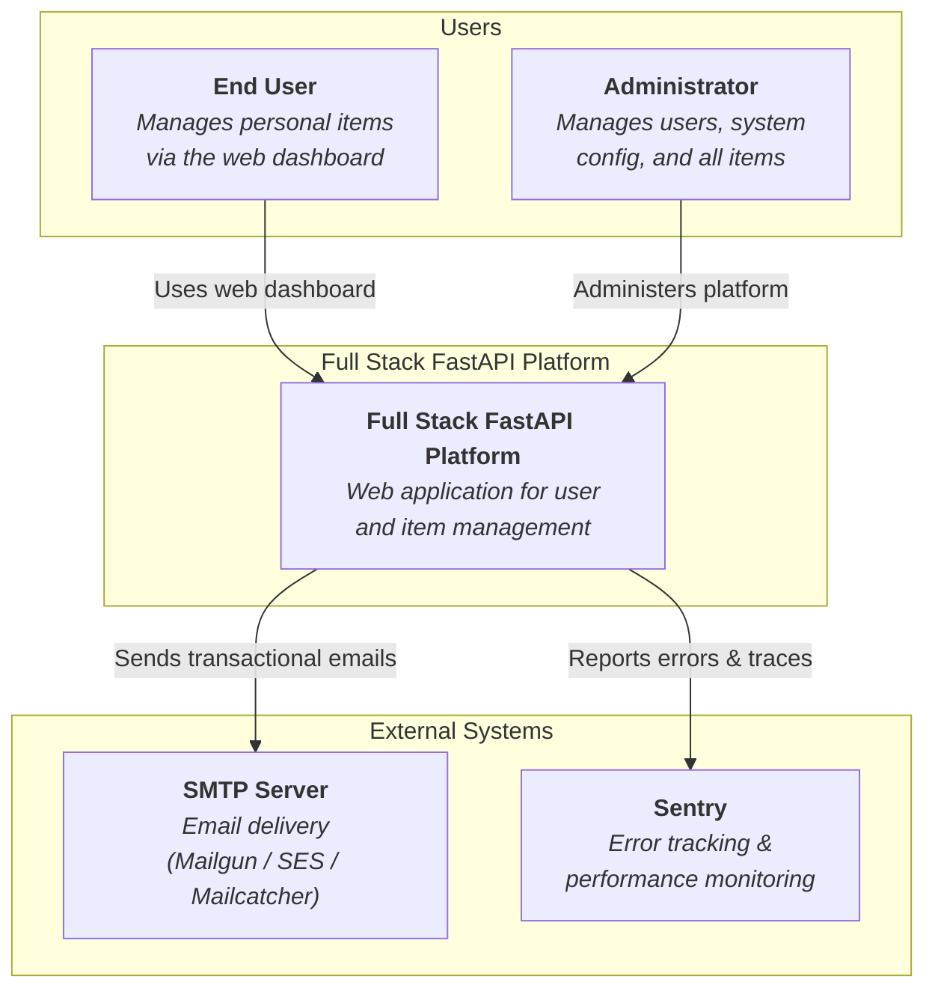
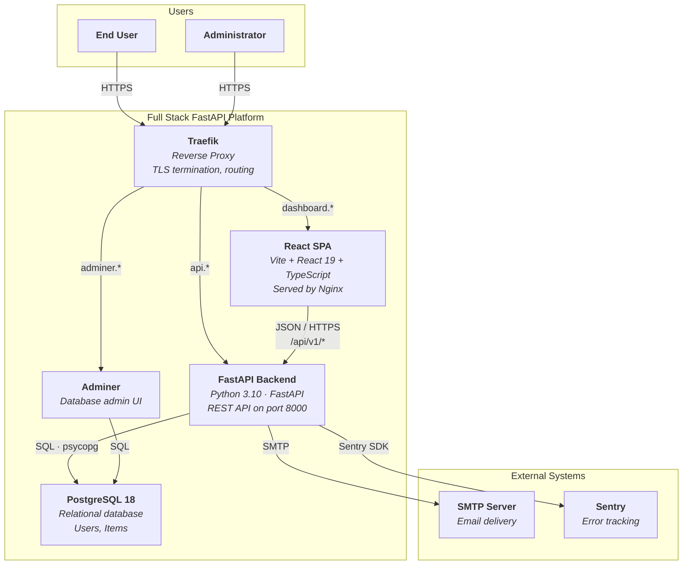
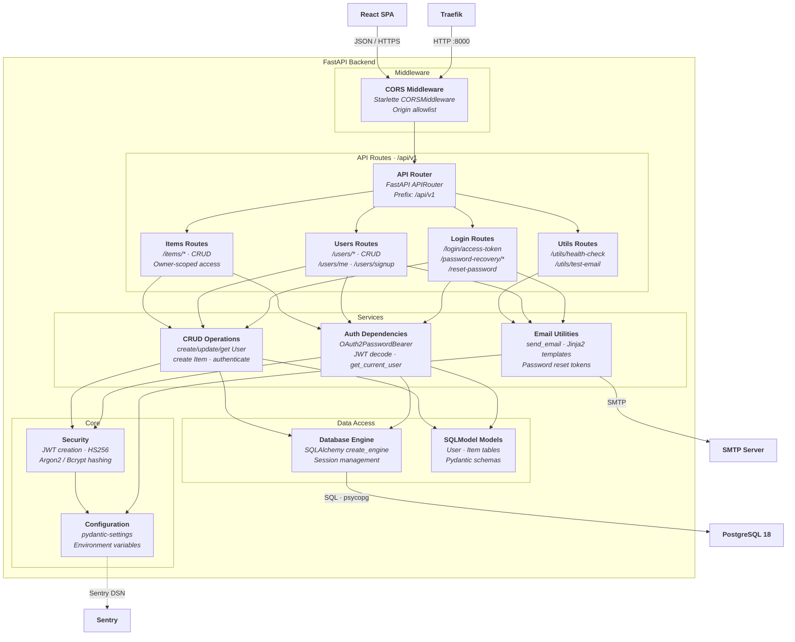
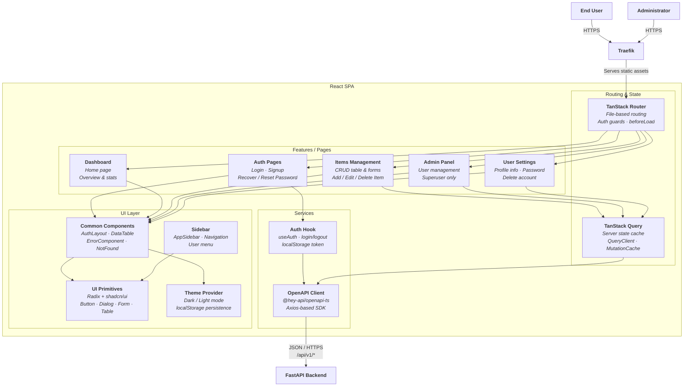
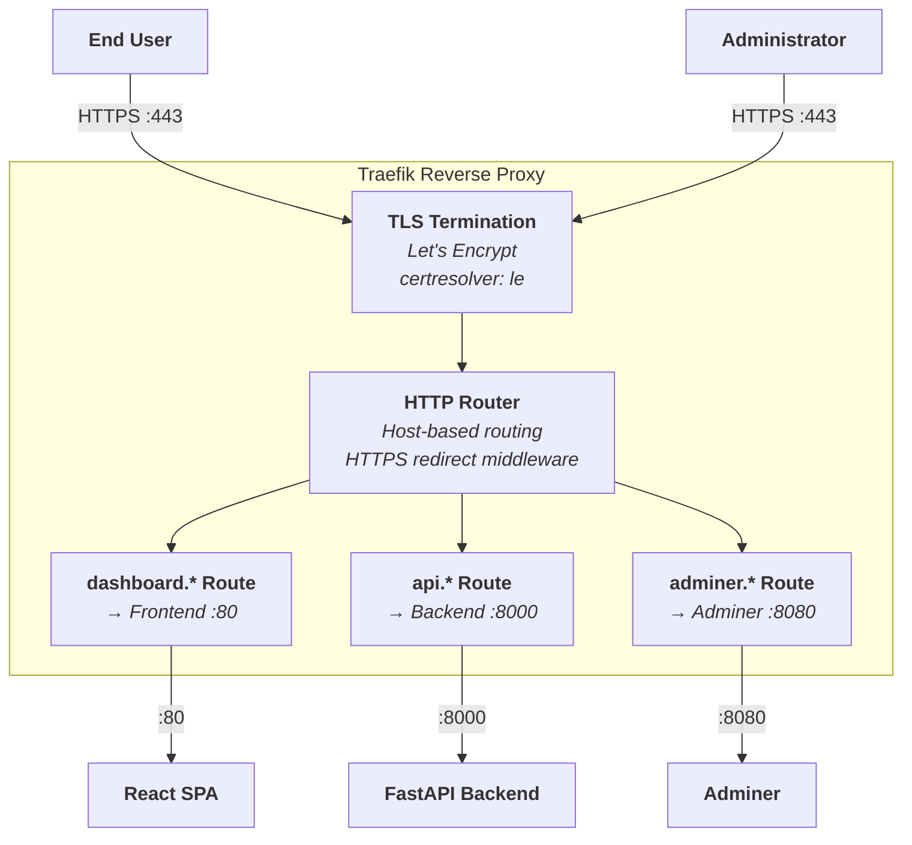

# C4 Architecture Model — Full Stack FastAPI Platform

> Auto-generated C4 model covering L1 (System Context), L2 (Container),
> and L3 (Component) diagrams for every container with internal structure.

---

## L1: System Context



---

## L2: Container



---

## L3: FastAPI Backend



---

## L3: React SPA



---

## L3: Traefik



---

## Containment Map

```text
%% ══════════════════════════════════════════════════════════════════
%% CONTAINMENT MAP — Full Stack FastAPI Platform
%% Every subgraph and node across all levels.
%% ══════════════════════════════════════════════════════════════════

%% ── L1 top-level groups ─────────────────────────────────────────
users                     CONTAINS [user, admin_user]
fastapi_platform_boundary CONTAINS [traefik, spa, fastapi_api, pg, adminer]
external_systems          CONTAINS [smtp_server, sentry]

%% ── L2→L3 internal containment ──────────────────────────────────

%% FastAPI Backend (fastapi_api) ───────────────────────────────────
fastapi_api CONTAINS [mw, routes, services, core, data_access]
  mw          CONTAINS [cors_mw]
  routes      CONTAINS [api_router, login_routes, users_routes, items_routes, utils_routes]
  services    CONTAINS [auth_deps, crud_layer, email_utils]
  core        CONTAINS [core_config, security]
  data_access CONTAINS [db_engine, models_layer]

%% React SPA (spa) ─────────────────────────────────────────────────
spa CONTAINS [routing, features, services_layer, ui]
  routing        CONTAINS [tanstack_router, query_client]
  features       CONTAINS [auth_pages, dashboard_page, items_features, admin_features, settings_features]
  services_layer CONTAINS [api_client, auth_hook]
  ui             CONTAINS [common_ui, sidebar_ui, ui_primitives, theme_provider]

%% Traefik (traefik) ───────────────────────────────────────────────
traefik CONTAINS [tls_termination, http_router, dashboard_route, api_route, adminer_route]
```

---

## ID Cross-Reference

| Stable ID | L1 | L2 | L3 Scope | Description |
|---|---|---|---|---|
| `user` | ✓ | ✓ | spa | End User actor |
| `admin_user` | ✓ | ✓ | spa | Administrator actor |
| `fastapi_platform` | ✓ | — | — | System node (L1 only) |
| `fastapi_platform_boundary` | ✓ | ✓ | — | System boundary subgraph |
| `traefik` | — | ✓ | fastapi_api, spa, traefik | Reverse proxy container / L3 scope |
| `spa` | — | ✓ | fastapi_api, spa | React SPA container / L3 scope |
| `fastapi_api` | — | ✓ | fastapi_api | FastAPI backend container / L3 scope |
| `pg` | — | ✓ | fastapi_api | PostgreSQL database |
| `adminer` | — | ✓ | traefik | DB admin UI |
| `smtp_server` | ✓ | ✓ | fastapi_api | External SMTP server |
| `sentry` | ✓ | ✓ | fastapi_api | External monitoring |
