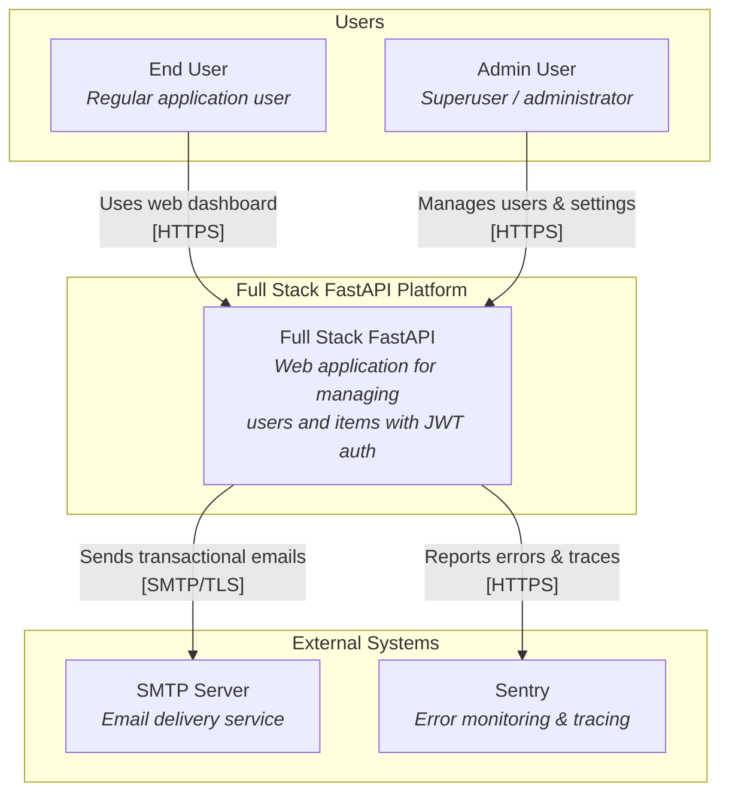
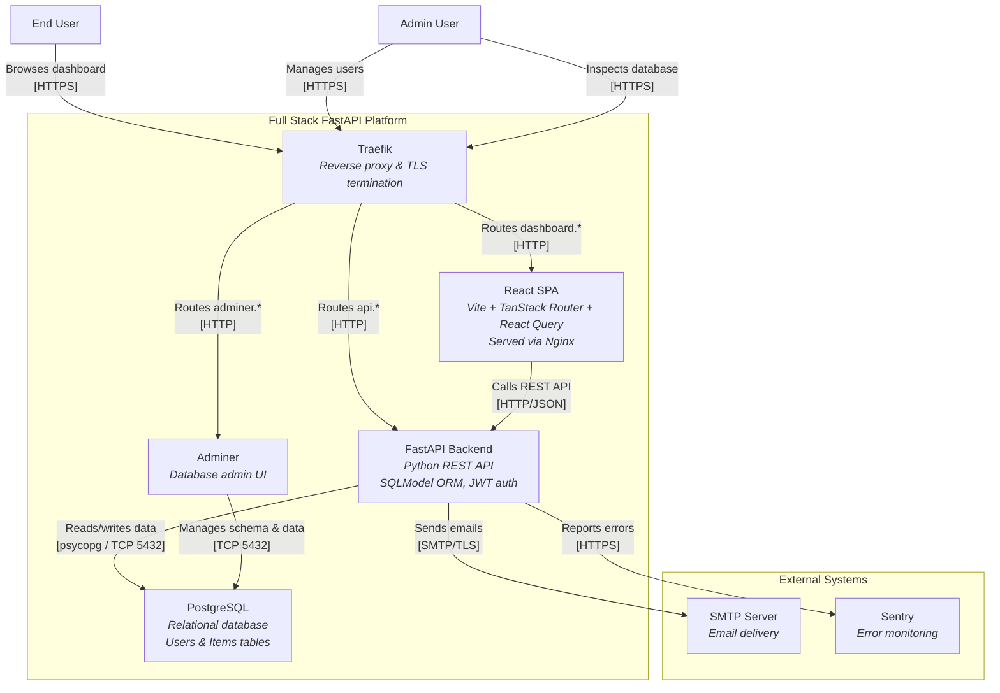
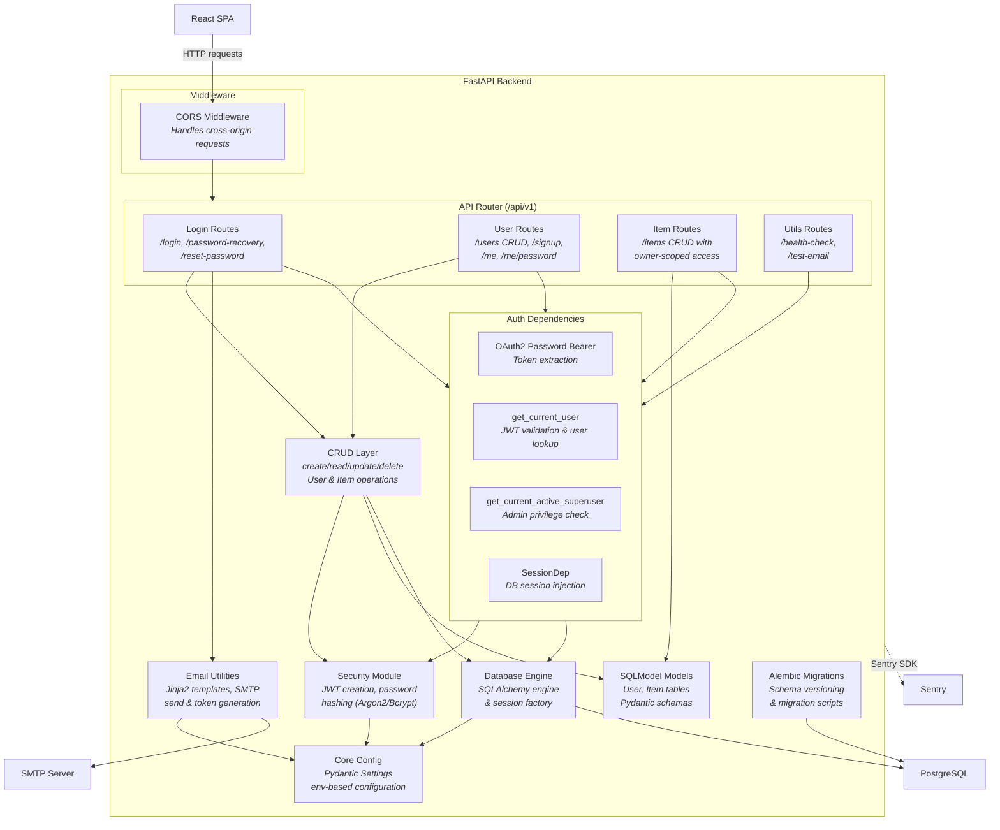
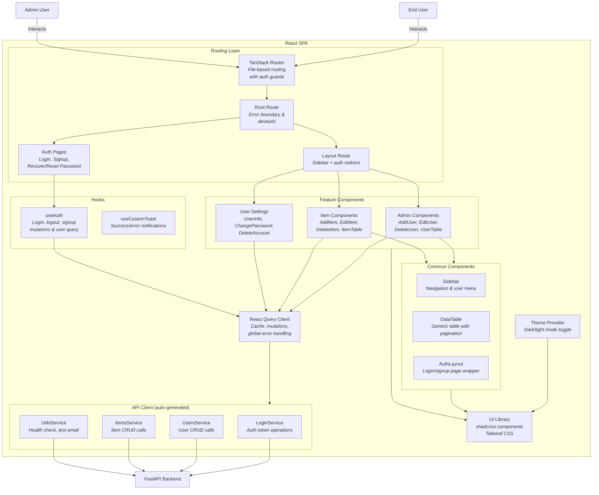

# C4 Architecture Model — Full Stack FastAPI Template

---

## L1: System Context



---

## L2: Container



---

## L3: FastAPI Backend



---

## L3: React SPA



---

## Containment Map

```text
%% ═══════════════════════════════════════════════════════════════════
%% CONTAINMENT MAP — Full Stack FastAPI Template
%% ═══════════════════════════════════════════════════════════════════

%% ── L1 top-level groups ────────────────────────────────────────────
users                CONTAINS [end_user, admin_user]
fullstack_fastapi_boundary CONTAINS [traefik, spa, fastapi_backend, pg, adminer]
external             CONTAINS [smtp_server, sentry]

%% ── L2→L3 containment: fastapi_backend ─────────────────────────────
fastapi_backend      CONTAINS [middleware, api_router, auth_deps, crud_layer, models_layer, security_mod, core_config, email_utils, db_engine, alembic_mig]
  middleware         CONTAINS [cors_mw]
  api_router         CONTAINS [login_routes, user_routes, item_routes, utils_routes]
  auth_deps          CONTAINS [oauth2_scheme, get_current_user, get_superuser, session_dep]

%% ── L2→L3 containment: spa ─────────────────────────────────────────
spa                  CONTAINS [routing, hooks_layer, api_client, query_client, features, common_ui, ui_lib, theme_prov]
  routing            CONTAINS [tanstack_router, root_route, layout_route, auth_routes]
  hooks_layer        CONTAINS [auth_hooks, toast_hooks]
  api_client         CONTAINS [login_service, users_service, items_service, utils_service]
  features           CONTAINS [admin_features, item_features, user_settings_feat]
  common_ui          CONTAINS [sidebar_comp, data_table, auth_layout]
```
