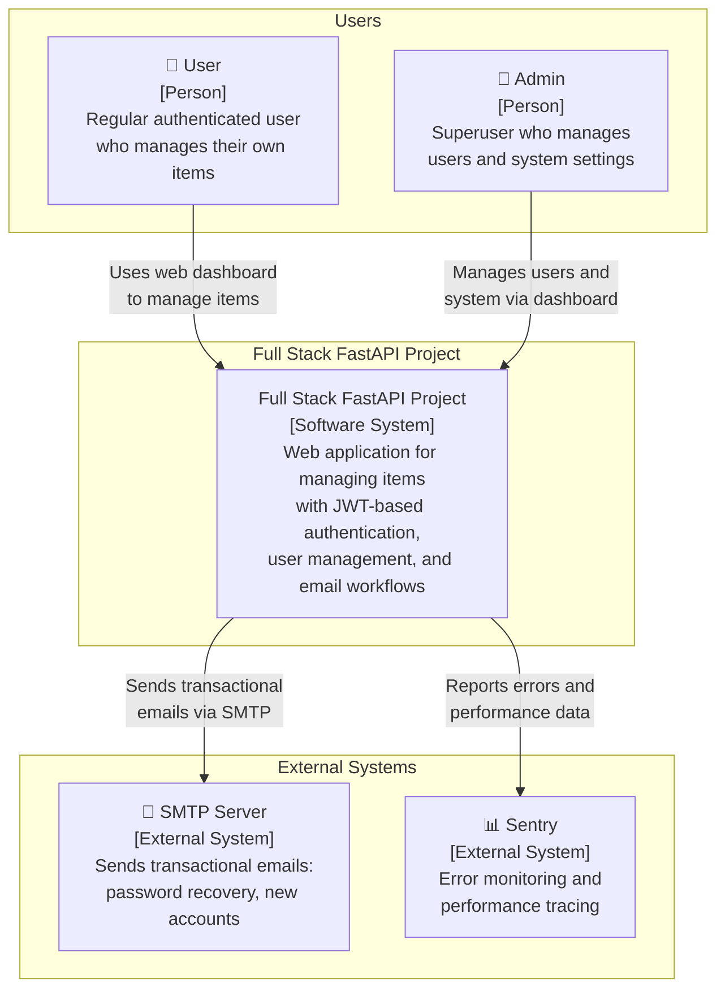
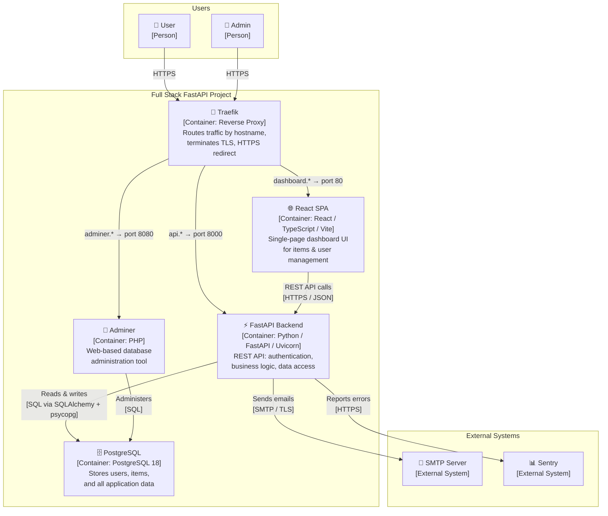
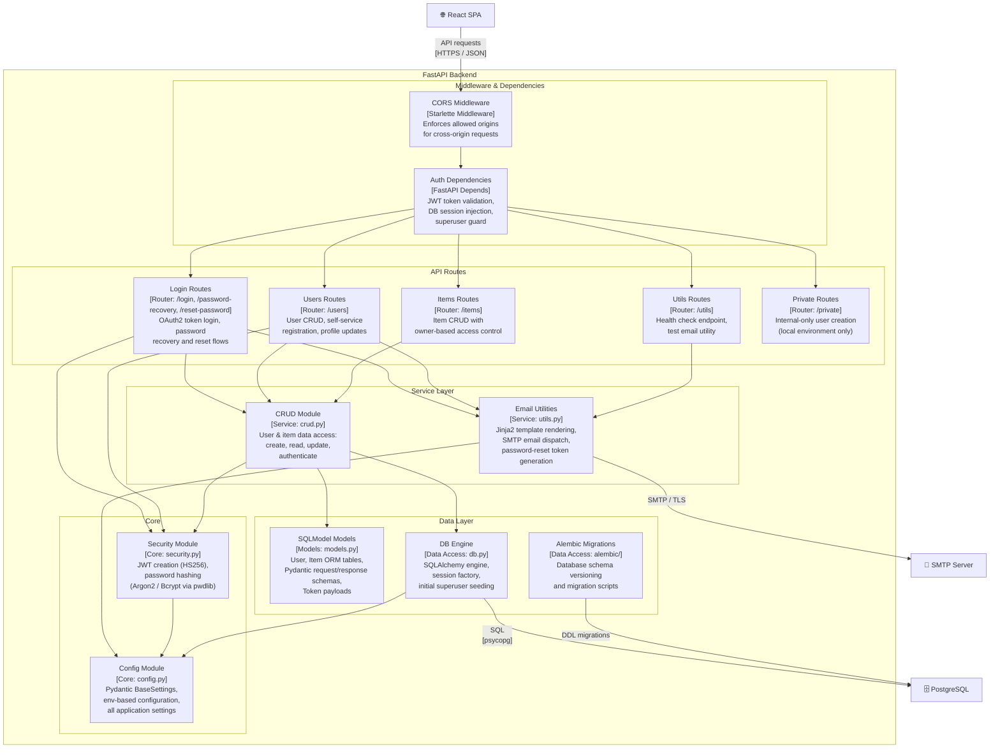
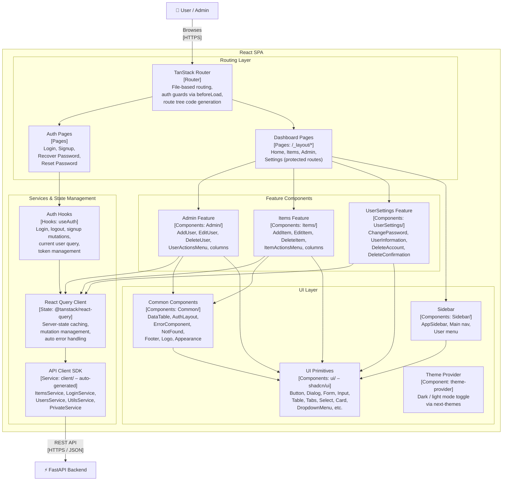

# C4 Architecture Model – Full Stack FastAPI Project

---

## L1: System Context



---

## L2: Container Diagram



---

## L3: FastAPI Backend – Component Diagram



---

## L3: React SPA – Component Diagram



---

## Containment Map

```
%% ══════════════════════════════════════════════════════════════════
%% CONTAINMENT MAP
%% ══════════════════════════════════════════════════════════════════

%% ── L1 top-level groups ──────────────────────────────────────────
users                    CONTAINS [user, admin]
fastapi_project_boundary CONTAINS [fastapi_project]
external                 CONTAINS [smtp, sentry]

%% ── L2 system internals (L1 → L2 expansion) ─────────────────────
fastapi_project_boundary CONTAINS [spa, api, pg, traefik, adminer]

%% ── L3: FastAPI Backend (api) ────────────────────────────────────
api        CONTAINS [middleware, routes, services, core, data]
  middleware CONTAINS [cors_mw, auth_dep]
  routes     CONTAINS [login_routes, users_routes, items_routes, utils_routes, private_routes]
  services   CONTAINS [crud_layer, email_utils]
  core       CONTAINS [security_mod, config_mod]
  data       CONTAINS [models_layer, db_engine, alembic_mig]

%% ── L3: React SPA (spa) ─────────────────────────────────────────
spa        CONTAINS [routing, features, services_layer, ui]
  routing        CONTAINS [tanstack_router, auth_pages, dashboard_pages]
  features       CONTAINS [admin_feat, items_feat, settings_feat]
  services_layer CONTAINS [api_client, query_client, auth_hooks]
  ui             CONTAINS [sidebar_comp, common_comp, ui_primitives, theme_prov]
```
