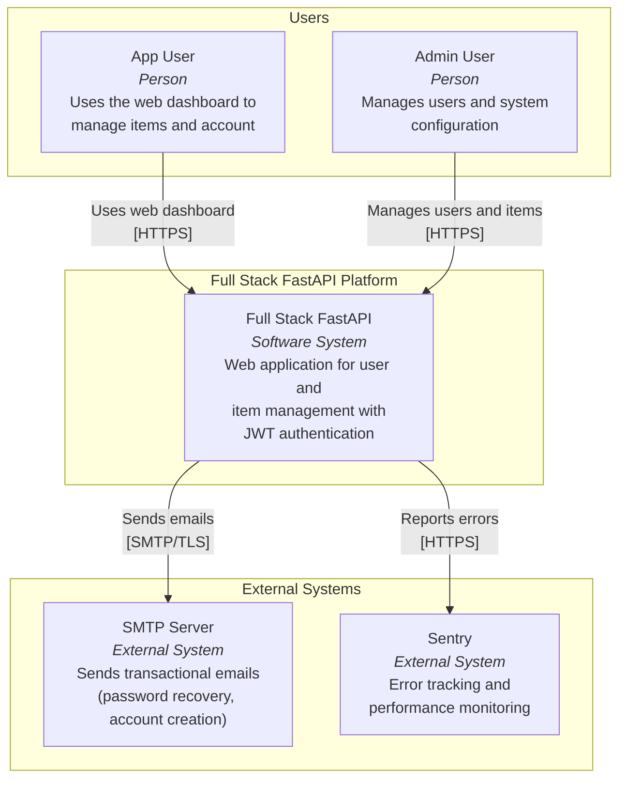
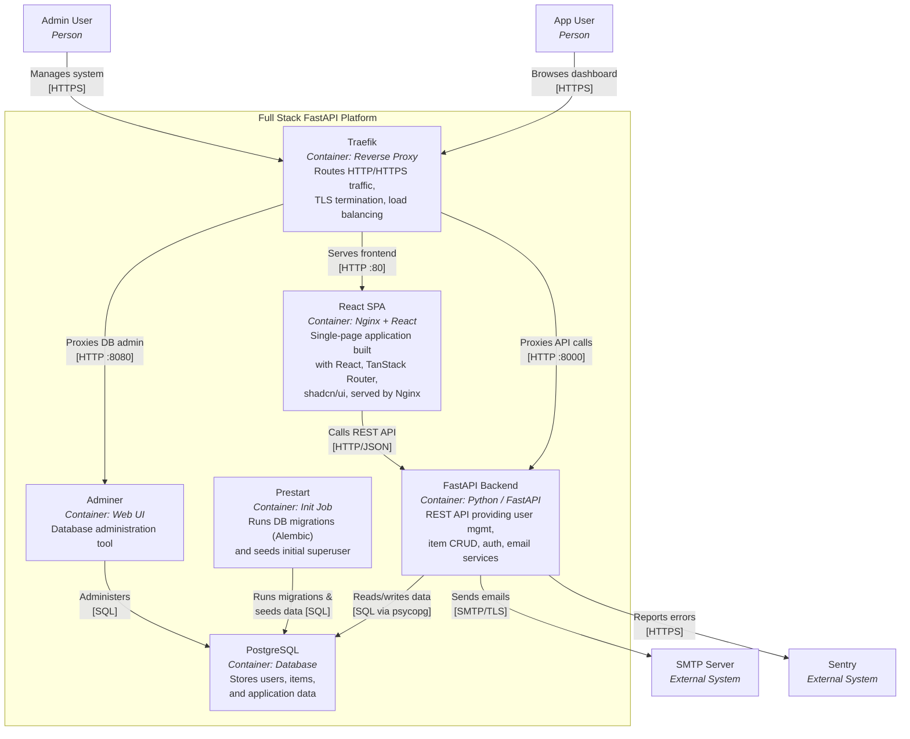
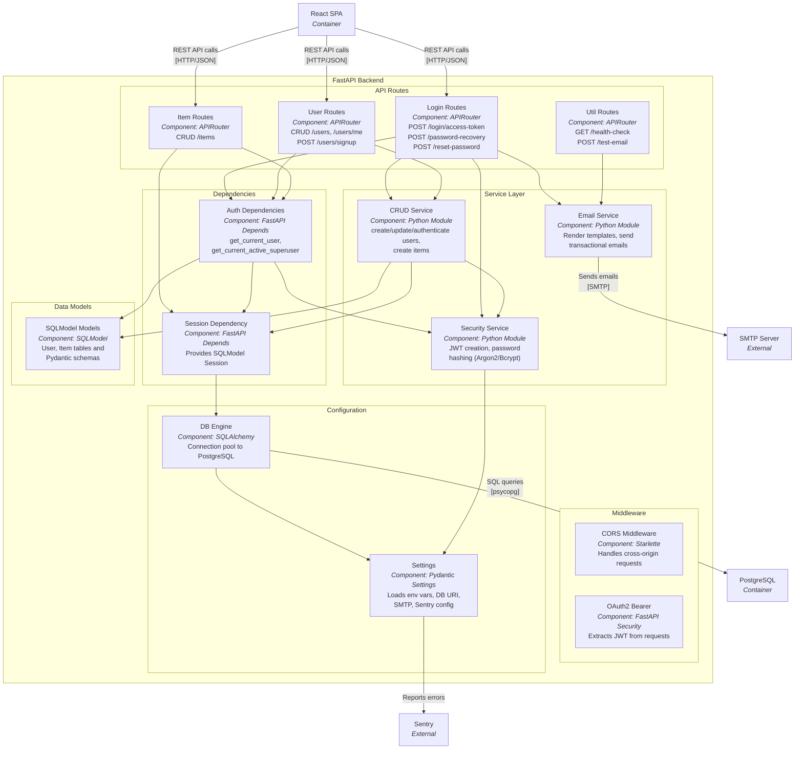
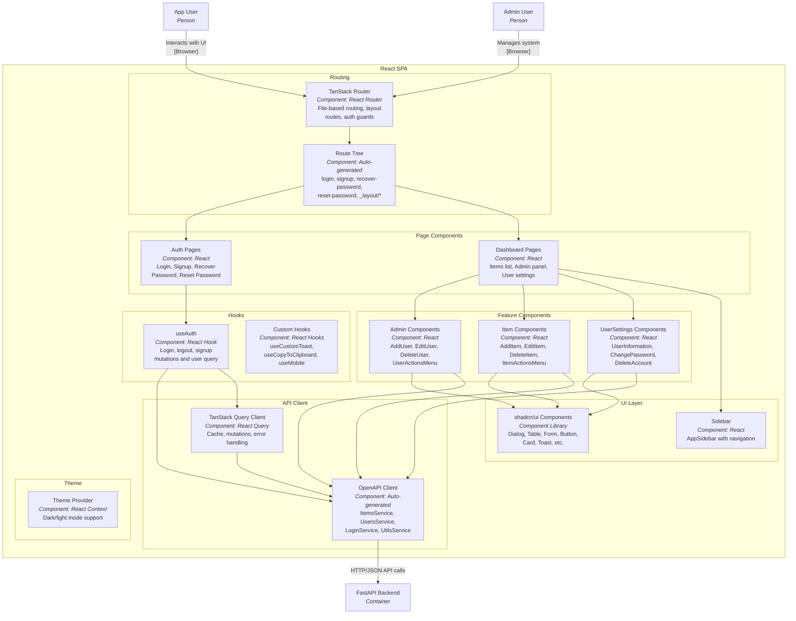
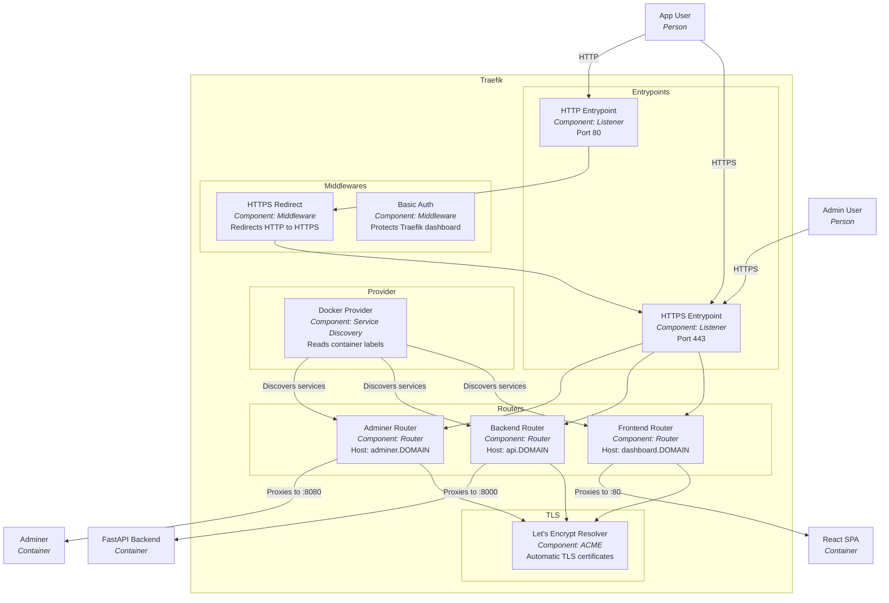

# C4 Architecture Model — Full Stack FastAPI Template

## L1: System Context



---

## L2: Container Diagram



---

## L3: FastAPI Backend — Component Diagram



---

## L3: React SPA — Component Diagram



---

## L3: Traefik — Component Diagram



---

## Containment Map

```
%% ══════════════════════════════════════════════════════════════════
%% CONTAINMENT MAP — Full Stack FastAPI Template
%% ══════════════════════════════════════════════════════════════════

%% ── L1 top-level groups ─────────────────────────────────────────
users              CONTAINS [app_user, admin_user]
fullstack_boundary CONTAINS [traefik, spa, fastapi_backend, pg, prestart, adminer]
external           CONTAINS [smtp, sentry]

%% ── L2→L3 internal containment ──────────────────────────────────

%% FastAPI Backend (L3)
fastapi_backend    CONTAINS [middleware, routes, deps, services, models_layer, config_layer]
  middleware       CONTAINS [cors_mw, oauth2_mw]
  routes           CONTAINS [login_routes, user_routes, item_routes, util_routes]
  deps             CONTAINS [auth_deps, session_dep]
  services         CONTAINS [crud_service, security_service, email_service]
  models_layer     CONTAINS [sqlmodels]
  config_layer     CONTAINS [app_config, db_engine]

%% React SPA (L3)
spa                CONTAINS [routing, pages, features, ui_layer, hooks_layer, api_client, theme]
  routing          CONTAINS [tanstack_router, route_tree]
  pages            CONTAINS [auth_pages, dashboard_pages]
  features         CONTAINS [admin_components, item_components, settings_components]
  ui_layer         CONTAINS [sidebar, shadcn_ui]
  hooks_layer      CONTAINS [use_auth, custom_hooks]
  api_client       CONTAINS [openapi_client, query_client]
  theme            CONTAINS [theme_provider]

%% Traefik (L3)
traefik            CONTAINS [entrypoints, middlewares, routers, tls, provider]
  entrypoints      CONTAINS [http_ep, https_ep]
  middlewares       CONTAINS [https_redirect, basic_auth]
  routers          CONTAINS [frontend_router, backend_router, adminer_router]
  tls              CONTAINS [le_resolver]
  provider         CONTAINS [docker_provider]
```
