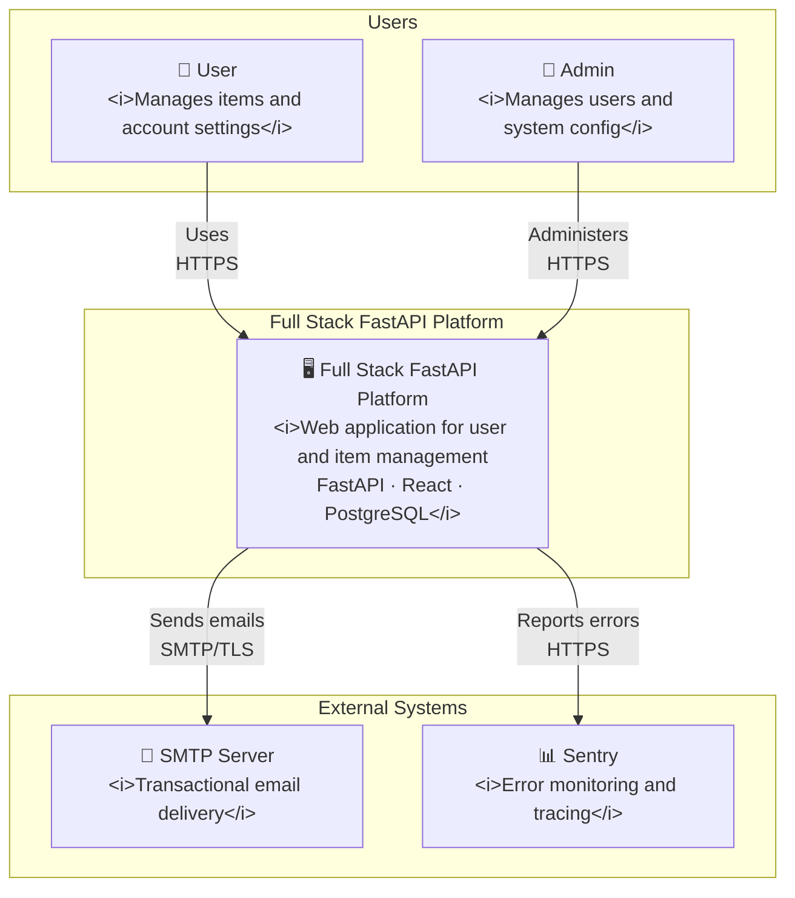
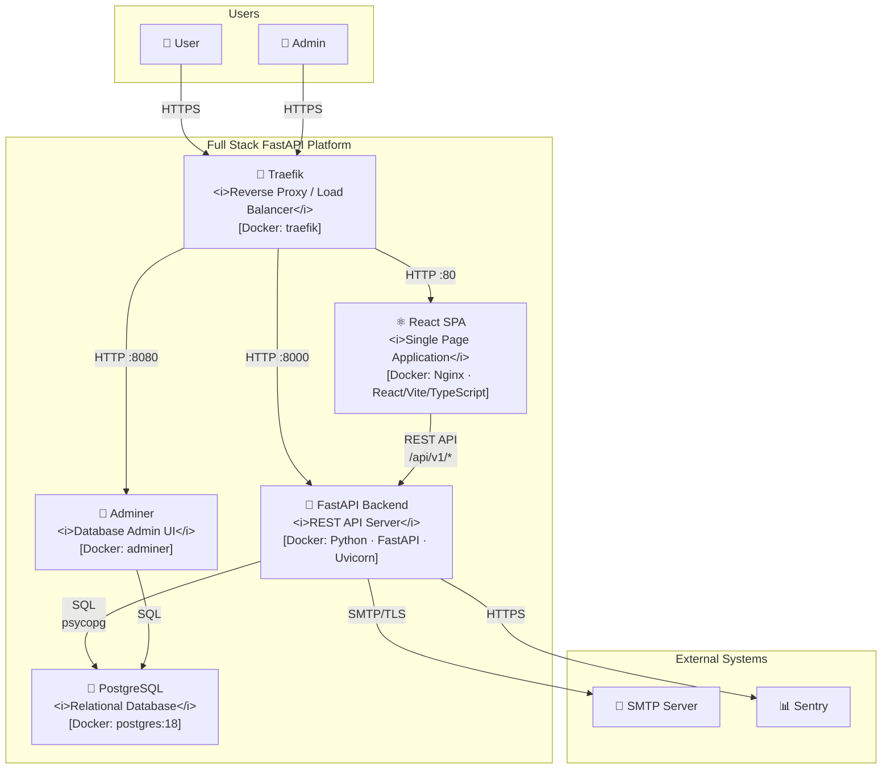
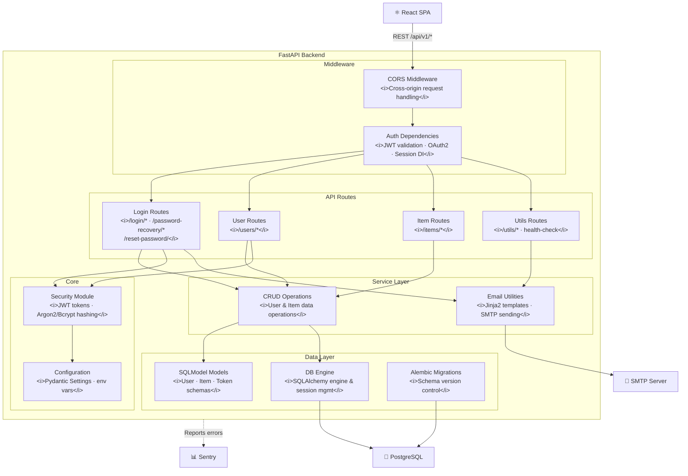
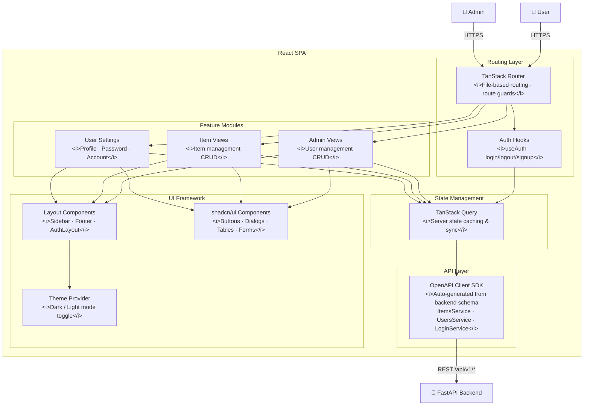

# C4 Architecture Model — Full Stack FastAPI Platform

## L1: System Context



---

## L2: Container



---

## L3: FastAPI Backend



---

## L3: React SPA



---

## Containment Map

```
%% ═══════════════════════════════════════════════════════════════
%% CONTAINMENT MAP
%% ═══════════════════════════════════════════════════════════════

%% ── L1 top-level groups ─────────────────────────────────────────
users              CONTAINS [user, admin_user]
platform_boundary  CONTAINS [traefik, spa, fastapi_backend, pg, adminer]
external           CONTAINS [smtp, sentry]

%% ── L2→L3: FastAPI Backend ──────────────────────────────────────
fastapi_backend    CONTAINS [middleware, routes, services, core, data_layer]
  middleware       CONTAINS [cors_mw, auth_deps]
  routes           CONTAINS [login_routes, user_routes, item_routes, utils_routes]
  services         CONTAINS [crud_layer, email_utils]
  core             CONTAINS [security_mod, config_mod]
  data_layer       CONTAINS [models_layer, db_engine, alembic]

%% ── L2→L3: React SPA ───────────────────────────────────────────
spa                CONTAINS [routing, state_mgmt, api_layer, features, ui_framework]
  routing          CONTAINS [router, auth_hooks]
  state_mgmt       CONTAINS [query_client]
  api_layer        CONTAINS [api_client]
  features         CONTAINS [admin_views, item_views, settings_views]
  ui_framework     CONTAINS [layout_components, ui_lib, theme_provider]
```
