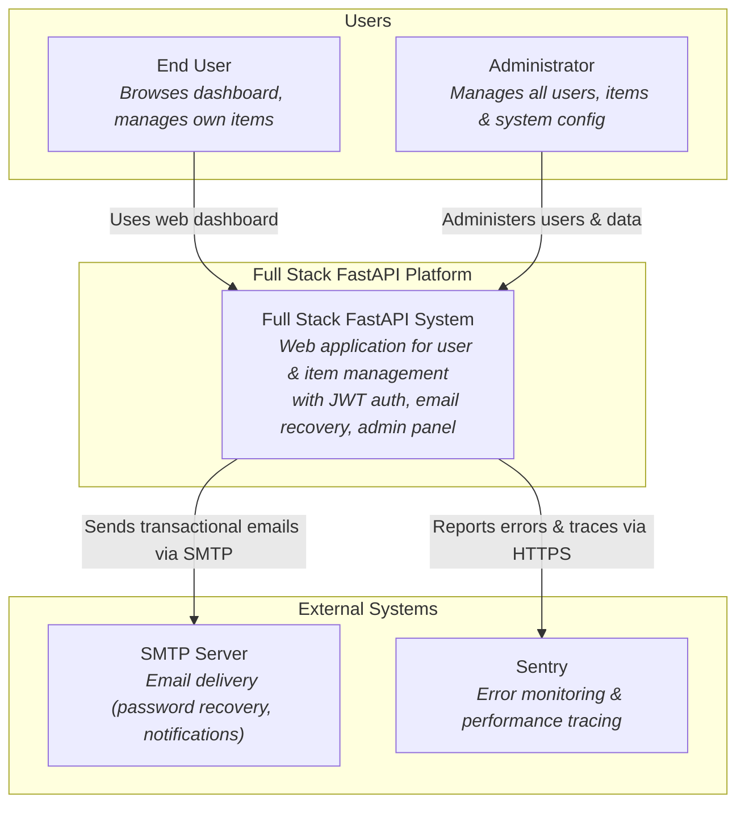
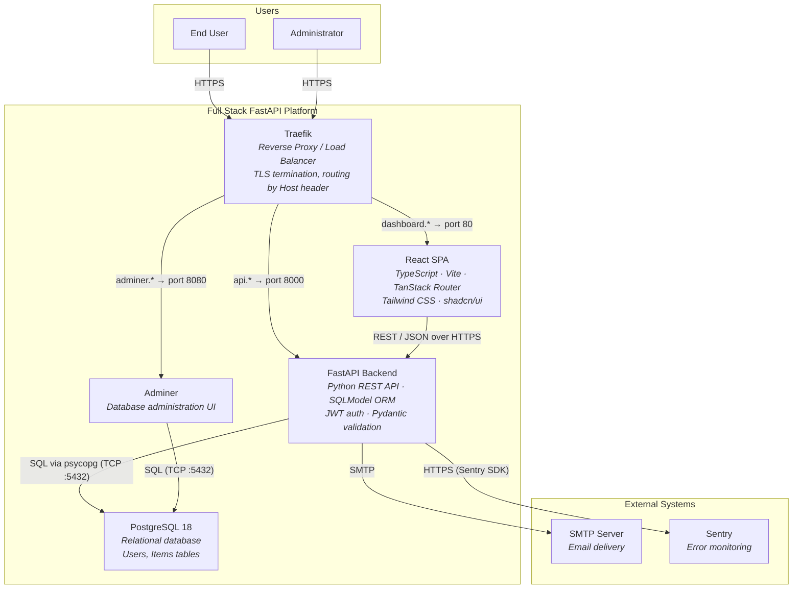
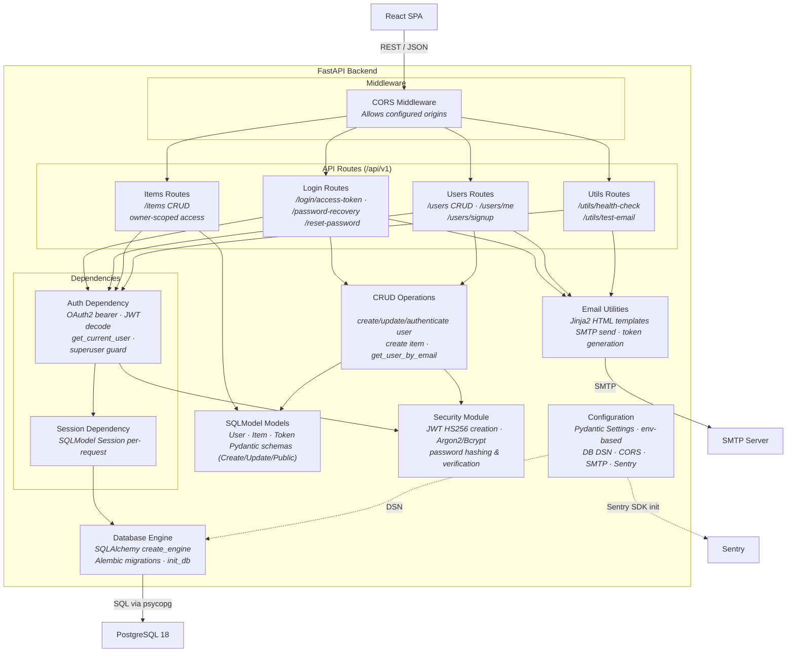
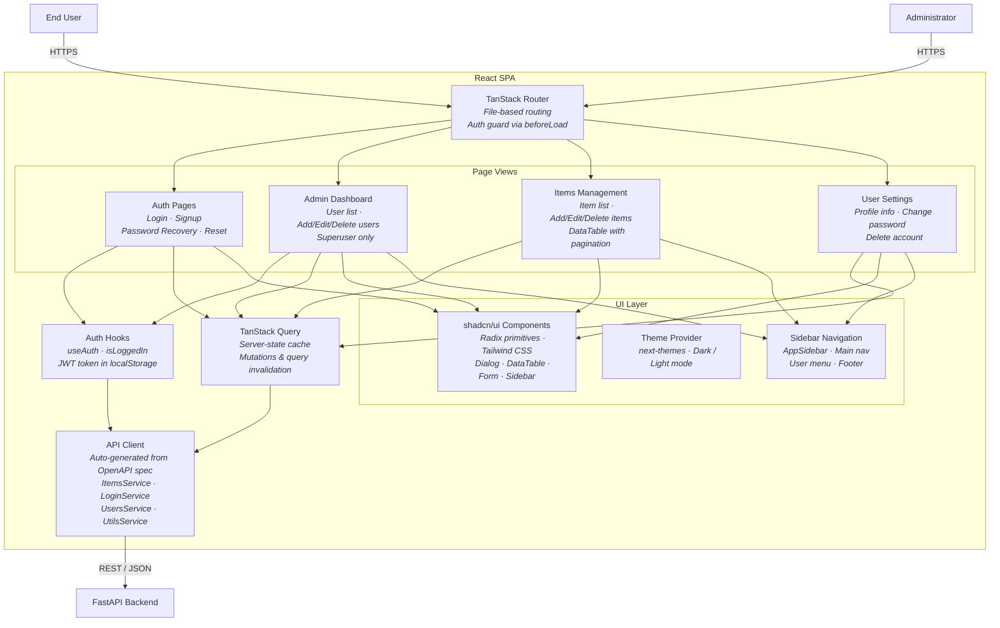

# C4 Architecture Model — Full Stack FastAPI Platform

---

## L1: System Context



---

## L2: Container



---

## L3: FastAPI Backend



---

## L3: React SPA



---

## Containment Map

```text
%% ── L1 top-level groups ────────────────────────────────────────────────────
users              CONTAINS [user, admin_user]
fullstack_system   CONTAINS [traefik, spa, fastapi_backend, pg, adminer]
external           CONTAINS [smtp_server, sentry]

%% ── L2 → L3 internal containment ───────────────────────────────────────────

%% FastAPI Backend (L3)
fastapi_backend    CONTAINS [middleware, routes, deps, crud_layer, models_layer, security_mod, config_mod, email_utils, db_engine]
  middleware       CONTAINS [cors_mw]
  routes           CONTAINS [login_routes, users_routes, items_routes, utils_routes]
  deps             CONTAINS [auth_dep, session_dep]

%% React SPA (L3)
spa                CONTAINS [tanstack_router, views, api_client, auth_hooks, query_layer, ui_layer]
  views            CONTAINS [login_view, admin_view, items_view, settings_view]
  ui_layer         CONTAINS [ui_lib, theme_provider, sidebar_nav]
```
