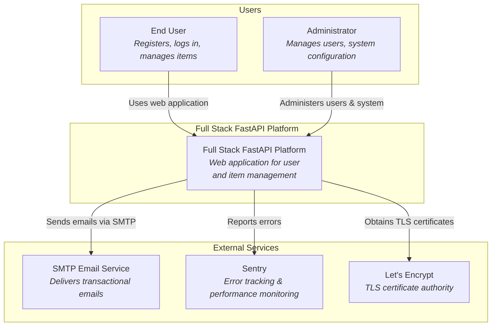
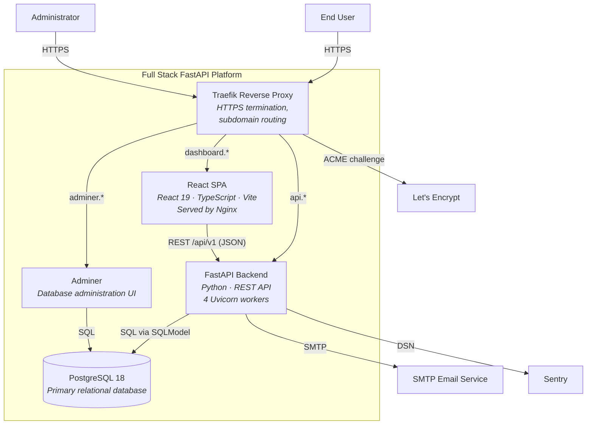
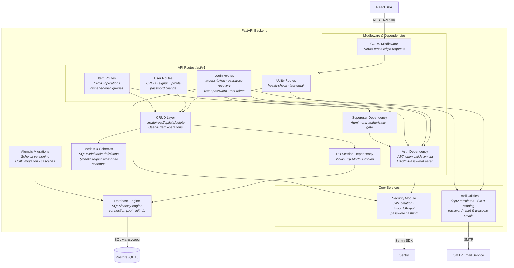
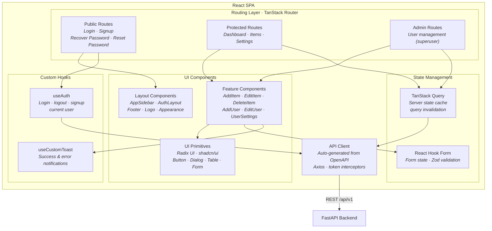

# C4 Architecture Model — Full Stack FastAPI Platform

---

## L1: System Context



---

## L2: Container Diagram



---

## L3: FastAPI Backend



---

## L3: React SPA



---

## Containment Map

```text
%% ══════════════════════════════════════════════════════════════════
%% CONTAINMENT MAP — every subgraph and its children across all levels
%% ══════════════════════════════════════════════════════════════════

%% ── L1 top-level groups ─────────────────────────────────────────
users            CONTAINS [user, admin_user]
system_boundary  CONTAINS [fullstack_system, traefik, spa, fastapi, pg, adminer]
external         CONTAINS [smtp_ext, sentry_ext, letsencrypt]

%% ── L2 system internals (inside system_boundary) ────────────────
system_boundary  CONTAINS [traefik, spa, fastapi, pg, adminer]

%% ── L3: FastAPI Backend (fastapi) ───────────────────────────────
fastapi          CONTAINS [middleware, routes, core_services, crud_layer, models_layer, db_engine, alembic]
  middleware     CONTAINS [cors_mw, auth_dep, superuser_dep, db_dep]
  routes         CONTAINS [login_routes, user_routes, item_routes, util_routes]
  core_services  CONTAINS [security, email_utils]

%% ── L3: React SPA (spa) ────────────────────────────────────────
spa              CONTAINS [routing, components, state_layer, api_client, hooks_layer]
  routing        CONTAINS [public_routes, protected_routes, admin_routes]
  components     CONTAINS [ui_primitives, feature_components, layout_components]
  state_layer    CONTAINS [query_cache, form_state]
  hooks_layer    CONTAINS [use_auth, use_toast]
```
