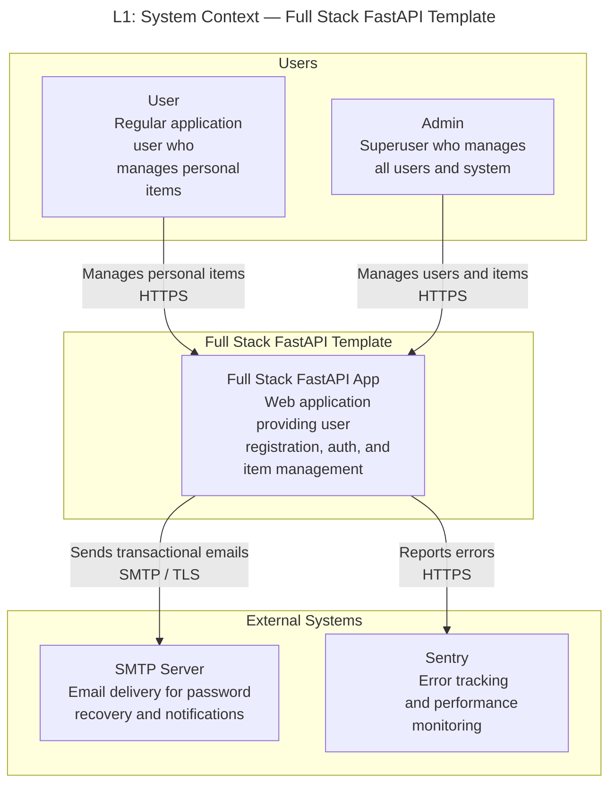
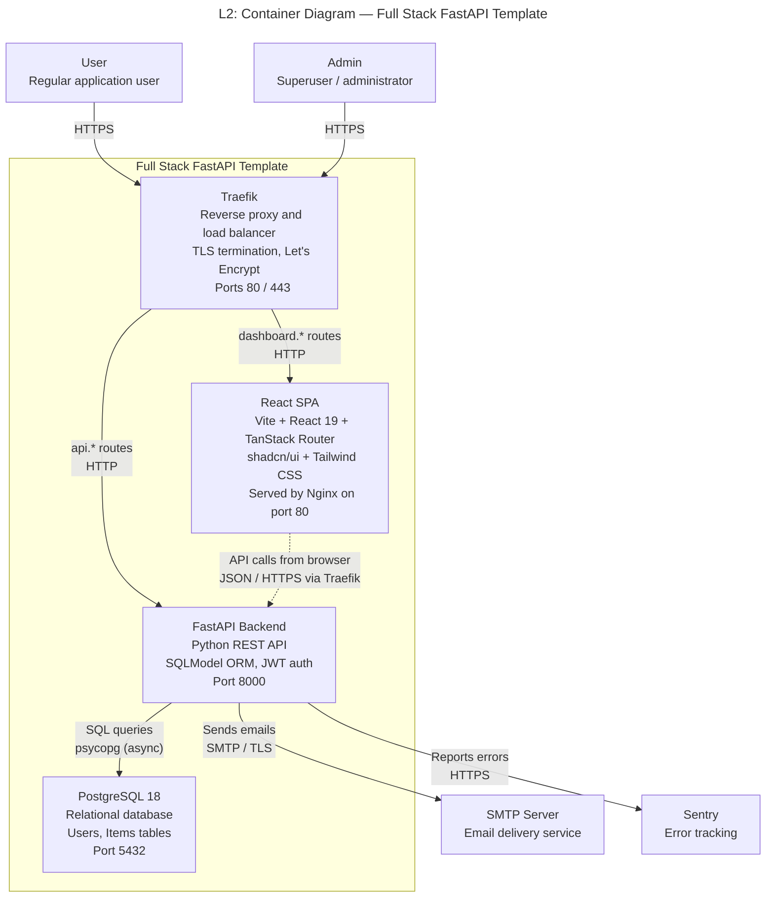
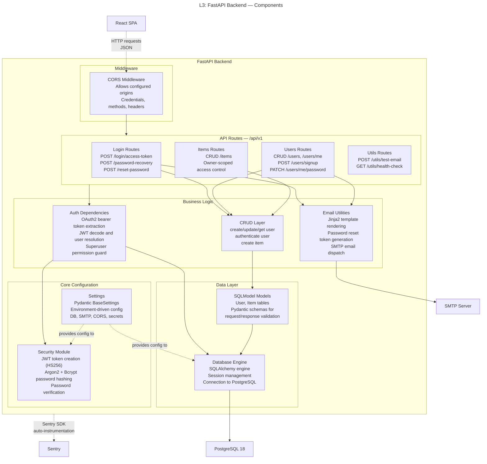
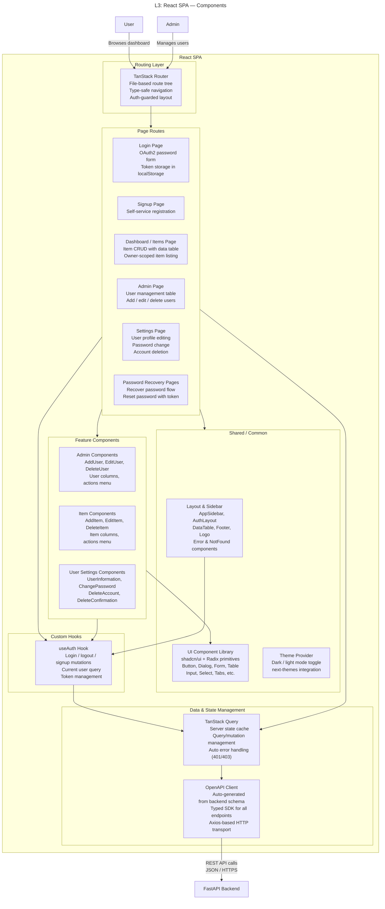

# C4 Architecture Model — Full Stack FastAPI Template

## L1: System Context



---

## L2: Container Diagram



---

## L3: FastAPI Backend — Component Diagram



---

## L3: React SPA — Component Diagram



---

## Containment Map

```text
%% ═══════════════════════════════════════════════════════════════════
%% CONTAINMENT MAP — Full Stack FastAPI Template
%% Covers L1 → L2 → L3. Every subgraph and node listed.
%% ═══════════════════════════════════════════════════════════════════

%% ── L1 top-level groups ────────────────────────────────────────────
users              CONTAINS [user, admin_user]
fullstack_boundary CONTAINS [traefik, spa, fastapi_backend, pg]
external           CONTAINS [smtp, sentry]

%% ── L2 containers (inside fullstack_boundary) ──────────────────────
%%   traefik        — no internal structure (config-driven proxy)
%%   pg             — no internal structure (managed database)

%% ── L3: fastapi_backend components ─────────────────────────────────
fastapi_backend CONTAINS [mw, routes, services, data, core]
  mw            CONTAINS [cors_mw]
  routes        CONTAINS [login_routes, users_routes, items_routes, utils_routes]
  services      CONTAINS [auth_deps, crud_layer, email_utils]
  data          CONTAINS [models_layer, db_engine]
  core          CONTAINS [security_module, config_settings]

%% ── L3: spa components ─────────────────────────────────────────────
spa             CONTAINS [routing, data_layer, pages, features, common, hooks]
  routing       CONTAINS [tanstack_router]
  data_layer    CONTAINS [tanstack_query, api_client]
  pages         CONTAINS [login_page, signup_page, dashboard_page, admin_page, settings_page, password_pages]
  features      CONTAINS [admin_features, item_features, settings_features]
  common        CONTAINS [layout_components, ui_library, theme_provider]
  hooks         CONTAINS [auth_hook]
```
