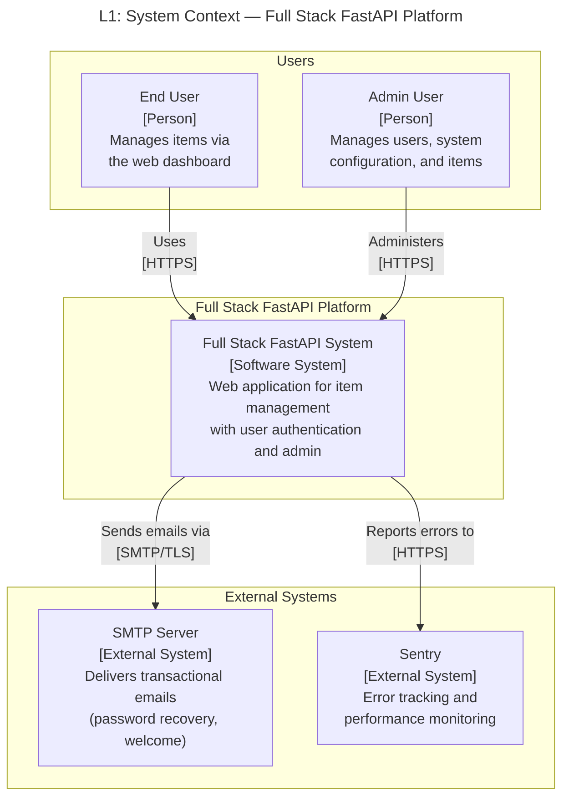
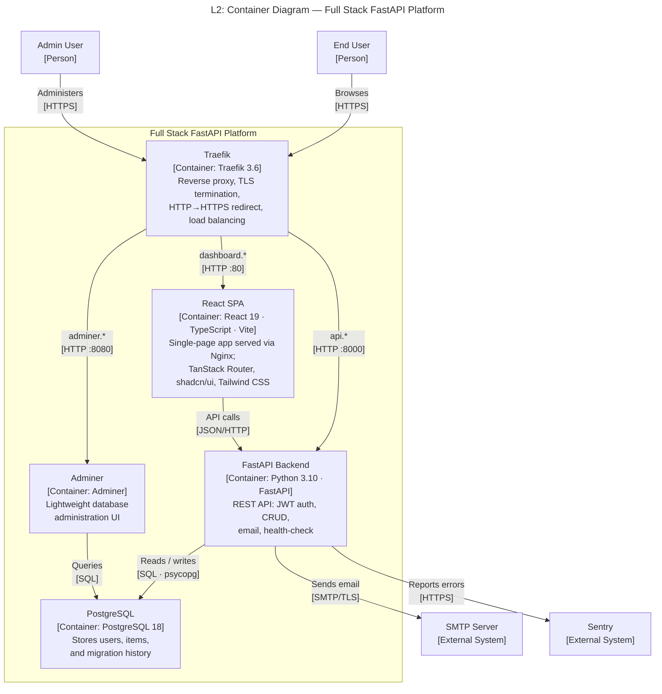
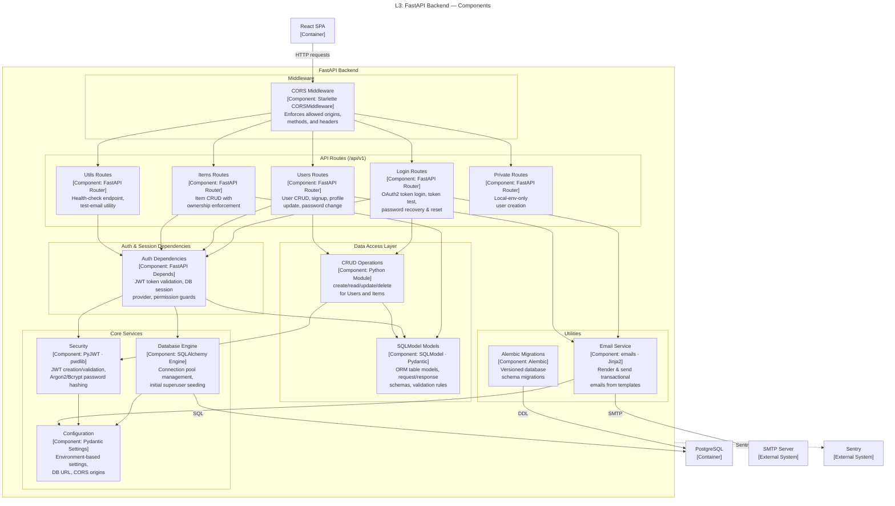
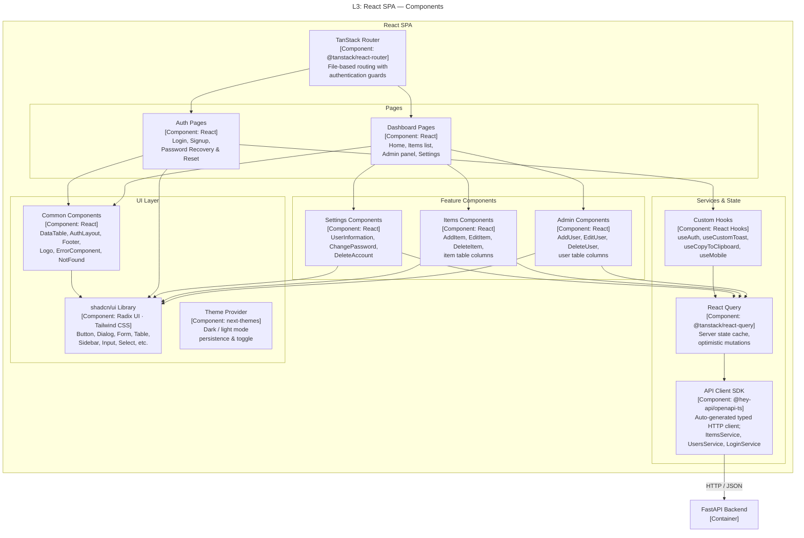

# C4 Architecture Model — Full Stack FastAPI Template

## L1: System Context



---

## L2: Container Diagram



---

## L3: FastAPI Backend — Component Diagram



---

## L3: React SPA — Component Diagram



---

## Containment Map

```text
%% ── L1 top-level groups ─────────────────────────────────────────

users              CONTAINS [end_user, admin_user]
fullstack_boundary CONTAINS [fullstack_system]
external           CONTAINS [smtp_server, sentry]

%% ── L2: fullstack_system (zoom into the platform) ───────────────

fullstack_system   CONTAINS [traefik, react_spa, fastapi_backend, pg, adminer]

%% ── L3: fastapi_backend (zoom into the backend container) ───────

fastapi_backend    CONTAINS [middleware, routes, deps, data_access, core, utilities]
  middleware       CONTAINS [cors_mw]
  routes           CONTAINS [login_routes, users_routes, items_routes, utils_routes, private_routes]
  deps             CONTAINS [auth_deps]
  data_access      CONTAINS [crud_layer, models_layer]
  core             CONTAINS [core_config, core_security, db_engine]
  utilities        CONTAINS [email_utils, alembic_migrations]

%% ── L3: react_spa (zoom into the frontend container) ────────────

react_spa          CONTAINS [router, pages, features, services, ui]
  pages            CONTAINS [auth_pages, dashboard_pages]
  features         CONTAINS [admin_components, items_components, settings_components]
  services         CONTAINS [api_client, custom_hooks, query_layer]
  ui               CONTAINS [common_components, ui_lib, theme_provider]
```
