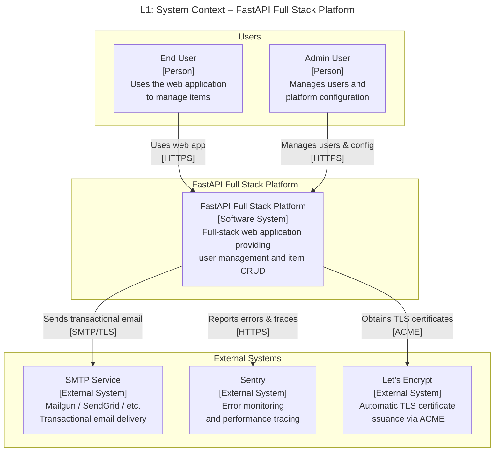
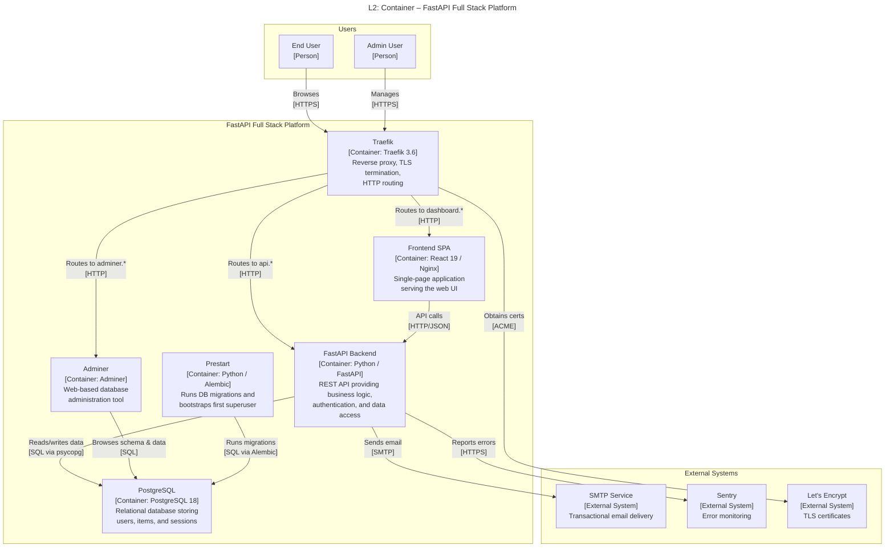
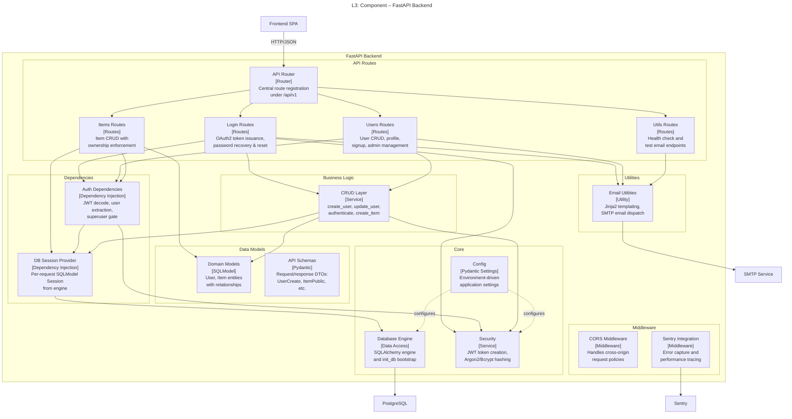
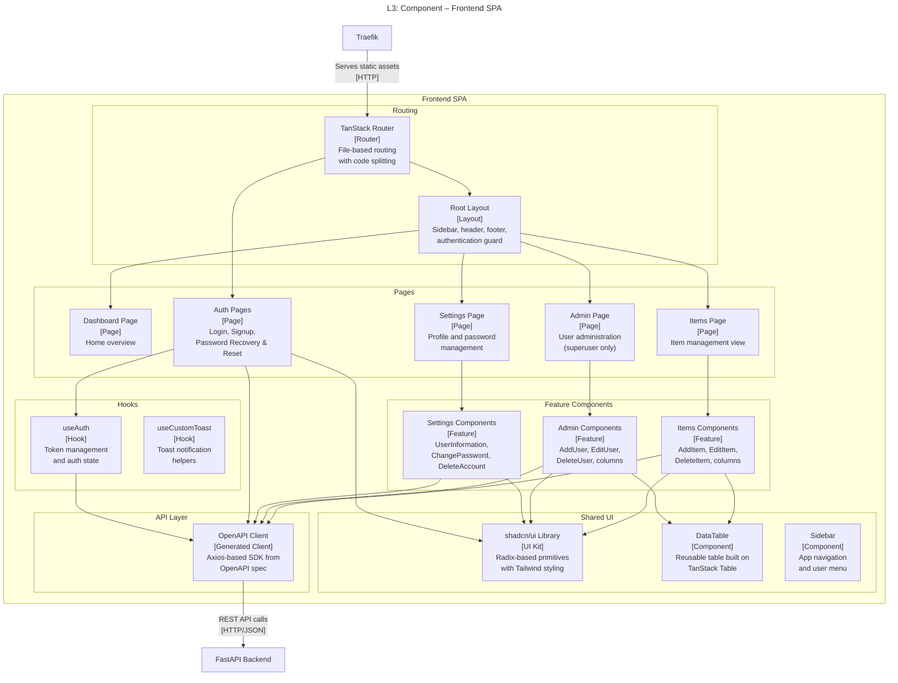
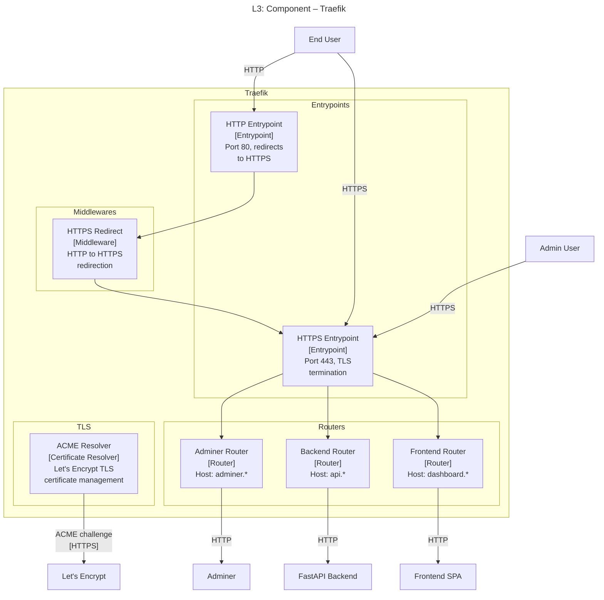

# C4 Architecture Model – FastAPI Full Stack Platform

> Auto-generated C4 model covering L1 (System Context), L2 (Container),
> and L3 (Component) diagrams for every container with internal structure.

---

## L1: System Context



---

## L2: Container



---

## L3: FastAPI Backend



---

## L3: Frontend SPA



---

## L3: Traefik



---

## Containment Map

```text
%% ══════════════════════════════════════════════════════════════════
%% CONTAINMENT MAP — covers L1, L2, and all L3 diagrams
%% ══════════════════════════════════════════════════════════════════

%% ── L1 top-level groups ─────────────────────────────────────────
users              CONTAINS [user, admin_user]
fullstack_boundary CONTAINS [fullstack_system, traefik, spa, fastapi_backend, pg, adminer, prestart]
external           CONTAINS [smtp, sentry, letsencrypt]

%% ── L2 container detail (same fullstack_boundary, expanded) ─────
%% fullstack_boundary already listed above with all containers

%% ── L3: fastapi_backend ─────────────────────────────────────────
fastapi_backend CONTAINS [middleware, routes, deps, services, models_layer, core, utils]
  middleware    CONTAINS [cors_mw, sentry_mw]
  routes        CONTAINS [api_router, login_routes, users_routes, items_routes, utils_routes]
  deps          CONTAINS [auth_deps, db_session]
  services      CONTAINS [crud_layer]
  models_layer  CONTAINS [domain_models, api_schemas]
  core          CONTAINS [core_config, core_db, core_security]
  utils         CONTAINS [email_utils]

%% ── L3: spa ─────────────────────────────────────────────────────
spa CONTAINS [routing, pages, features, shared, api_layer, hooks_layer]
  routing       CONTAINS [tanstack_router, root_layout]
  pages         CONTAINS [dashboard_page, items_page, admin_page, settings_page, auth_pages]
  features      CONTAINS [items_features, admin_features, settings_features]
  shared        CONTAINS [ui_library, data_table, sidebar_component]
  api_layer     CONTAINS [api_client]
  hooks_layer   CONTAINS [use_auth, use_custom_toast]

%% ── L3: traefik ─────────────────────────────────────────────────
traefik CONTAINS [entrypoints, routers_layer, middlewares_layer, tls_layer]
  entrypoints       CONTAINS [http_ep, https_ep]
  routers_layer     CONTAINS [frontend_router, backend_router, adminer_router]
  middlewares_layer CONTAINS [https_redirect]
  tls_layer         CONTAINS [acme_resolver]
```

---

## Stable ID Reference

| ID | Name | Appears On |
|----|------|-----------|
| `user` | End User | L1, L2, L3:traefik |
| `admin_user` | Admin User | L1, L2, L3:traefik |
| `fullstack_system` | Platform (abstract) | L1 |
| `fullstack_boundary` | Platform boundary | L1, L2 |
| `traefik` | Traefik | L2, L3:traefik (scope), L3:spa |
| `spa` | Frontend SPA | L2, L3:spa (scope), L3:fastapi_backend |
| `fastapi_backend` | FastAPI Backend | L2, L3:fastapi_backend (scope), L3:spa |
| `pg` | PostgreSQL | L2, L3:fastapi_backend |
| `adminer` | Adminer | L2, L3:traefik |
| `prestart` | Prestart | L2 |
| `smtp` | SMTP Service | L1, L2, L3:fastapi_backend |
| `sentry` | Sentry | L1, L2, L3:fastapi_backend |
| `letsencrypt` | Let's Encrypt | L1, L2, L3:traefik |
