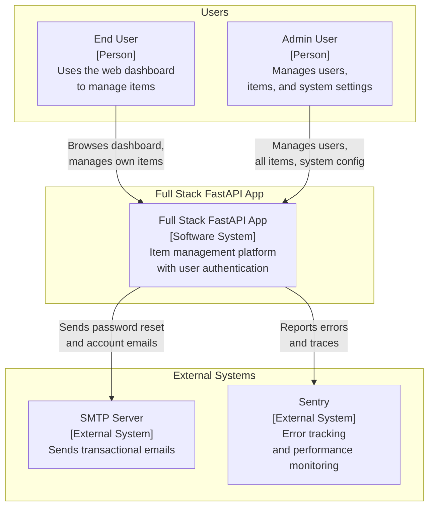
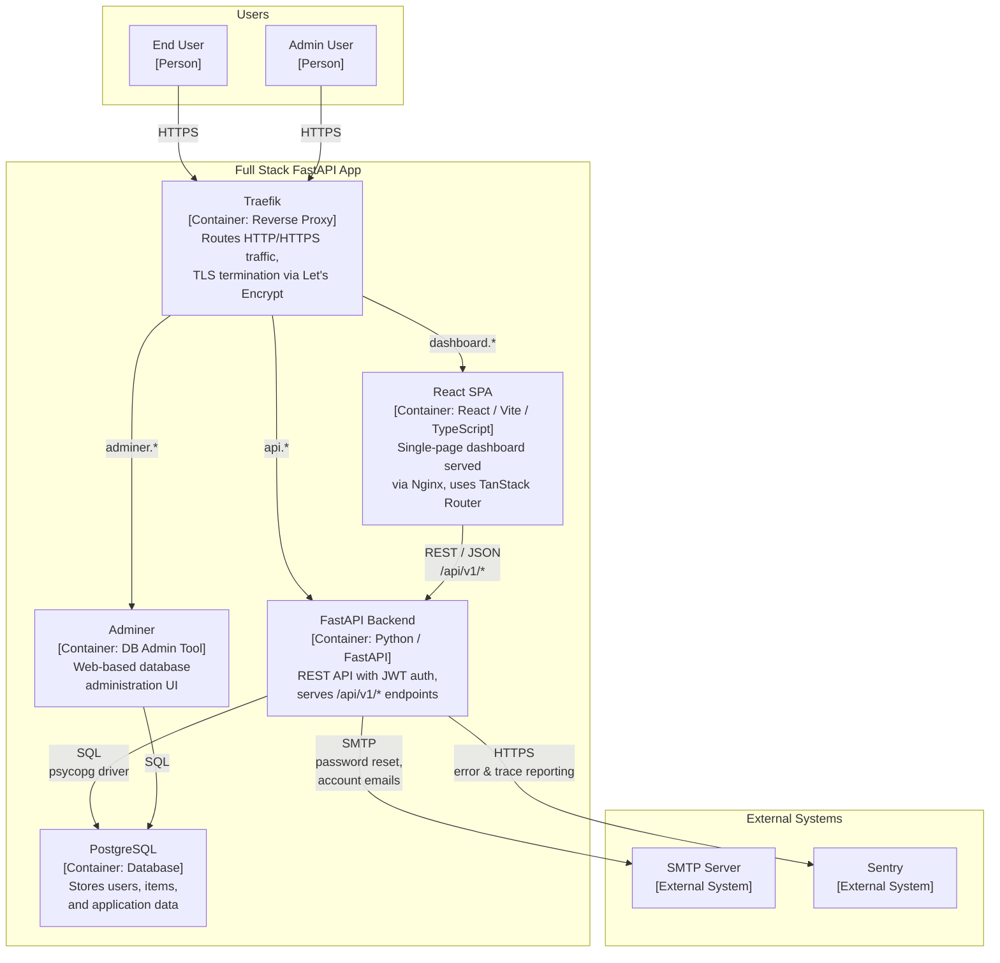
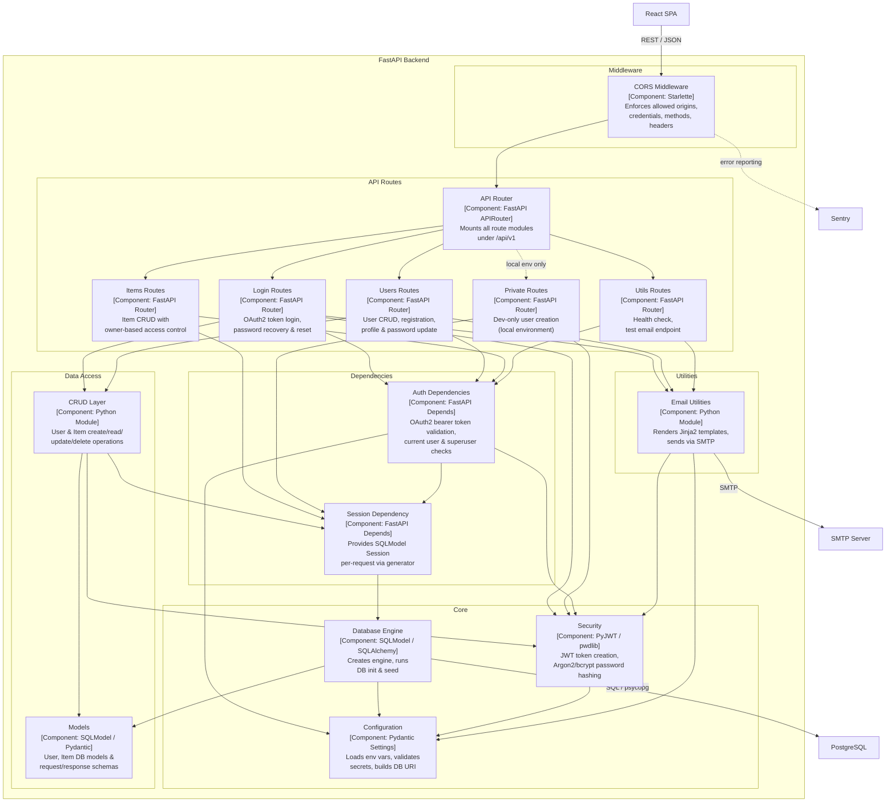
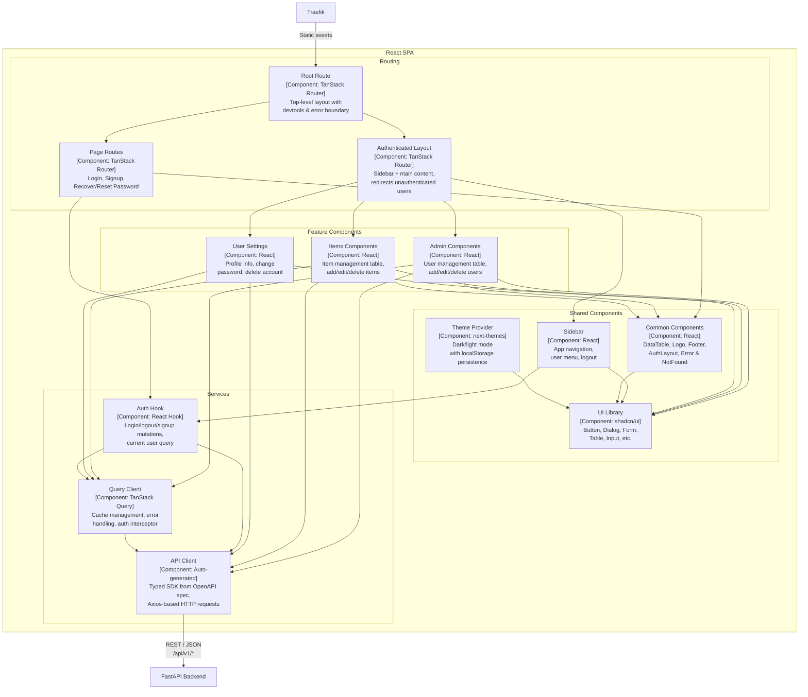

# C4 Architecture Model — Full Stack FastAPI Template

---

## L1: System Context



---

## L2: Container



---

## L3: FastAPI Backend



---

## L3: React SPA



---

## Containment Map

```text
%% ═══════════════════════════════════════════════════════════════════
%% CONTAINMENT MAP — Full Stack FastAPI Template
%% Every subgraph and node from L1–L3 must appear here.
%% Indentation encodes parent → child nesting.
%% ═══════════════════════════════════════════════════════════════════

%% ── L1 top-level groups ─────────────────────────────────────────
users_boundary          CONTAINS [user, admin_user]
fullstack_app_boundary  CONTAINS [fullstack_app, traefik, spa, fastapi_backend, pg, adminer]
external                CONTAINS [smtp, sentry]

%% ── L2 containers (inside fullstack_app_boundary) ───────────────
fullstack_app_boundary  CONTAINS [traefik, spa, fastapi_backend, pg, adminer]

%% ── L3: FastAPI Backend ─────────────────────────────────────────
fastapi_backend         CONTAINS [middleware, routes, deps, core, data_access, utils]
  middleware            CONTAINS [cors_mw]
  routes                CONTAINS [api_router, login_routes, users_routes, items_routes, utils_routes, private_routes]
  deps                  CONTAINS [auth_dep, session_dep]
  core                  CONTAINS [core_config, core_security, core_db]
  data_access           CONTAINS [crud_layer, models_layer]
  utils                 CONTAINS [email_utils]

%% ── L3: React SPA ──────────────────────────────────────────────
spa                     CONTAINS [routing, features, shared, services]
  routing               CONTAINS [router_root, router_layout, router_pages]
  features              CONTAINS [admin_components, items_components, settings_components]
  shared                CONTAINS [common_components, sidebar_component, ui_lib, theme_provider]
  services              CONTAINS [api_client, auth_hook, query_client]
```
