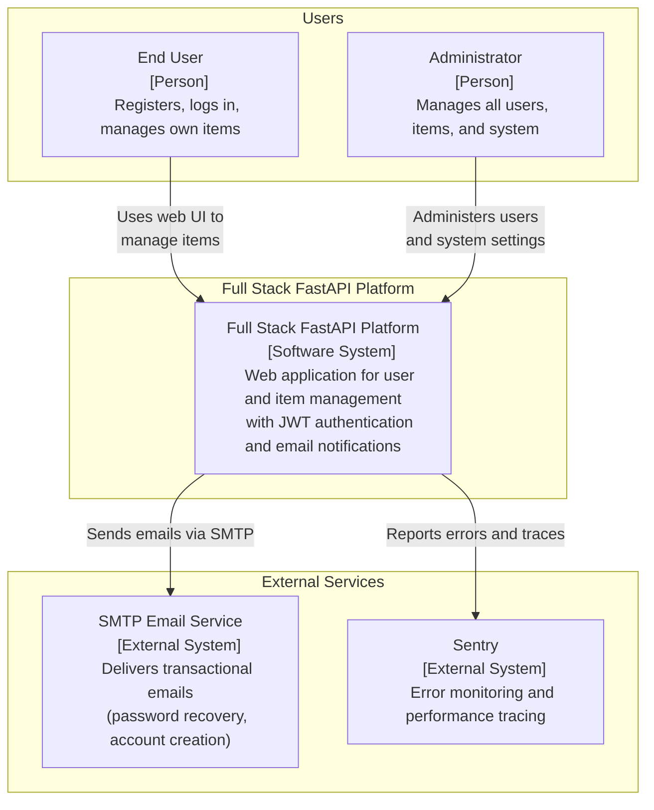
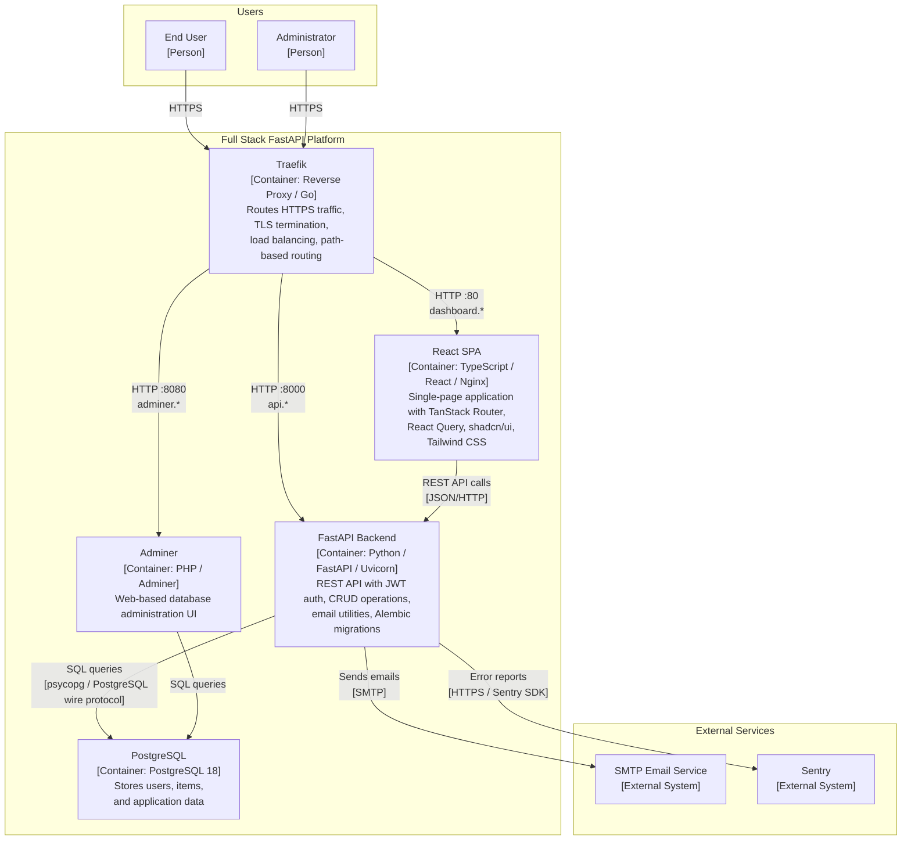
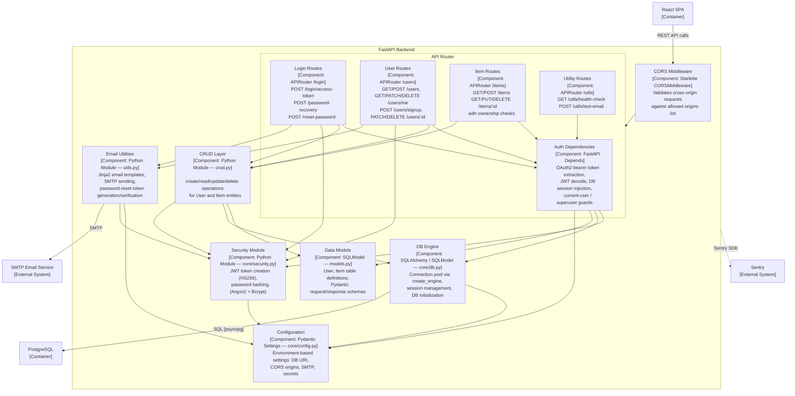
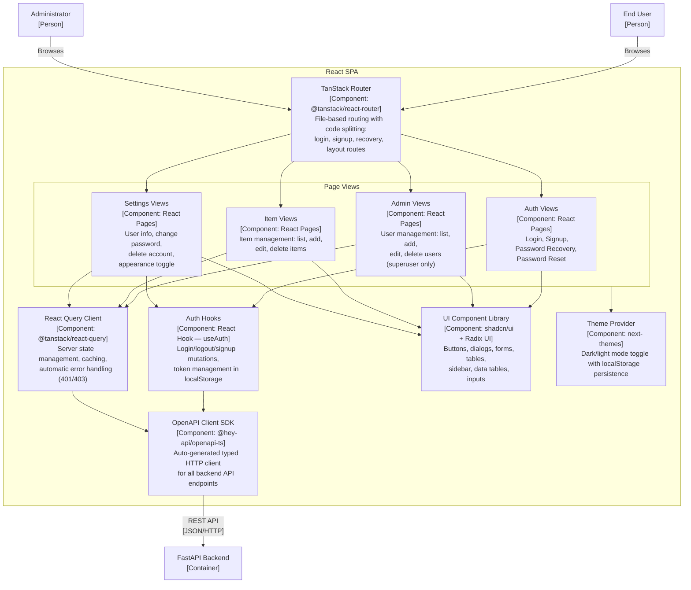

# C4 Architecture Model — Full Stack FastAPI Platform

---

## L1: System Context

Shows the Full Stack FastAPI Platform in its environment: the actors who use it
and the external systems it depends on.



---

## L2: Container

Zooms into the Full Stack FastAPI Platform to show its deployable containers,
how they communicate, and how external actors and systems connect.



---

## L3: FastAPI Backend

Component diagram for the FastAPI Backend container, showing its internal
modules: route handlers, middleware, CRUD layer, security, and data access.



---

## L3: React SPA

Component diagram for the React SPA container, showing its internal structure:
routing, state management, API client, page views, and UI components.



---

## Containment Map

Every subgraph from every diagram, with its direct children.
Indented entries indicate nesting (child-of-child).

```text
%% ── CONTAINMENT MAP ─────────────────────────────────────────────

%% ── L1 top-level groups ─────────────────────────────────────────
users            CONTAINS [end_user, admin_user]
system_boundary  CONTAINS [traefik, spa, fastapi_backend, pg, adminer]
external         CONTAINS [smtp_service, sentry_service]

%% ── L2→L3 internal containment (FastAPI Backend) ────────────────
fastapi_backend  CONTAINS [cors_mw, api_router, crud_layer, security_mod, config_mod, db_session, email_utils, models_layer]
  api_router     CONTAINS [auth_deps, login_routes, user_routes, item_routes, util_routes]

%% ── L2→L3 internal containment (React SPA) ─────────────────────
spa              CONTAINS [tanstack_router, query_client, api_client, auth_hooks, pages, ui_lib, theme_provider]
  pages          CONTAINS [auth_views, admin_views, item_views, settings_views]
```
