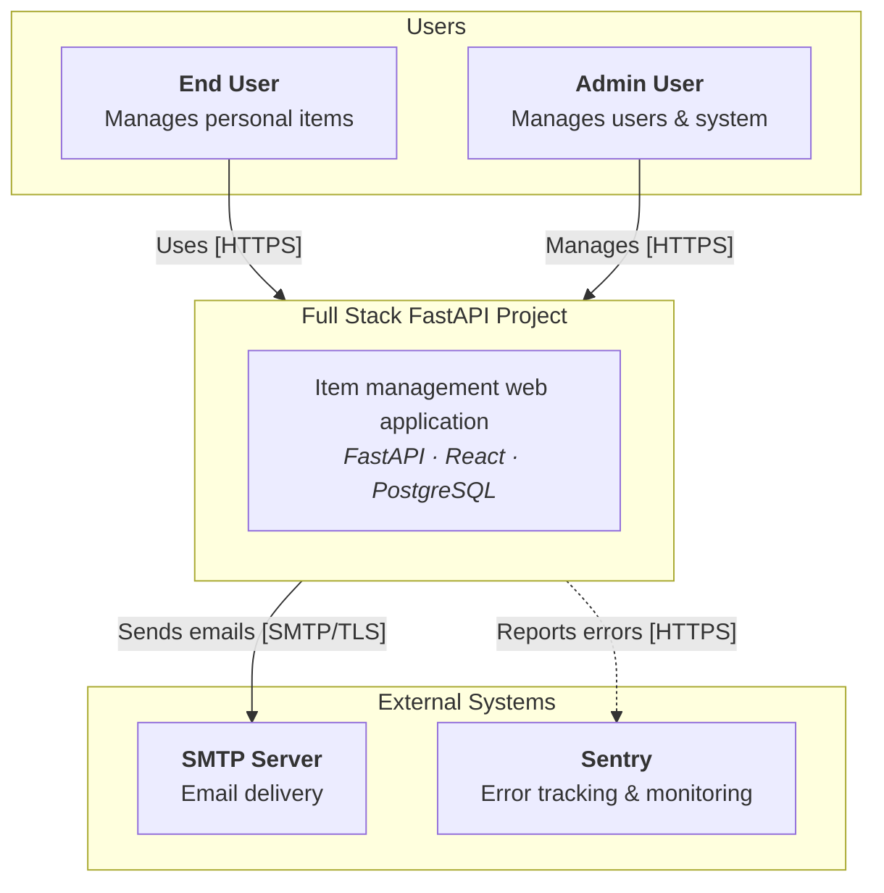
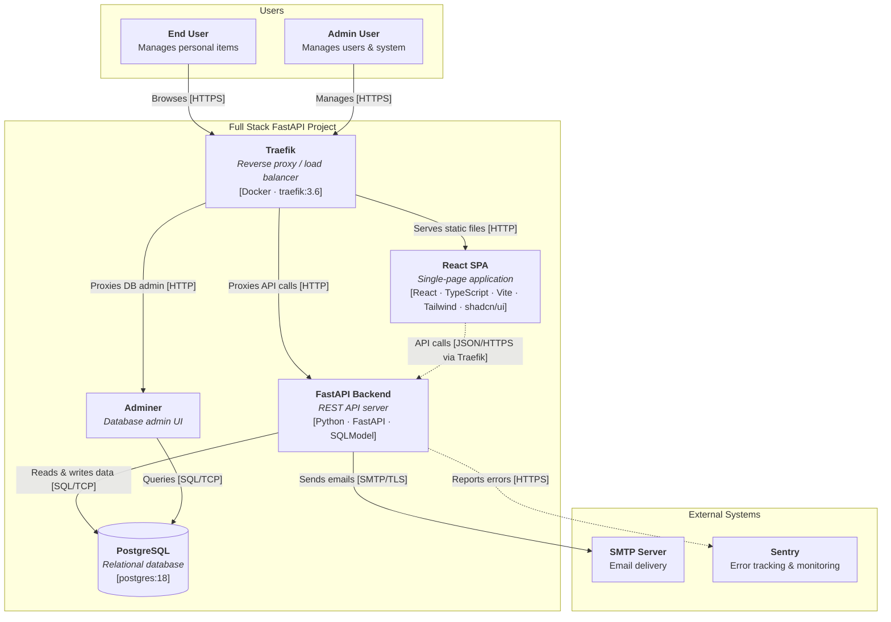
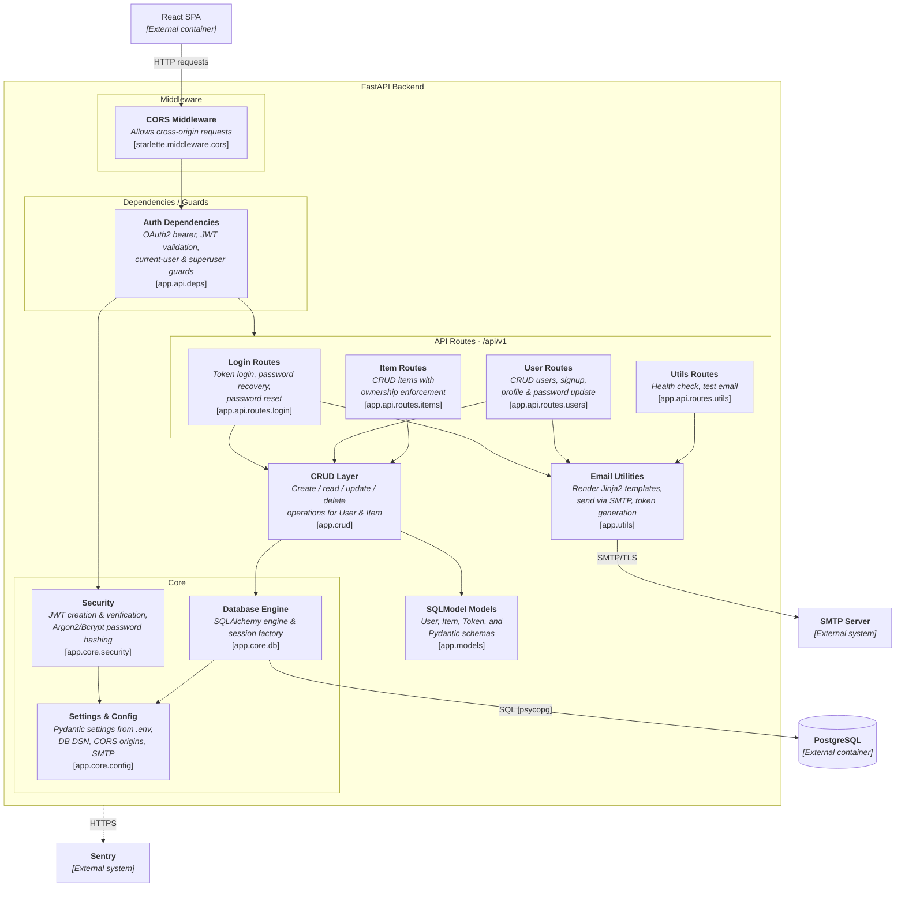
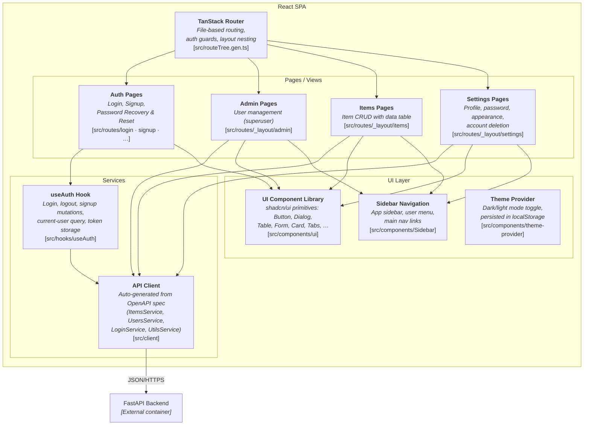

# C4 Architecture Model — Full Stack FastAPI Project

---

## L1: System Context



---

## L2: Container Diagram



---

## L3: FastAPI Backend



---

## L3: React SPA



---

## Containment Map

```text
%% ═══════════════════════════════════════════════════════════════════
%% CONTAINMENT MAP — Full Stack FastAPI Project
%% Covers L1, L2, L3-Backend, L3-SPA
%% ═══════════════════════════════════════════════════════════════════

%% ── L1 top-level groups ─────────────────────────────────────────
users              CONTAINS [end_user, admin_user]
fastapi_platform   CONTAINS [traefik, react_spa, fastapi_backend, pg, adminer]
external           CONTAINS [smtp, sentry]

%% ── L2 → L3 internal containment ───────────────────────────────

%% FastAPI Backend (L3)
fastapi_backend    CONTAINS [middleware, deps, routes, crud_layer, models_layer, core, email_utils]
  middleware       CONTAINS [cors_mw]
  deps             CONTAINS [auth_deps]
  routes           CONTAINS [login_routes, user_routes, item_routes, utils_routes]
  core             CONTAINS [core_config, core_security, core_db]

%% React SPA (L3)
react_spa          CONTAINS [tanstack_router, pages, services_layer, ui_layer]
  pages            CONTAINS [auth_views, admin_views, items_views, settings_views]
  services_layer   CONTAINS [api_client, auth_hook]
  ui_layer         CONTAINS [sidebar, ui_components, theme_provider]
```
