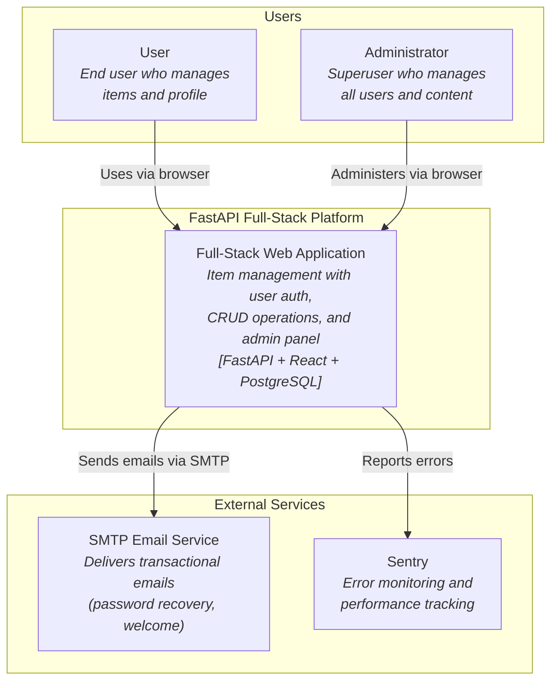
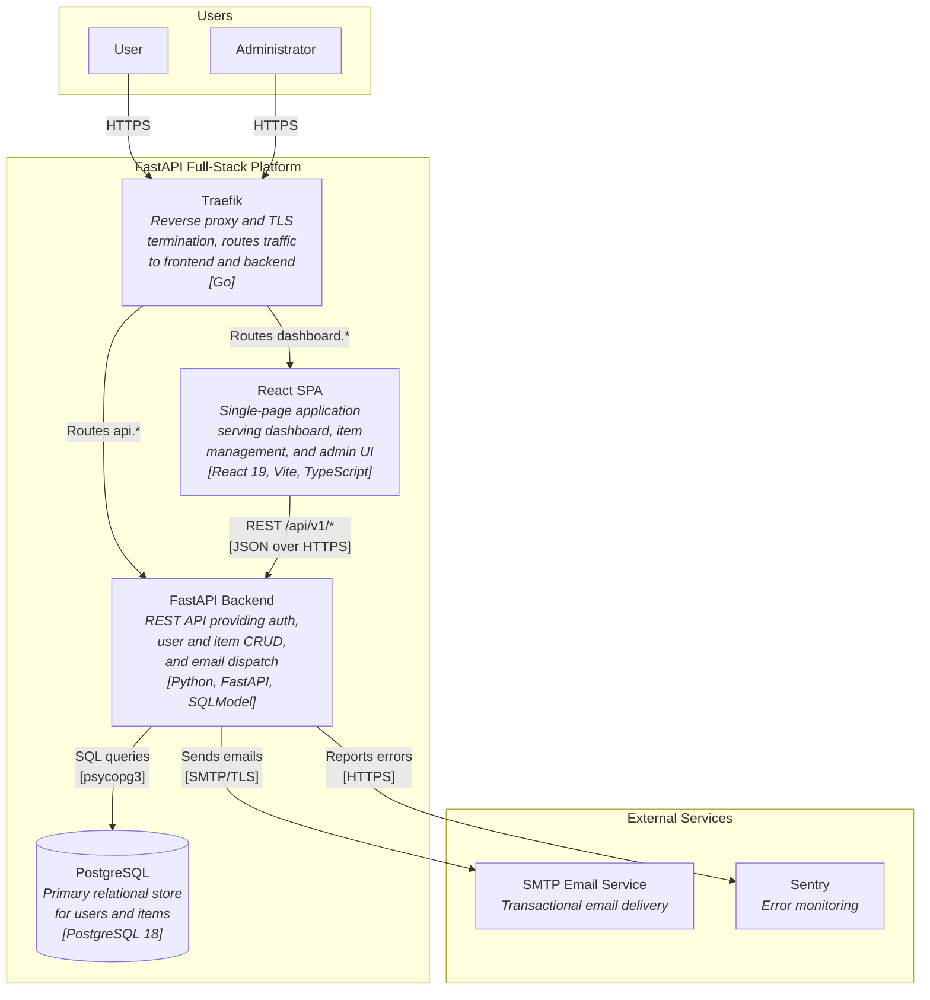
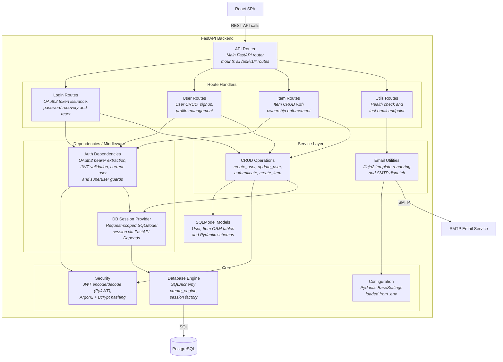
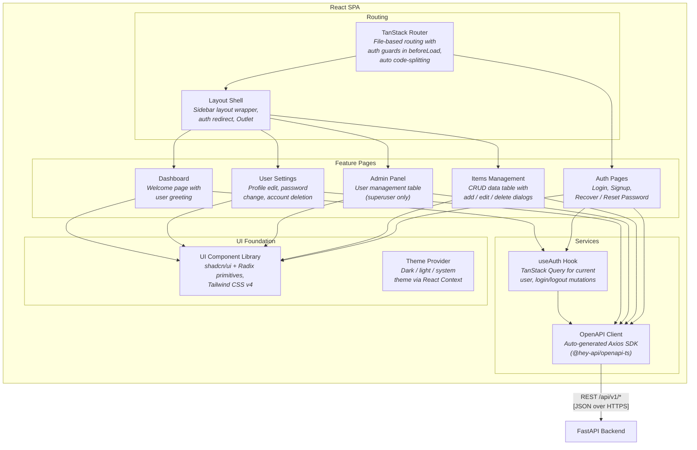

# C4 Architecture Model — FastAPI Full-Stack Platform

> Auto-generated C4 model for the
> [full-stack-fastapi-template](https://github.com/fastapi/full-stack-fastapi-template)
> codebase. Covers L1 (System Context), L2 (Container), and L3 (Component)
> diagrams with a complete containment map.

---

## L1: System Context



---

## L2: Container



---

## L3: FastAPI Backend



---

## L3: React SPA



---

## Containment Map

```text
%% ── L1 top-level groups ────────────────────────────────────────────
users              CONTAINS [user, admin_user]
platform_boundary  CONTAINS [traefik, spa, fastapi, pg]
external           CONTAINS [smtp, sentry]

%% ── L2 → L3: FastAPI Backend ───────────────────────────────────────
fastapi    CONTAINS [api_router, routes, middleware, services, core, models_layer]
  routes     CONTAINS [login_routes, user_routes, item_routes, util_routes]
  middleware CONTAINS [auth_deps, db_session]
  services   CONTAINS [crud_layer, email_utils]
  core       CONTAINS [core_config, core_security, core_db]

%% ── L2 → L3: React SPA ────────────────────────────────────────────
spa            CONTAINS [routing, features, services_layer, ui_layer]
  routing        CONTAINS [tanstack_router, layout]
  features       CONTAINS [auth_pages, dashboard_page, items_feature, admin_feature, settings_feature]
  services_layer CONTAINS [api_client, auth_hook]
  ui_layer       CONTAINS [ui_components, theme_provider]
```
