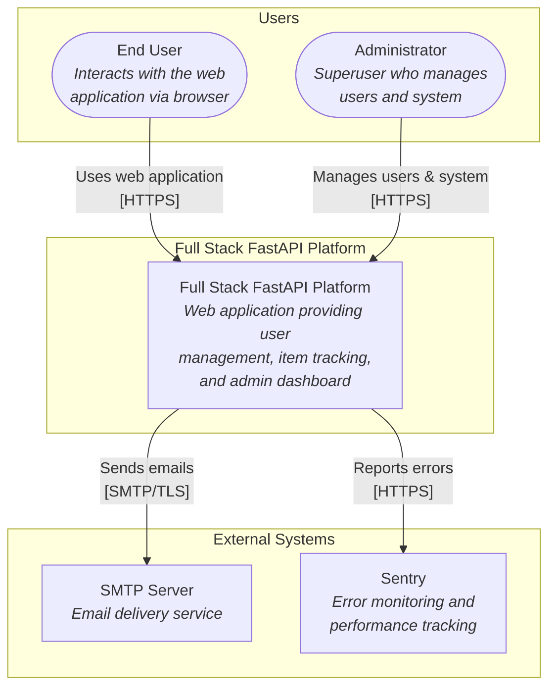
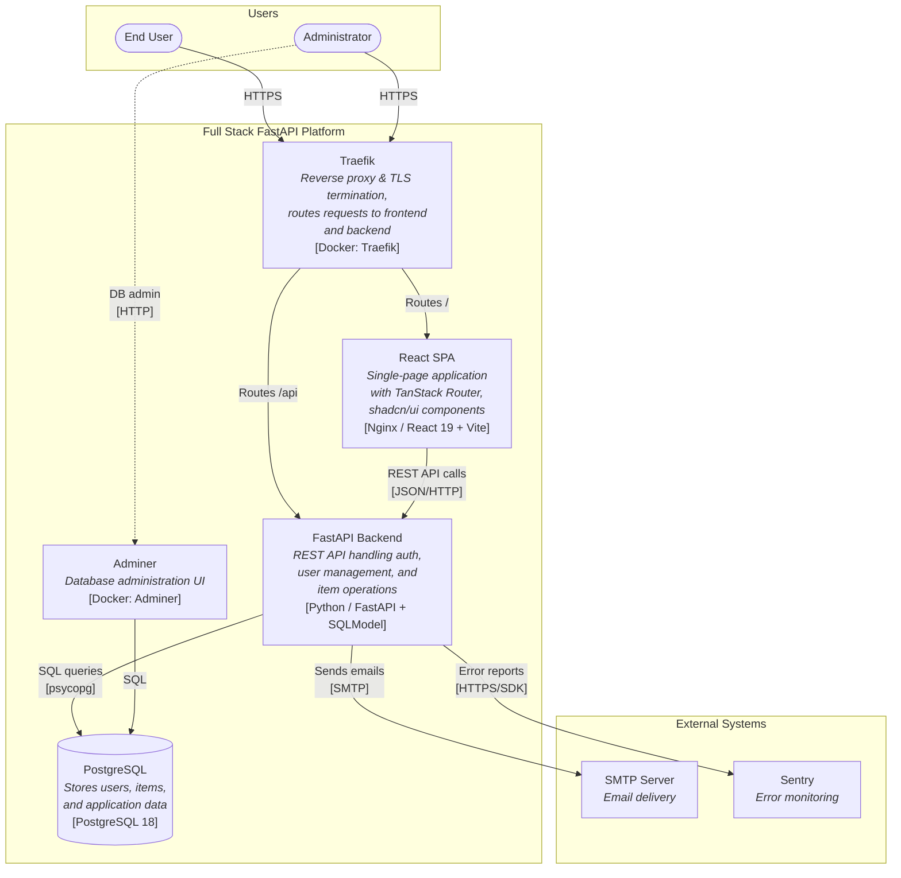
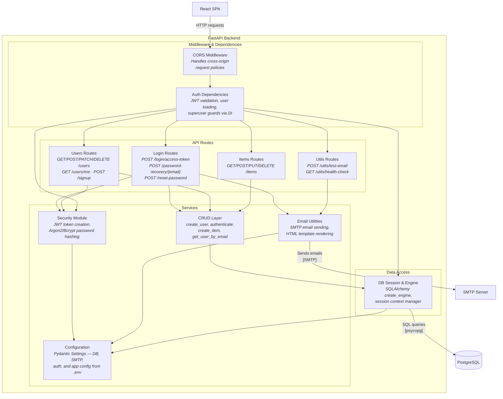
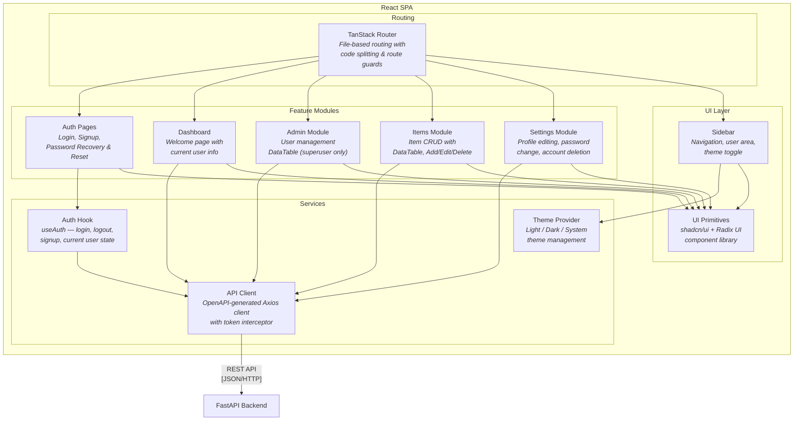

# C4 Architecture Model — Full Stack FastAPI Platform

---

## L1: System Context



---

## L2: Container



---

## L3: FastAPI Backend



---

## L3: React SPA



---

## Containment Map

```text
%% ── CONTAINMENT MAP ─────────────────────────────────────────────
%%
%% Every subgraph from every diagram appears as a CONTAINS entry.
%% Nesting is expressed by indentation: child groups are indented
%% under their parent.

%% ── L1 top-level groups ─────────────────────────────────────────
users            CONTAINS [user, admin_user]
system_boundary  CONTAINS [traefik, spa, fastapi_backend, pg, adminer]
external         CONTAINS [smtp, sentry]

%% ── L2→L3 internal containment (FastAPI Backend) ────────────────
fastapi_backend  CONTAINS [mw, routes, services, data_access]
  mw             CONTAINS [cors_mw, auth_deps]
  routes         CONTAINS [login_routes, users_routes, items_routes, utils_routes]
  services       CONTAINS [crud_layer, security_mod, email_utils, config_mod]
  data_access    CONTAINS [db_session]

%% ── L2→L3 internal containment (React SPA) ─────────────────────
spa              CONTAINS [routing, features, services_layer, ui_layer]
  routing        CONTAINS [tanstack_router]
  features       CONTAINS [auth_pages, dashboard_page, admin_mod, items_mod, settings_mod]
  services_layer CONTAINS [auth_hook, api_client, theme_provider]
  ui_layer       CONTAINS [sidebar_comp, ui_primitives]
```
