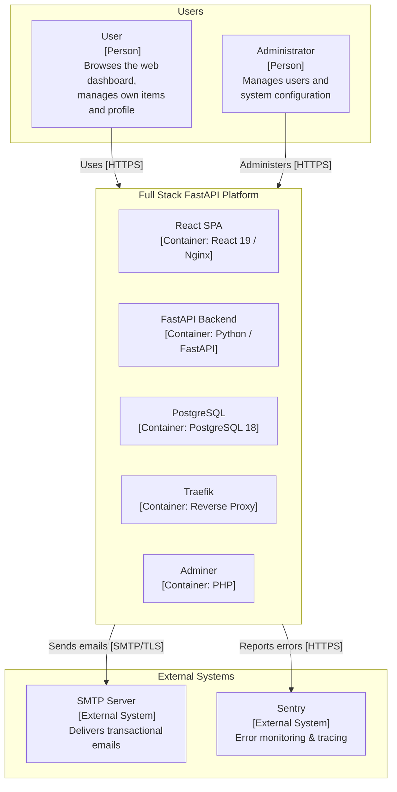
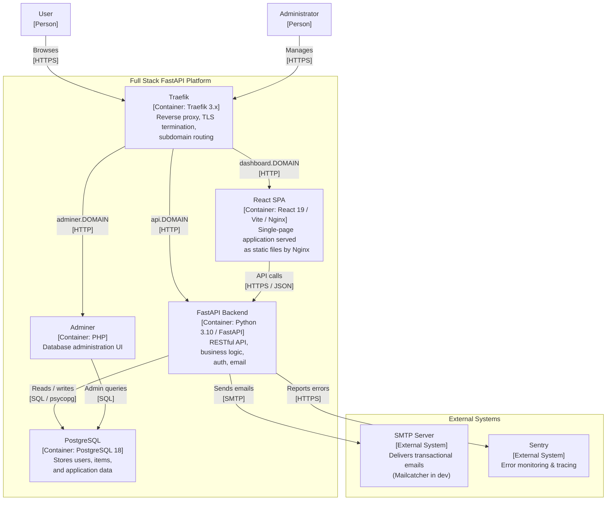
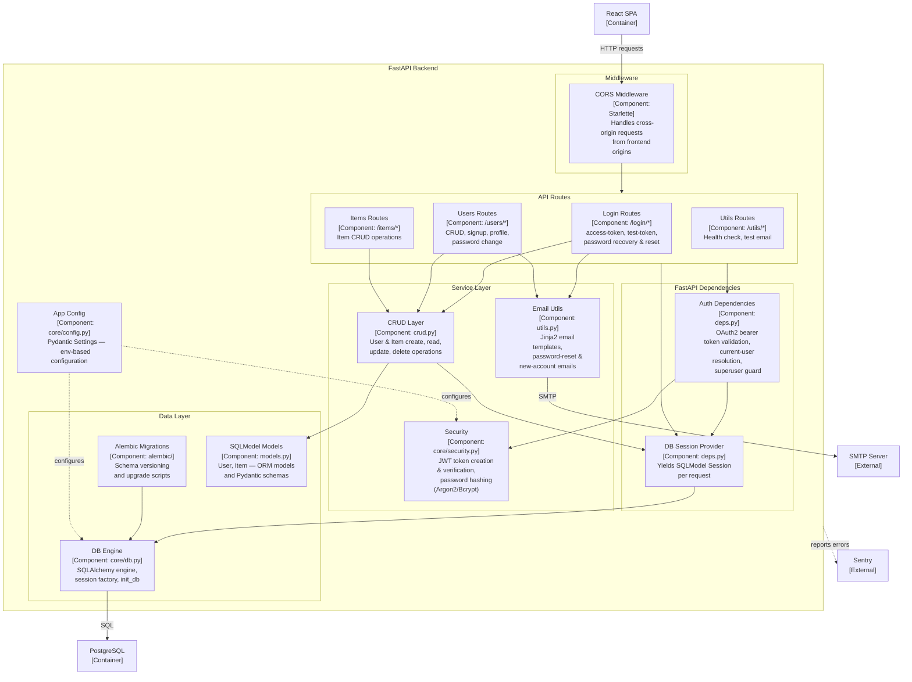
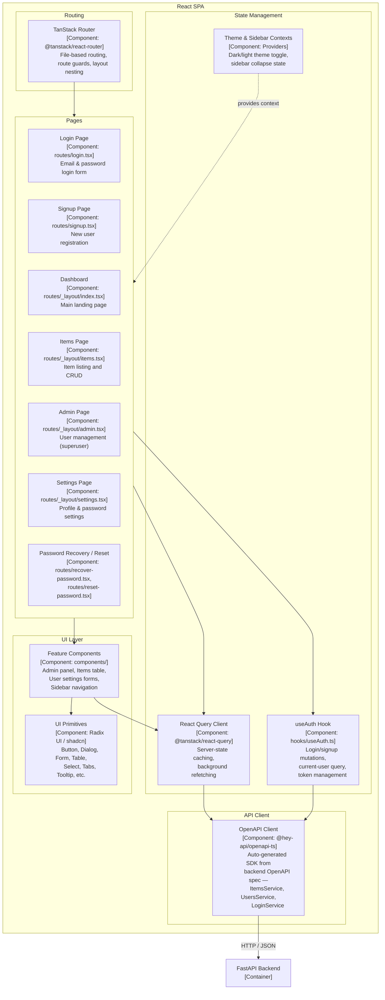

# C4 Architecture Model — Full Stack FastAPI Platform

---

## L1: System Context



---

## L2: Container Diagram



---

## L3: FastAPI Backend



---

## L3: React SPA



---

## Containment Map

```text
%% ═══════════════════════════════════════════════════════════════════
%% CONTAINMENT MAP — Full Stack FastAPI Platform
%% Every subgraph from every diagram appears as a CONTAINS entry.
%% Indentation shows nesting depth.
%% ═══════════════════════════════════════════════════════════════════

%% ── L1 top-level groups ────────────────────────────────────────────
users              CONTAINS [user, admin_user]
platform_boundary  CONTAINS [traefik_proxy, react_spa, fastapi_api, pg, adminer]
external           CONTAINS [smtp_server, sentry]

%% ── L2 → L3 internal containment ──────────────────────────────────

%% ── FastAPI Backend (fastapi_api) ──────────────────────────────────
fastapi_api        CONTAINS [middleware, api_routes, dependencies, services, data_layer, app_config]
  middleware       CONTAINS [cors_mw]
  api_routes       CONTAINS [login_routes, users_routes, items_routes, utils_routes]
  dependencies     CONTAINS [auth_deps, db_session_dep]
  services         CONTAINS [crud_layer, security, email_utils]
  data_layer       CONTAINS [models_layer, db_engine, alembic_migrations]

%% ── React SPA (react_spa) ──────────────────────────────────────────
react_spa          CONTAINS [routing, pages, state_mgmt, ui_layer, client_layer]
  routing          CONTAINS [tanstack_router]
  pages            CONTAINS [login_page, signup_page, dashboard_page, items_page, admin_page, settings_page, password_pages]
  state_mgmt       CONTAINS [query_client, auth_hook, theme_context]
  ui_layer         CONTAINS [ui_components, feature_components]
  client_layer     CONTAINS [api_client]
```
