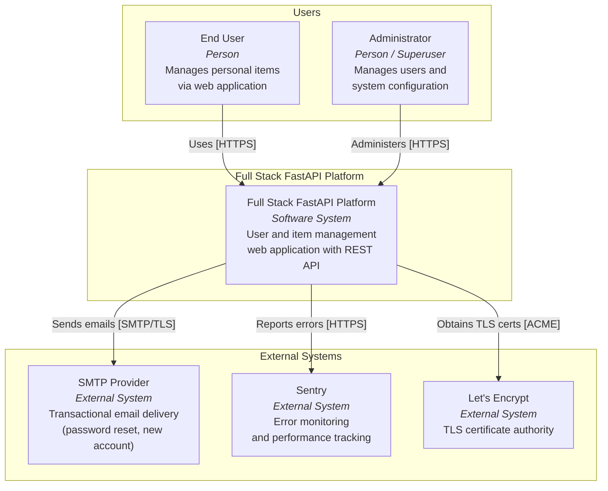
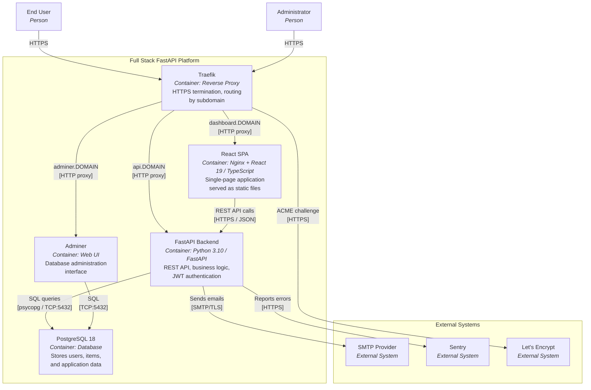
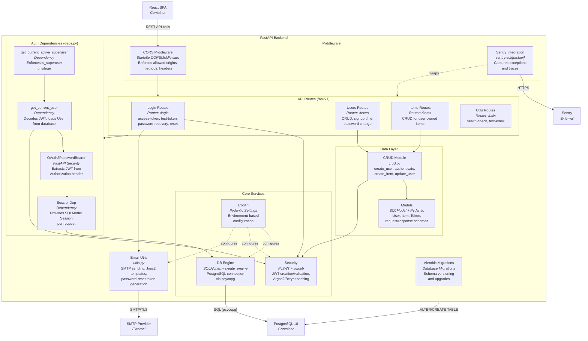
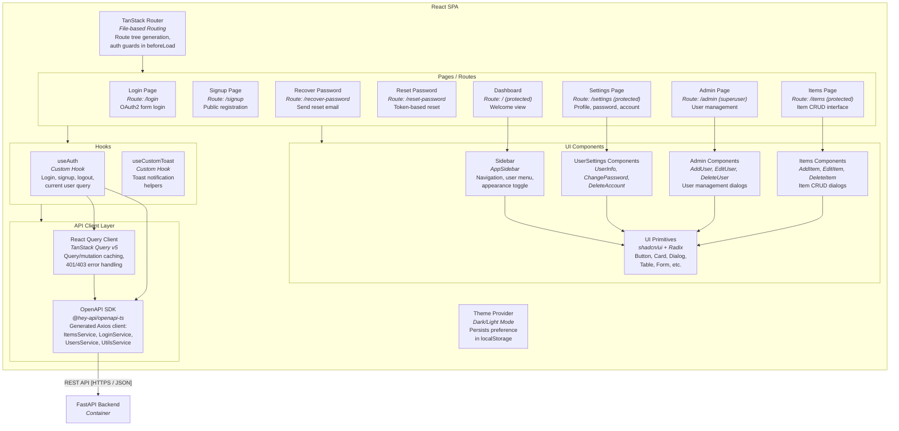

# C4 Architecture Model – Full Stack FastAPI Platform

---

## L1: System Context



---

## L2: Container Diagram



---

## L3: FastAPI Backend



---

## L3: React SPA



---

## Containment Map

```text
%% ═══════════════════════════════════════════════════════════════════
%% CONTAINMENT MAP — covers ALL levels (L1 → L2 → L3)
%% Every subgraph and its children are listed.
%% Nesting is expressed by indentation.
%% ═══════════════════════════════════════════════════════════════════

%% ── L1 top-level groups ────────────────────────────────────────────
users              CONTAINS [user, admin]
system_boundary    CONTAINS [fullstack_platform, traefik, spa, fastapi_backend, pg, adminer_ctr]
external           CONTAINS [smtp_ext, sentry_ext, letsencrypt]

%% ── L2 system boundary (containers) ───────────────────────────────
system_boundary    CONTAINS [traefik, spa, fastapi_backend, pg, adminer_ctr]

%% ── L3: FastAPI Backend ───────────────────────────────────────────
fastapi_backend    CONTAINS [middleware, auth, routes, data, core, email_utils, alembic_migrations]
  middleware       CONTAINS [cors_mw, sentry_integration]
  auth             CONTAINS [oauth2_bearer, session_dep, get_current_user_dep, get_superuser_dep]
  routes           CONTAINS [login_routes, users_routes, items_routes, utils_routes]
  data             CONTAINS [crud_layer, models_layer]
  core             CONTAINS [config_mod, db_engine, security_mod]

%% ── L3: React SPA ────────────────────────────────────────────────
spa                CONTAINS [router, pages, components, hooks_layer, api_layer, theme_provider]
  pages            CONTAINS [login_page, signup_page, recover_page, reset_page, dashboard_page, items_page, admin_page, settings_page]
  components       CONTAINS [sidebar_comp, items_components, admin_components, settings_components, ui_lib]
  hooks_layer      CONTAINS [use_auth, use_toast]
  api_layer        CONTAINS [api_client, query_client]
```
