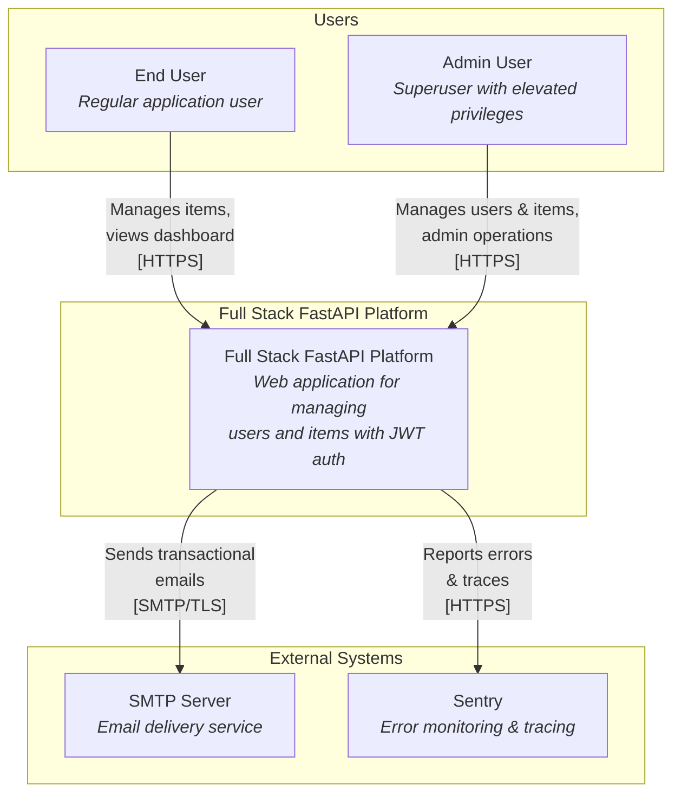
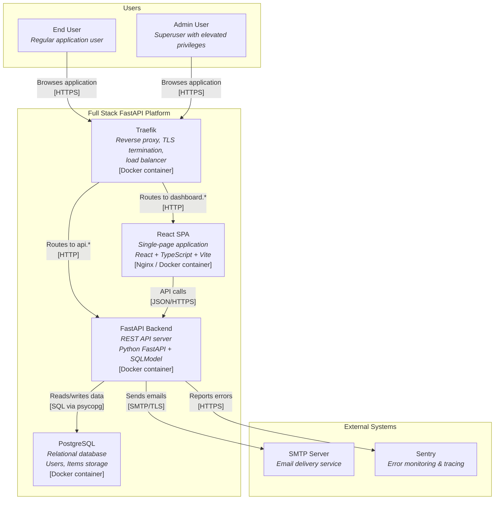
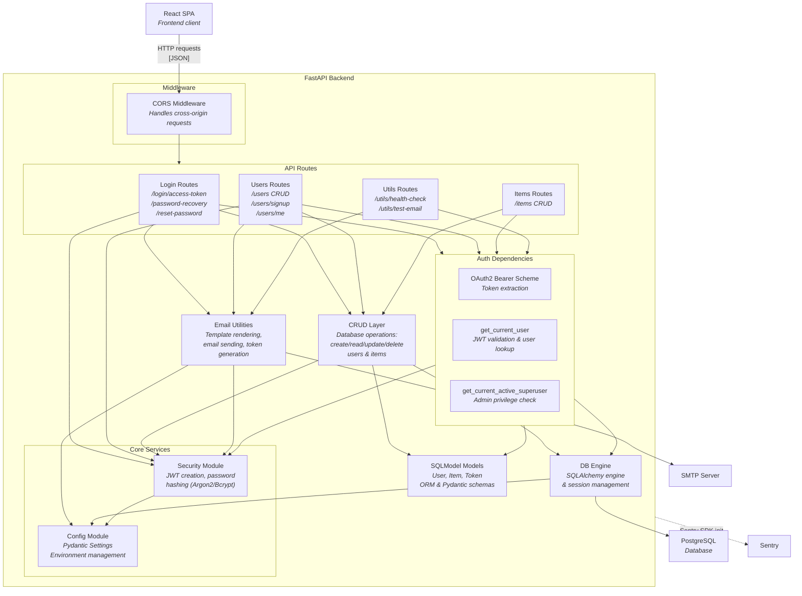
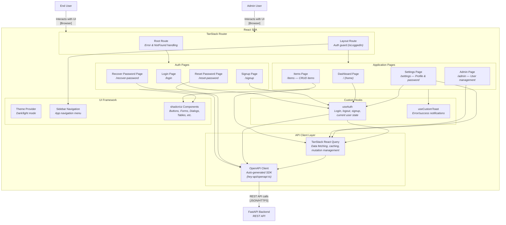
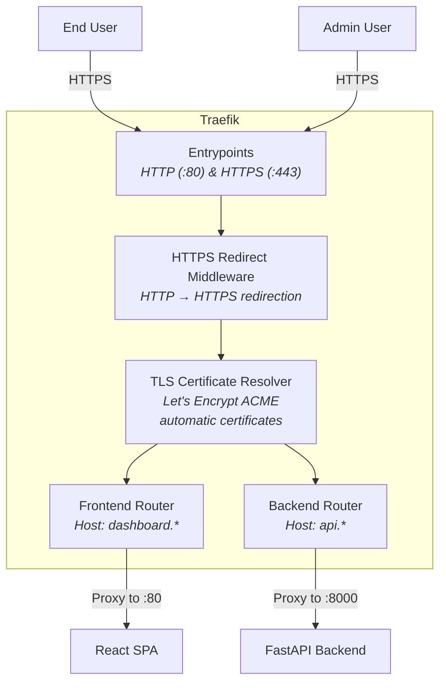
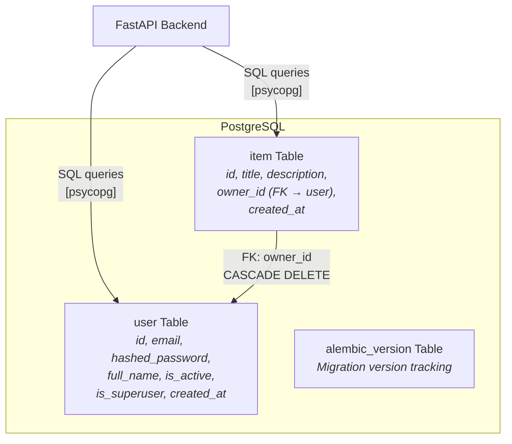

# C4 Architecture Model — Full Stack FastAPI Template

---

## L1: System Context



---

## L2: Container Diagram



---

## L3: FastAPI Backend



---

## L3: React SPA



---

## L3: Traefik



---

## L3: PostgreSQL



---

## Containment Map

```text
%% ══════════════════════════════════════════════════════════════════════
%% CONTAINMENT MAP
%% ══════════════════════════════════════════════════════════════════════

%% ── L1 top-level groups ─────────────────────────────────────────────
users            CONTAINS [end_user, admin_user]
system_boundary  CONTAINS [traefik, react_spa, fastapi_backend, pg]
external         CONTAINS [smtp, sentry]

%% ── L2→L3 internal containment ─────────────────────────────────────

%% FastAPI Backend (L3)
fastapi_backend  CONTAINS [middleware, auth_deps, routes, core, email_utils, crud_layer, models_layer, db_engine]
  middleware     CONTAINS [cors_mw]
  auth_deps      CONTAINS [oauth2_scheme, get_current_user, get_superuser]
  routes         CONTAINS [login_routes, users_routes, items_routes, utils_routes]
  core           CONTAINS [security_mod, config_mod]

%% React SPA (L3)
react_spa        CONTAINS [routing, auth_pages, app_pages, api_client, hooks, ui_layer]
  routing        CONTAINS [root_route, auth_guard]
  auth_pages     CONTAINS [login_page, signup_page, recover_pw_page, reset_pw_page]
  app_pages      CONTAINS [dashboard_page, items_page, admin_page, settings_page]
  api_client     CONTAINS [openapi_client, query_client]
  hooks          CONTAINS [use_auth, use_toast]
  ui_layer       CONTAINS [theme_provider, sidebar_nav, shadcn_ui]

%% Traefik (L3)
traefik          CONTAINS [entrypoints, https_redirect, tls_resolver, frontend_router, backend_router]

%% PostgreSQL (L3)
pg               CONTAINS [user_table, item_table, alembic_version]
```
