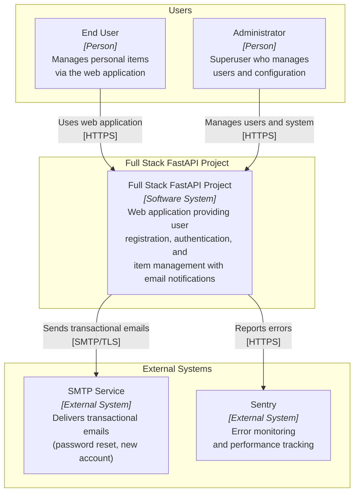
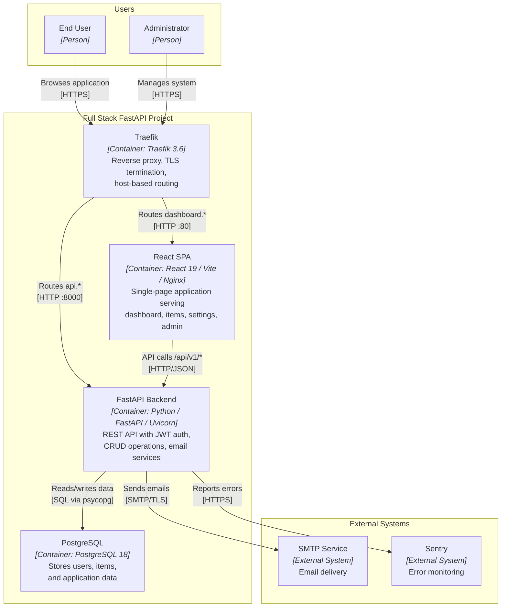
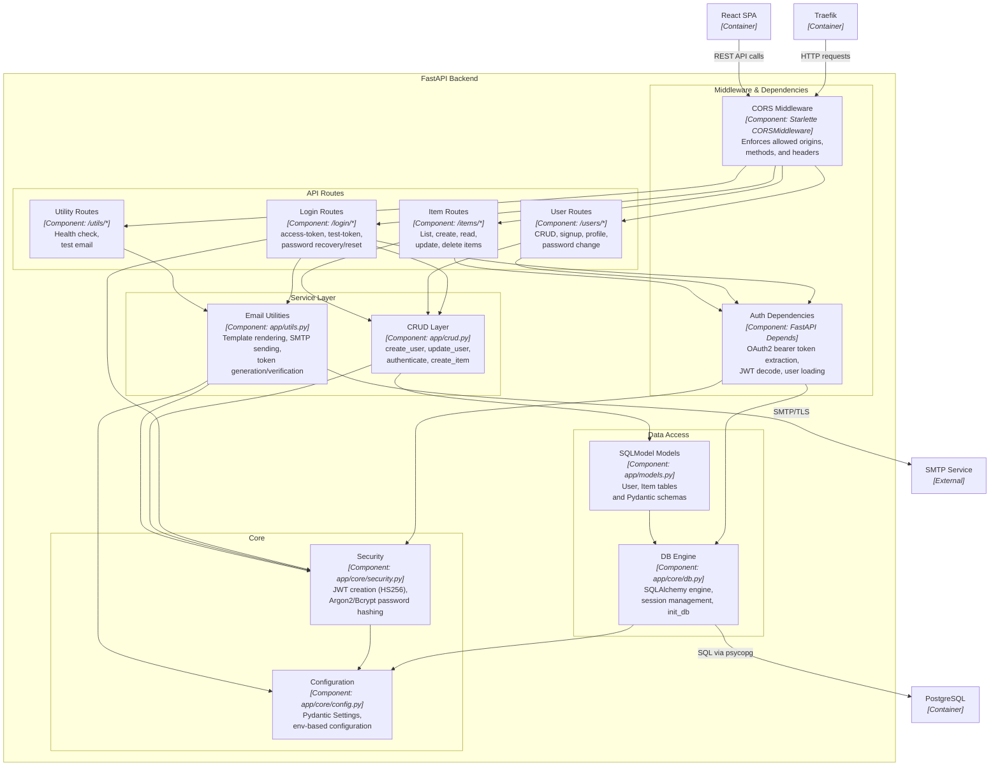
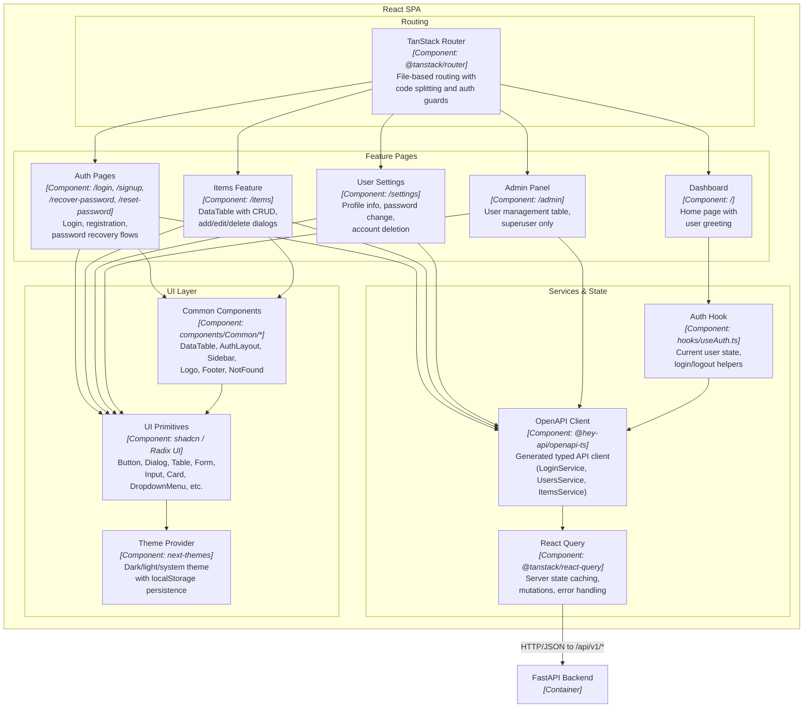

# C4 Architecture Model — Full Stack FastAPI Project

> Auto-generated C4 model covering L1 (System Context), L2 (Container),
> and L3 (Component) diagrams for the Full Stack FastAPI Project.

---

## L1: System Context



---

## L2: Container



---

## L3: FastAPI Backend



---

## L3: React SPA



---

## Containment Map

```text
%% ═══════════════════════════════════════════════════════════════════
%% CONTAINMENT MAP — Full Stack FastAPI Project
%% Covers L1, L2, and all L3 diagrams.
%% Every subgraph and its children from every diagram are listed.
%% ═══════════════════════════════════════════════════════════════════

%% ── L1 top-level groups ─────────────────────────────────────────
users            CONTAINS [end_user, admin_user]
system_boundary  CONTAINS [traefik, react_spa, fastapi_backend, pg]
external         CONTAINS [smtp, sentry]

%% ── L2→L3 internal containment (FastAPI Backend) ────────────────
fastapi_backend  CONTAINS [middleware, routes, services, core, data]
  middleware     CONTAINS [cors_mw, auth_deps]
  routes         CONTAINS [login_routes, user_routes, item_routes, util_routes]
  services       CONTAINS [crud_layer, email_utils]
  core           CONTAINS [security_core, config_core]
  data           CONTAINS [models_layer, db_engine]

%% ── L2→L3 internal containment (React SPA) ─────────────────────
react_spa        CONTAINS [routing, features, services_layer, ui_layer]
  routing        CONTAINS [tanstack_router]
  features       CONTAINS [auth_pages, dashboard_page, items_feature, settings_feature, admin_feature]
  services_layer CONTAINS [api_client, query_layer, auth_hook]
  ui_layer       CONTAINS [ui_components, common_components, theme_provider]
```
