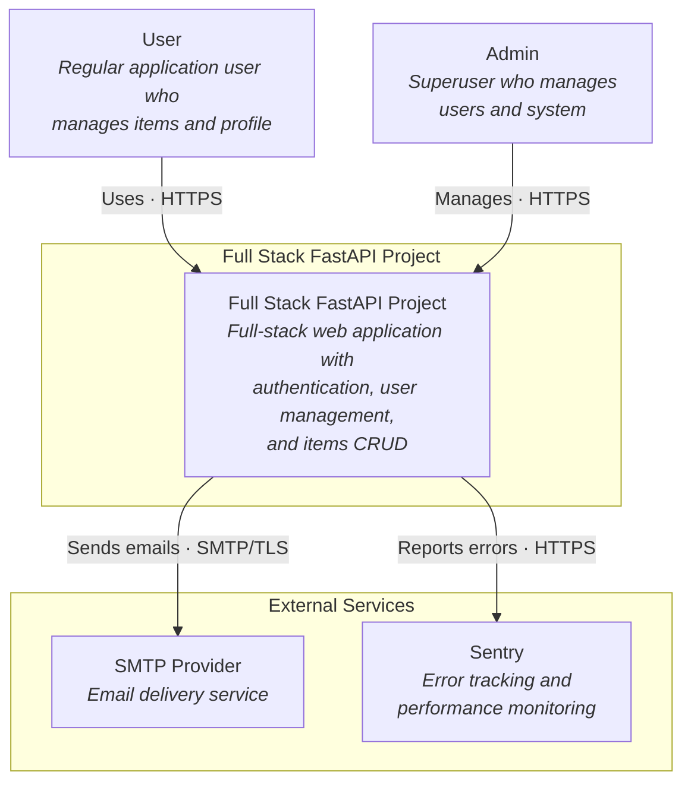
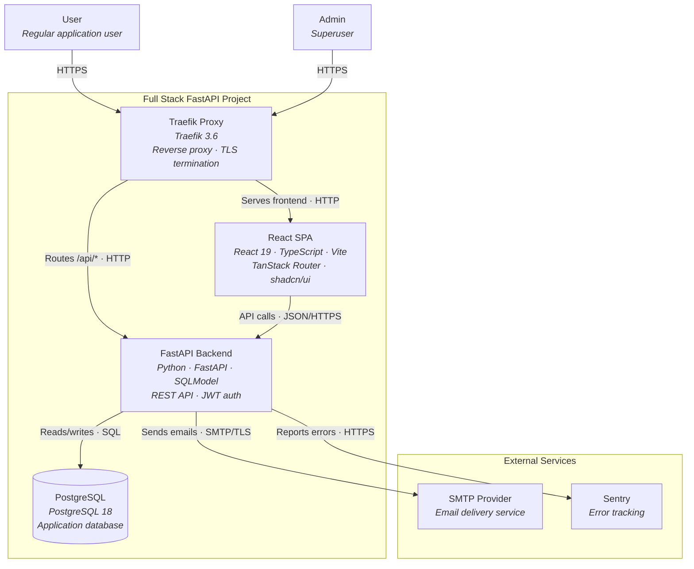
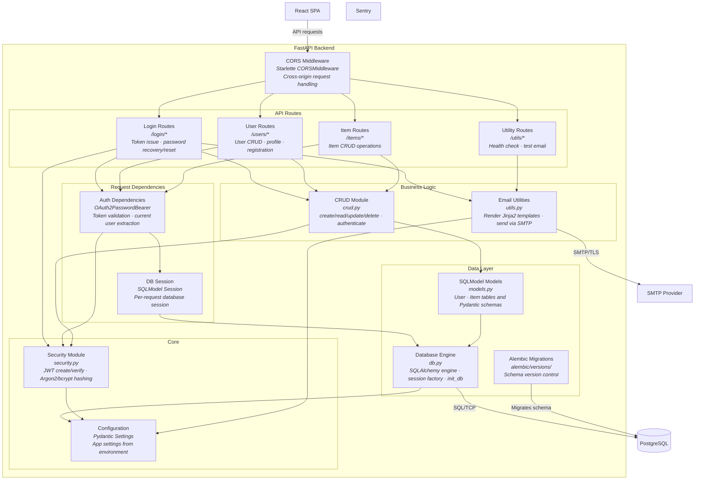
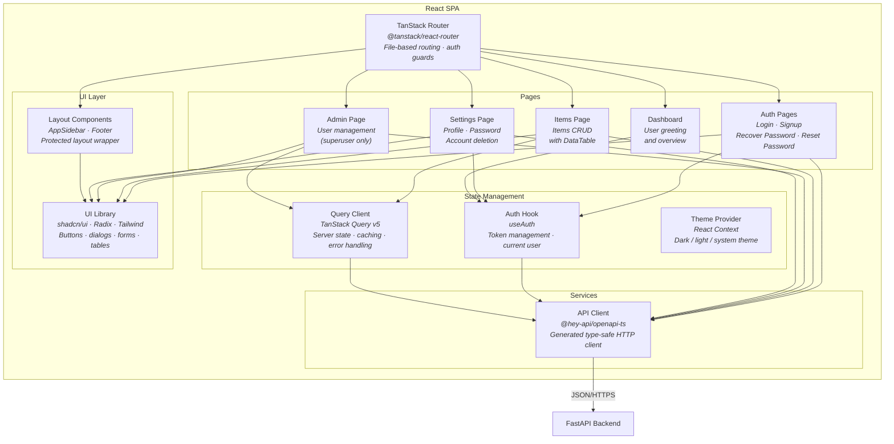

# C4 Architecture Model – Full Stack FastAPI Project

---

## L1: System Context



---

## L2: Container



---

## L3: FastAPI Backend



---

## L3: React SPA



---

## Containment Map

```text
%% ── CONTAINMENT MAP ──────────────────────────────────────────────
%%
%% Every subgraph from every diagram is listed.
%% Nesting is expressed by indentation.
%%
%% ── L1 top-level groups ─────────────────────────────────────────
system_boundary  CONTAINS [system]
external         CONTAINS [smtp, sentry]

%% ── L2 system internals (system_boundary zoomed in) ─────────────
system_boundary  CONTAINS [traefik, spa, fastapi, pg]
external         CONTAINS [smtp, sentry]

%% ── L3: FastAPI Backend ──────────────────────────────────────────
fastapi          CONTAINS [cors_mw, routes, deps_layer, business_layer, core_layer, data_layer]
  routes         CONTAINS [login_routes, user_routes, item_routes, util_routes]
  deps_layer     CONTAINS [auth_deps, db_deps]
  business_layer CONTAINS [crud, email_utils]
  core_layer     CONTAINS [core_security, core_config]
  data_layer     CONTAINS [models, core_db, alembic_mig]

%% ── L3: React SPA ───────────────────────────────────────────────
spa              CONTAINS [tanstack_router, pages, state_mgmt, services_layer, ui_layer]
  pages          CONTAINS [auth_pages, dashboard_page, items_page, admin_page, settings_page]
  state_mgmt     CONTAINS [query_client, auth_hook, theme_provider]
  services_layer CONTAINS [api_client]
  ui_layer       CONTAINS [layout_cmp, ui_lib]
```

---

## ID Cross-Reference

Stable IDs that appear across multiple diagrams:

| ID | L1 | L2 | L3: FastAPI | L3: SPA | Role |
|----|----|----|-------------|---------|------|
| `user` | Actor | Actor | — | — | Regular user |
| `admin` | Actor | Actor | — | — | Superuser |
| `system_boundary` | Subgraph | Subgraph | — | — | System boundary |
| `system` | Node | — | — | — | L1 system black box |
| `traefik` | — | Container | — | — | Reverse proxy |
| `spa` | — | Container | — | Scope boundary | React SPA |
| `fastapi` | — | Container | Scope boundary | External ref | FastAPI Backend |
| `pg` | — | Container DB | External ref | — | PostgreSQL |
| `smtp` | External | External | External ref | — | SMTP Provider |
| `sentry` | External | External | External ref | — | Error tracking |
| `external` | Subgraph | Subgraph | — | — | External services group |
