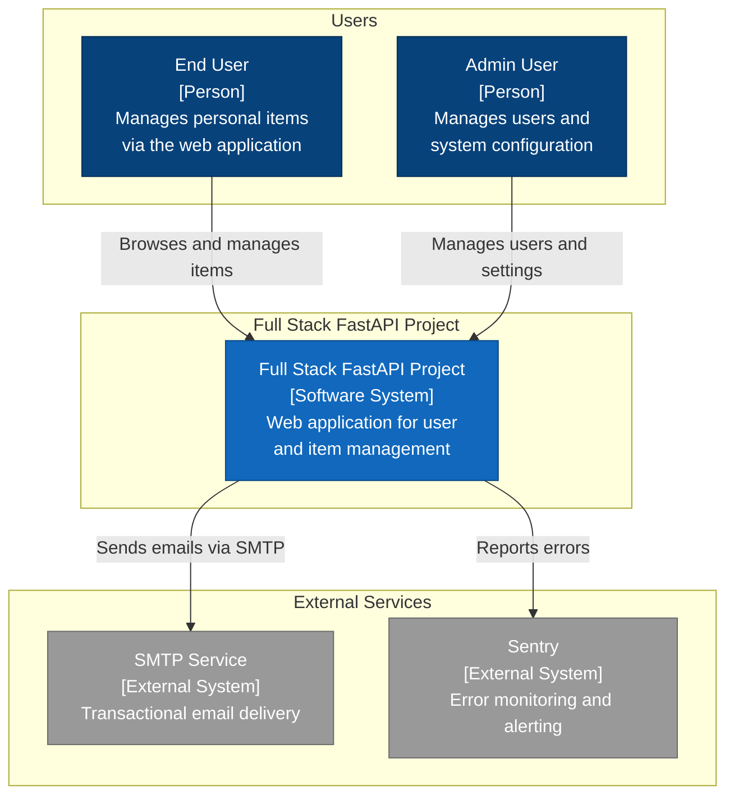
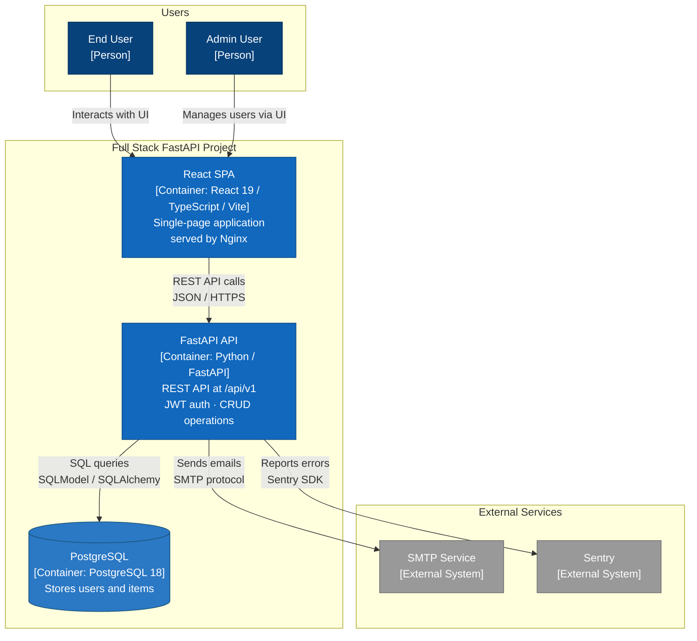
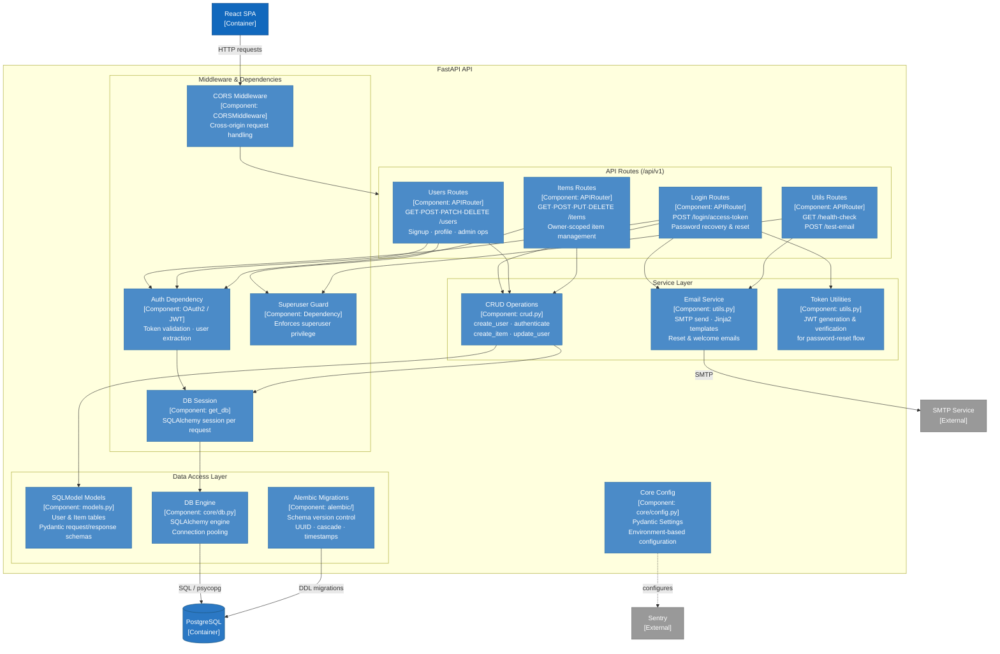
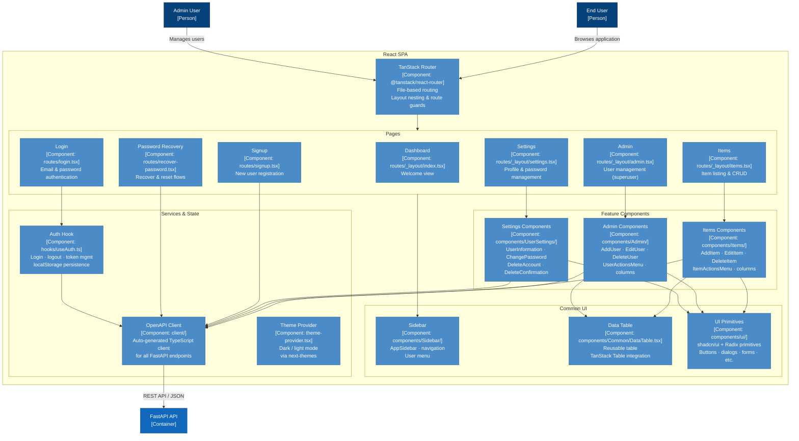

# C4 Architecture Model — Full Stack FastAPI Project

> Auto-generated C4 model for the
> [Full Stack FastAPI Project](https://github.com/fastapi/full-stack-fastapi-template).

---

## L1: System Context



---

## L2: Container Diagram



---

## L3: FastAPI API



---

## L3: React SPA



---

## Containment Map

```text
%% ═══════════════════════════════════════════════════════════════
%% CONTAINMENT MAP — Full Stack FastAPI Project
%% Covers L1, L2, and all L3 diagrams.
%% Every subgraph and its children are listed below.
%% ═══════════════════════════════════════════════════════════════

%% ── L1 top-level groups ──────────────────────────────────────────
users              CONTAINS [user, admin_user]
fullstack_boundary CONTAINS [fullstack_platform, react_spa, fastapi_api, pg]
external           CONTAINS [smtp, sentry]

%% ── L2→L3 FastAPI API ───────────────────────────────────────────
fastapi_api CONTAINS [middleware, routes, services, data_access, core_config]
  middleware   CONTAINS [cors_mw, auth_dep, db_dep, superuser_dep]
  routes       CONTAINS [login_routes, users_routes, items_routes, utils_routes]
  services     CONTAINS [crud_layer, email_service, token_utils]
  data_access  CONTAINS [models_layer, db_engine, alembic_mig]

%% ── L2→L3 React SPA ─────────────────────────────────────────────
react_spa CONTAINS [routing, pages, features, common_ui, services_layer]
  pages          CONTAINS [dashboard_page, login_page, signup_page, items_page, admin_page, settings_page, recovery_pages]
  features       CONTAINS [items_feat, admin_feat, settings_feat]
  common_ui      CONTAINS [sidebar_ui, data_table, ui_primitives]
  services_layer CONTAINS [api_client, auth_hook, theme_provider]
```
