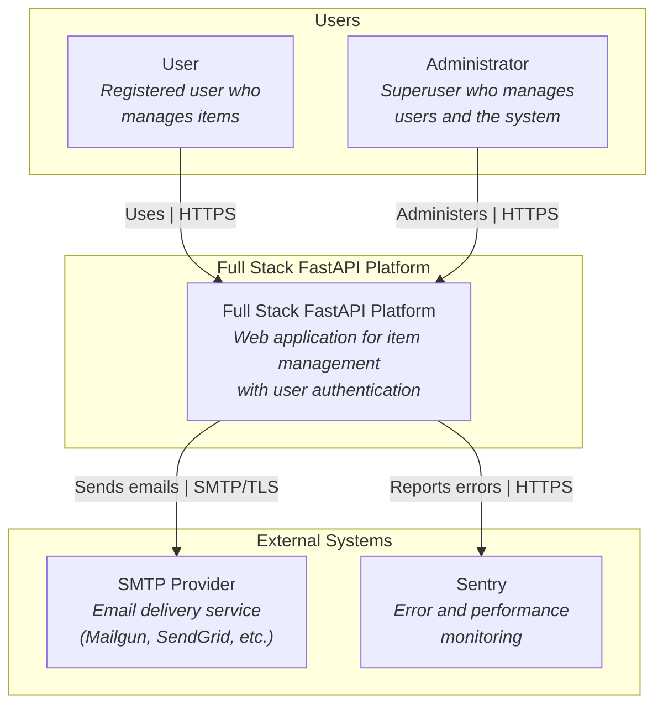
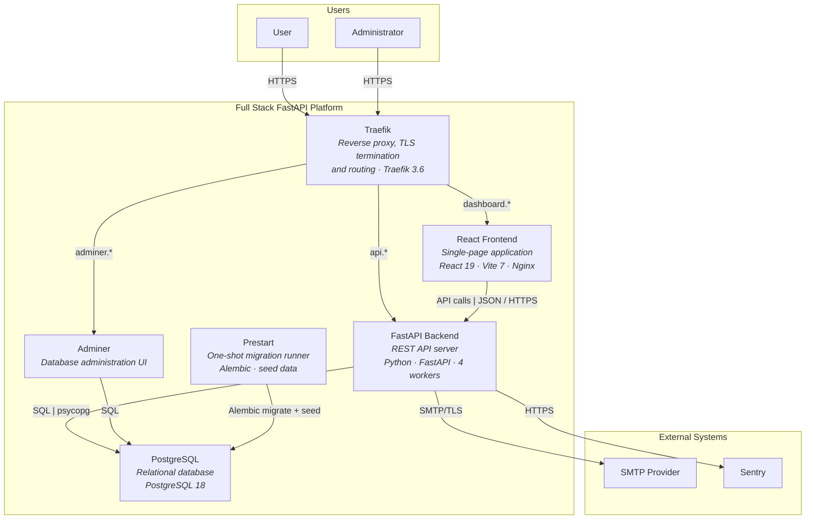
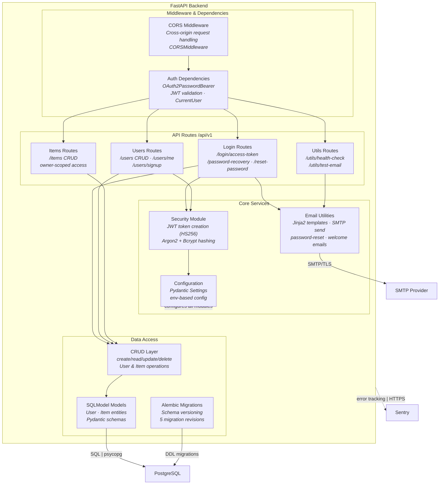
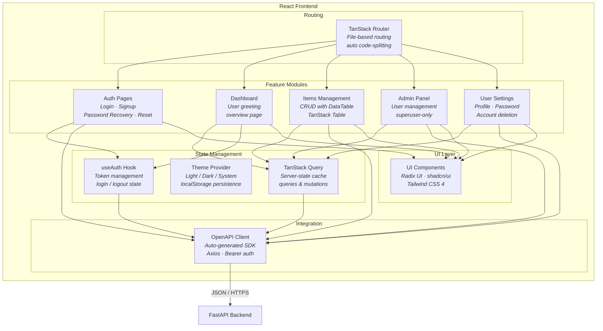

# C4 Architecture Model – Full Stack FastAPI Platform

---

## L1: System Context



---

## L2: Container



---

## L3: FastAPI Backend



---

## L3: React Frontend



---

## Containment Map

```text
%% ═══════════════════════════════════════════════════════════════════
%% CONTAINMENT MAP – Full Stack FastAPI Platform
%% Every subgraph from every diagram appears as a CONTAINS entry.
%% Indentation denotes nesting depth.
%% ═══════════════════════════════════════════════════════════════════

%% ── L1 top-level groups ────────────────────────────────────────────
users              CONTAINS [user, admin_user]
platform_boundary  CONTAINS [platform]
external           CONTAINS [smtp, sentry]

%% ── L2 platform internals ──────────────────────────────────────────
platform_boundary  CONTAINS [traefik, spa, fastapi_api, pg, adminer, prestart]

%% ── L3: FastAPI Backend (fastapi_api) ──────────────────────────────
fastapi_api        CONTAINS [middleware, routes, services, data]
  middleware       CONTAINS [cors_mw, auth_deps]
  routes           CONTAINS [login_routes, users_routes, items_routes, utils_routes]
  services         CONTAINS [security_mod, email_utils, config_mod]
  data             CONTAINS [crud_layer, models_layer, alembic_mig]

%% ── L3: React Frontend (spa) ──────────────────────────────────────
spa                CONTAINS [routing, state, features, integration_layer, ui]
  routing          CONTAINS [router]
  state            CONTAINS [query_client, theme_ctx, auth_hook]
  features         CONTAINS [auth_pages, dashboard_feat, items_feat, admin_feat, settings_feat]
  integration_layer CONTAINS [api_client]
  ui               CONTAINS [ui_kit]
```

---

## Stable ID Cross-Reference

| Stable ID        | L1          | L2               | L3 Scope Boundary |
|------------------|-------------|------------------|--------------------|
| `user`           | actor node  | actor node       | —                  |
| `admin_user`     | actor node  | actor node       | —                  |
| `platform`       | system node | _(boundary)_     | —                  |
| `spa`            | —           | container node   | scope boundary (L3)|
| `fastapi_api`    | —           | container node   | scope boundary (L3)|
| `pg`             | —           | container node   | external on L3     |
| `smtp`           | external    | external         | external on L3     |
| `sentry`         | external    | external         | external on L3     |
| `traefik`        | —           | container node   | —                  |
| `adminer`        | —           | container node   | —                  |
| `prestart`       | —           | container node   | —                  |
