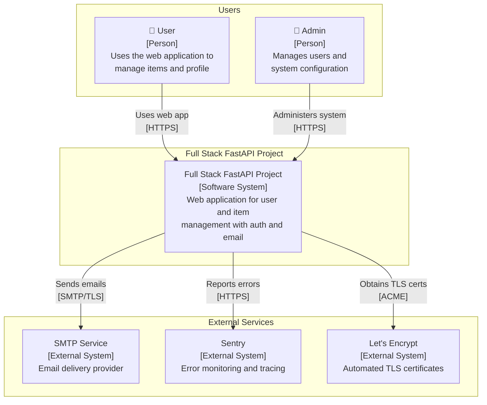
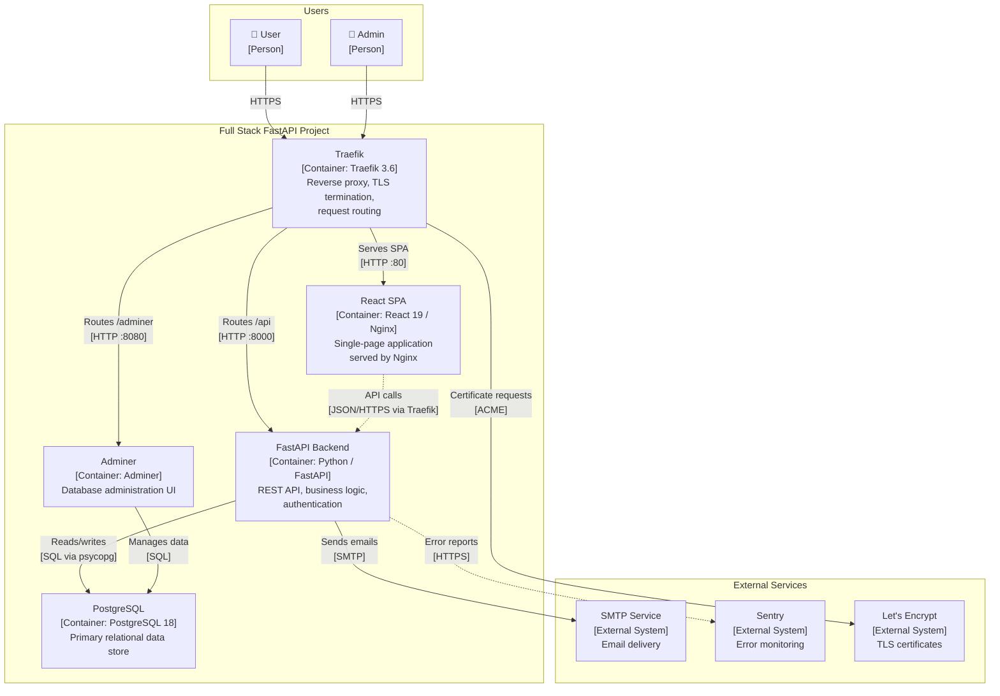
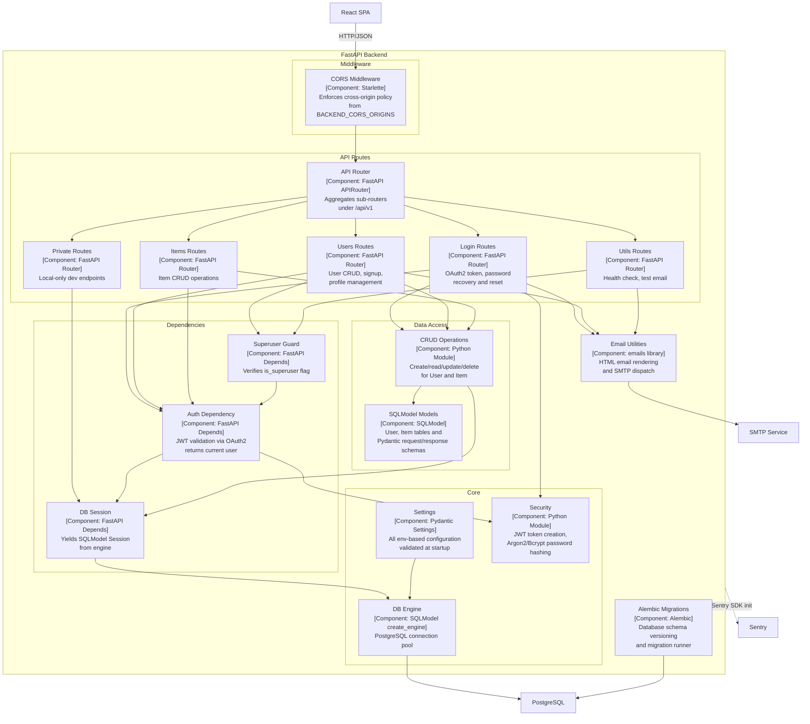
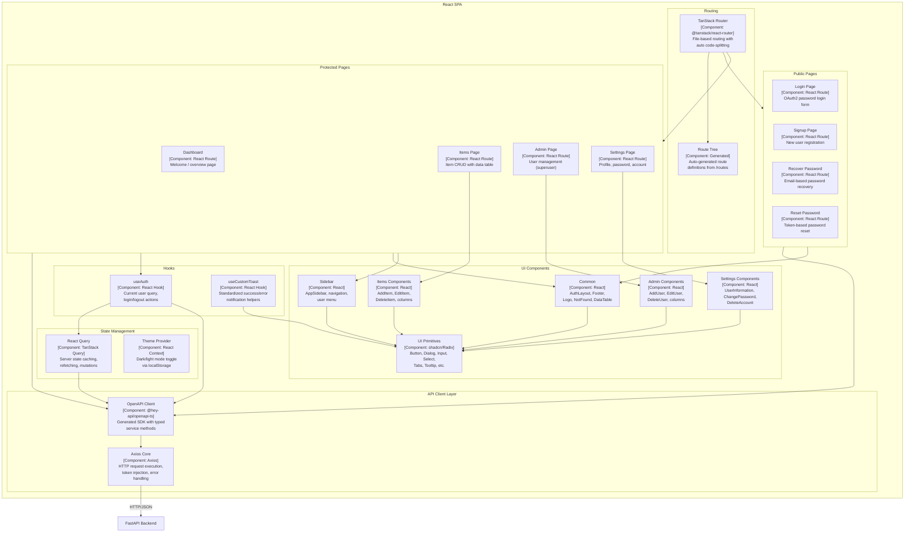

# C4 Architecture Model — Full Stack FastAPI Project

---

## L1: System Context



---

## L2: Container



---

## L3: FastAPI Backend



---

## L3: React SPA



---

## Containment Map

```text
%% ── CONTAINMENT MAP ──────────────────────────────────────────────────────────
%%
%% Every subgraph from every diagram is listed with its CONTAINS children.
%% Indentation expresses nesting depth for the parser's parent→child tree.
%%
%% ── L1 top-level groups ─────────────────────────────────────────────────────

users              CONTAINS [user, admin_user]
system_boundary    CONTAINS [fullstack_system, traefik, spa, fastapi, pg, adminer]
external           CONTAINS [smtp, sentry, letsencrypt]

%% ── L2 containers (same system_boundary, expanded) ──────────────────────────
%% system_boundary entries above include all L2 containers.

%% ── L3: FastAPI Backend ─────────────────────────────────────────────────────

fastapi            CONTAINS [middleware, routes, deps, data_layer, core, email_utils, alembic]
  middleware       CONTAINS [cors_mw]
  routes           CONTAINS [api_router, login_routes, users_routes, items_routes, utils_routes, private_routes]
  deps             CONTAINS [auth_dep, db_dep, superuser_dep]
  data_layer       CONTAINS [crud, models]
  core             CONTAINS [config, db_engine, security]

%% ── L3: React SPA ──────────────────────────────────────────────────────────

spa                CONTAINS [routing, client_layer, hooks_layer, state_layer, pages_public, pages_protected, ui_components]
  routing          CONTAINS [router, route_tree]
  client_layer     CONTAINS [api_client, axios_core]
  hooks_layer      CONTAINS [auth_hook, toast_hook]
  state_layer      CONTAINS [query_client, theme_provider]
  pages_public     CONTAINS [login_page, signup_page, recover_page, reset_page]
  pages_protected  CONTAINS [dashboard_page, items_page, admin_page, settings_page]
  ui_components    CONTAINS [common_components, sidebar_components, items_components, admin_components, settings_components, ui_primitives]
```
