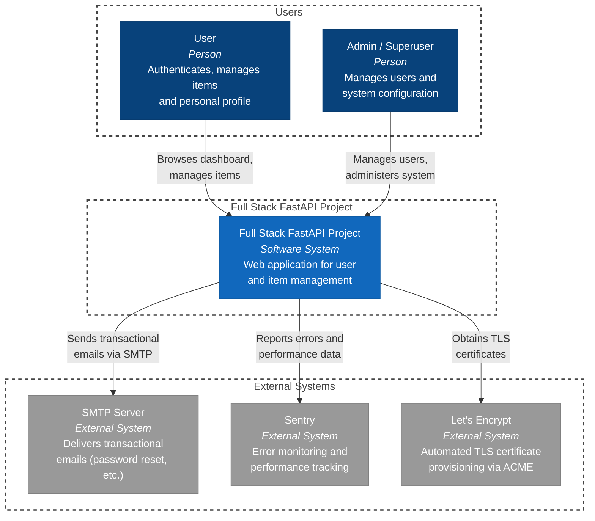
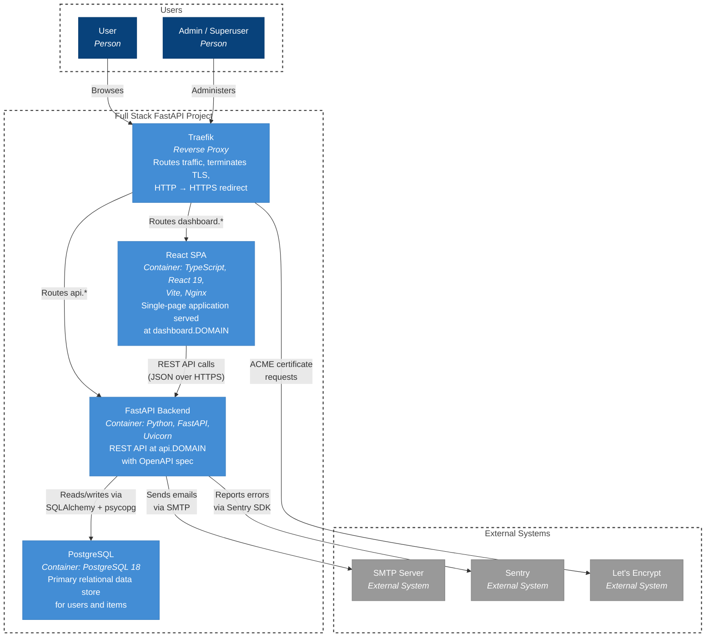
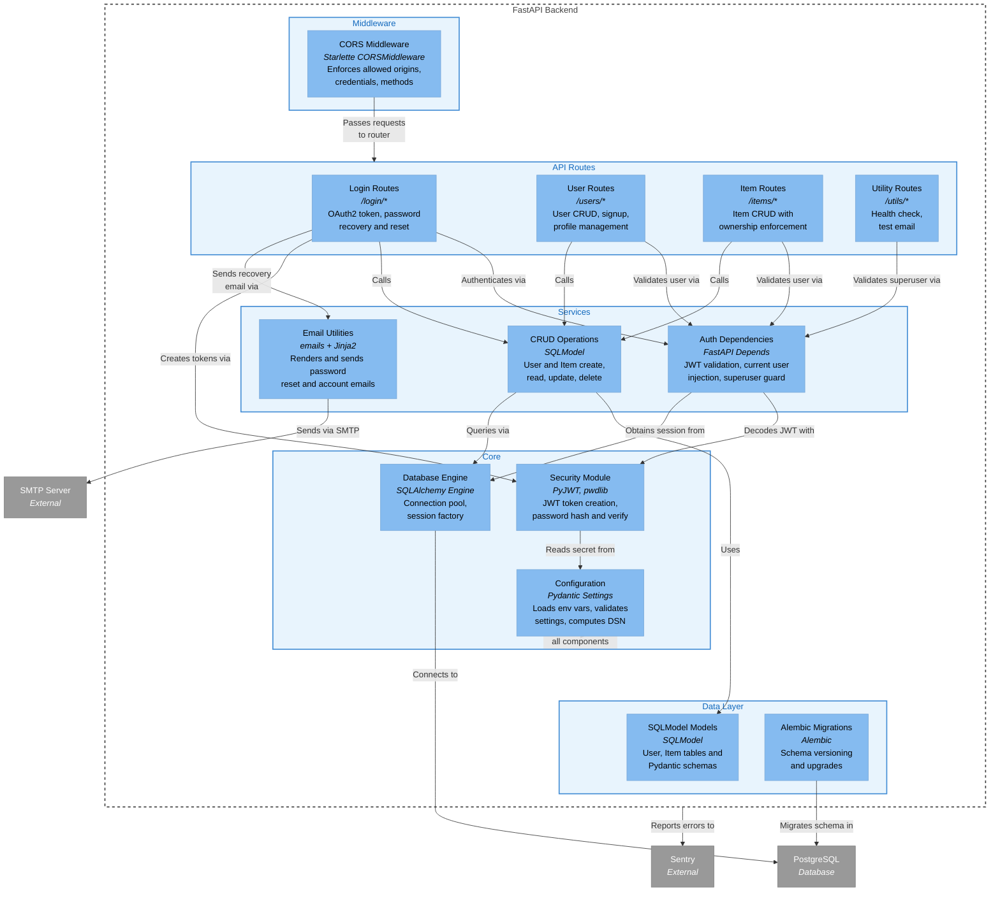
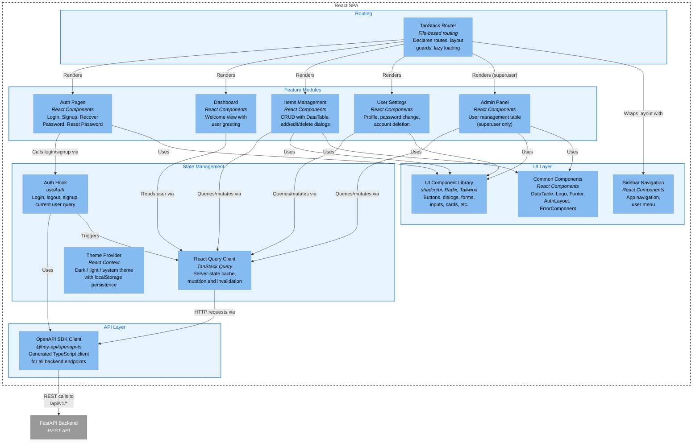

# C4 Architecture Model — Full Stack FastAPI Project

## L1: System Context



---

## L2: Container



---

## L3: FastAPI Backend



---

## L3: React SPA



---

## Containment Map

```text
%% ── L1 top-level groups ─────────────────────────────────────────
users              CONTAINS [user, admin_user]
fullstack_boundary CONTAINS [fullstack_app]
external           CONTAINS [smtp, sentry, letsencrypt]

%% ── L2 container-level (fullstack_boundary expands) ─────────────
fullstack_boundary CONTAINS [spa, fastapi_api, pg, traefik]

%% ── L3: FastAPI Backend (scope: fastapi_api) ────────────────────
fastapi_api CONTAINS [mw, routes, services, core, data]
  mw         CONTAINS [cors_mw]
  routes     CONTAINS [login_routes, user_routes, item_routes, util_routes]
  services   CONTAINS [auth_deps, crud_layer, email_utils]
  core       CONTAINS [security_mod, config_mod, db_engine]
  data       CONTAINS [models_layer, alembic_mig]

%% ── L3: React SPA (scope: spa) ─────────────────────────────────
spa CONTAINS [routing, state, api_layer, features, ui]
  routing    CONTAINS [router]
  state      CONTAINS [query_client, auth_hook, theme_provider]
  api_layer  CONTAINS [api_client]
  features   CONTAINS [auth_pages, dashboard_feat, items_feat, settings_feat, admin_feat]
  ui         CONTAINS [ui_lib, sidebar_comp, common_comp]
```
