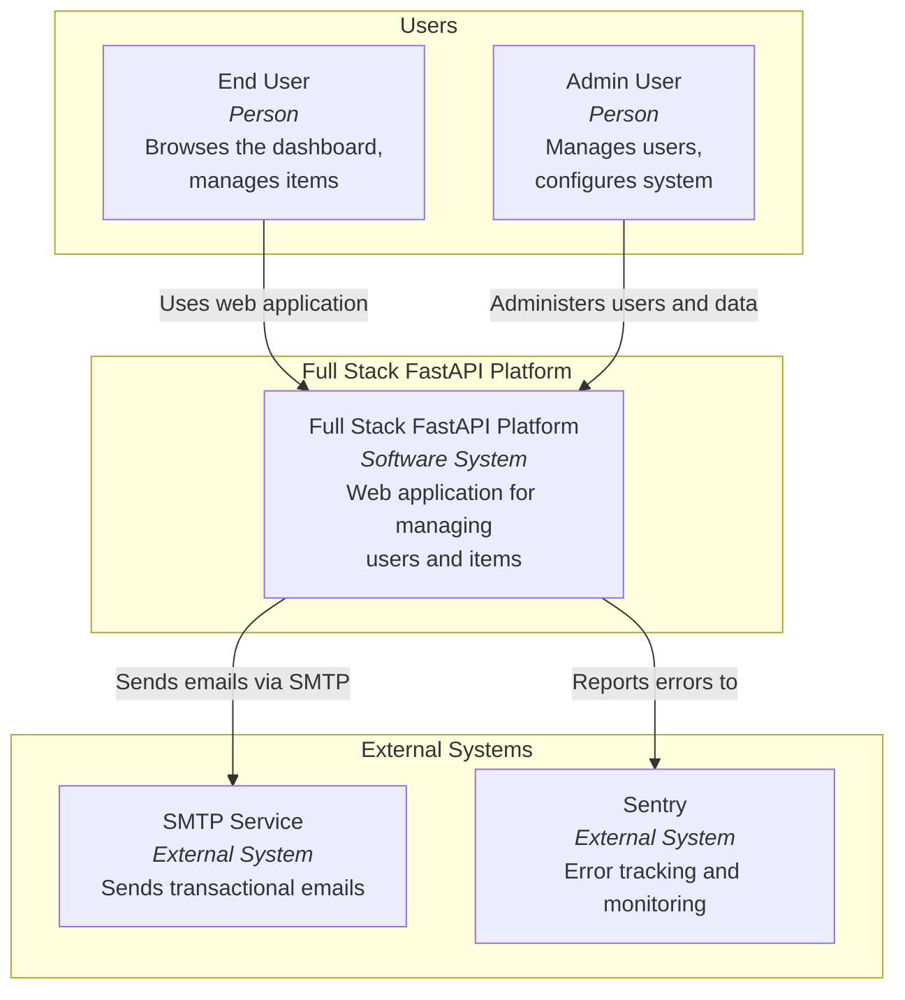
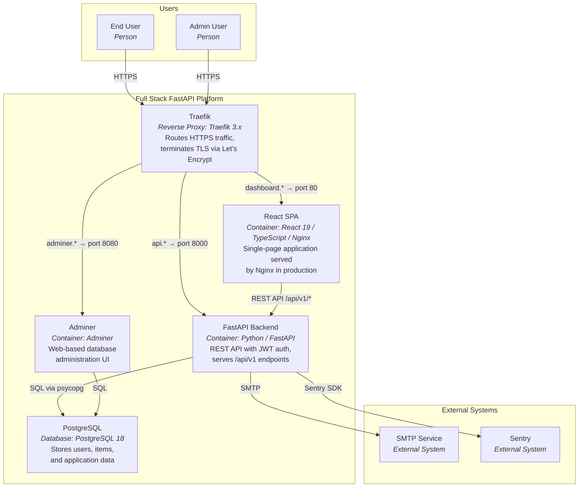
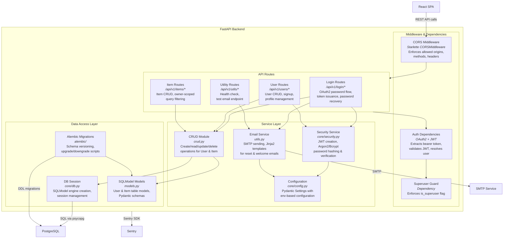
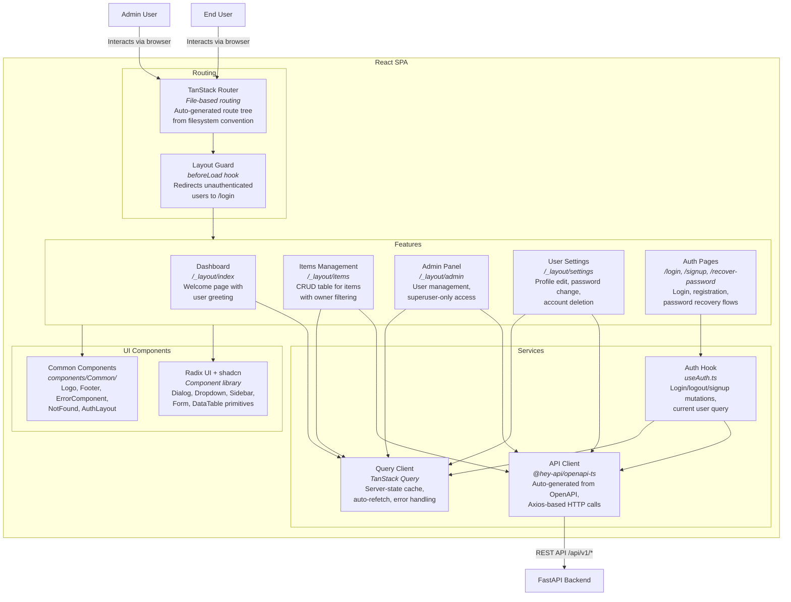
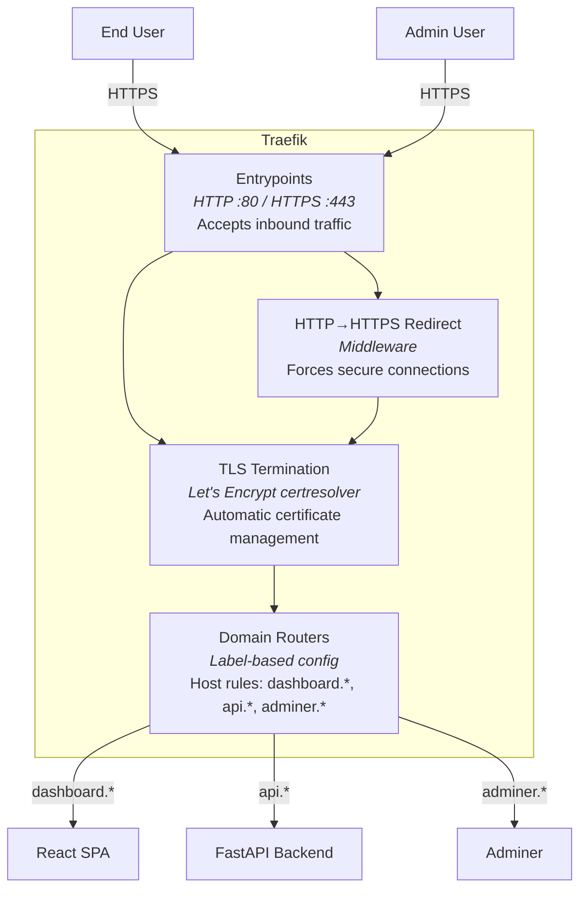

# C4 Architecture Model — Full Stack FastAPI Platform

---

## L1: System Context



---

## L2: Container Diagram



---

## L3: FastAPI Backend



---

## L3: React SPA



---

## L3: Traefik



---

## Containment Map

```text
%% ══════════════════════════════════════════════════════════════════
%% CONTAINMENT MAP — Full Stack FastAPI Platform
%% Every subgraph from every diagram appears as a CONTAINS entry.
%% Indentation reflects nesting depth.
%% ══════════════════════════════════════════════════════════════════

%% ── L1 top-level groups ─────────────────────────────────────────
users_group        CONTAINS [user, admin_user]
platform_boundary  CONTAINS [platform, traefik, spa, fastapi_backend, pg, adminer]
external           CONTAINS [smtp, sentry]

%% ── L2 container-level (same boundary, expanded) ────────────────
%%   platform_boundary already lists all containers above.
%%   L2 refines platform → {traefik, spa, fastapi_backend, pg, adminer}

%% ── L3: fastapi_backend ─────────────────────────────────────────
fastapi_backend    CONTAINS [middleware, routes, services, data]
  middleware       CONTAINS [cors_mw, auth_deps, superuser_dep]
  routes           CONTAINS [login_routes, user_routes, item_routes, util_routes]
  services         CONTAINS [crud_layer, security, email_utils, config]
  data             CONTAINS [models_layer, db_session, alembic]

%% ── L3: spa ─────────────────────────────────────────────────────
spa                CONTAINS [routing, features, services_layer, ui_layer]
  routing          CONTAINS [tanstack_router, layout_guard]
  features         CONTAINS [dashboard_feature, items_feature, admin_feature, settings_feature, auth_pages]
  services_layer   CONTAINS [api_client, auth_hook, query_client]
  ui_layer         CONTAINS [ui_lib, common_components]

%% ── L3: traefik ─────────────────────────────────────────────────
traefik            CONTAINS [entrypoints, tls_termination, http_redirect, routers]
```
