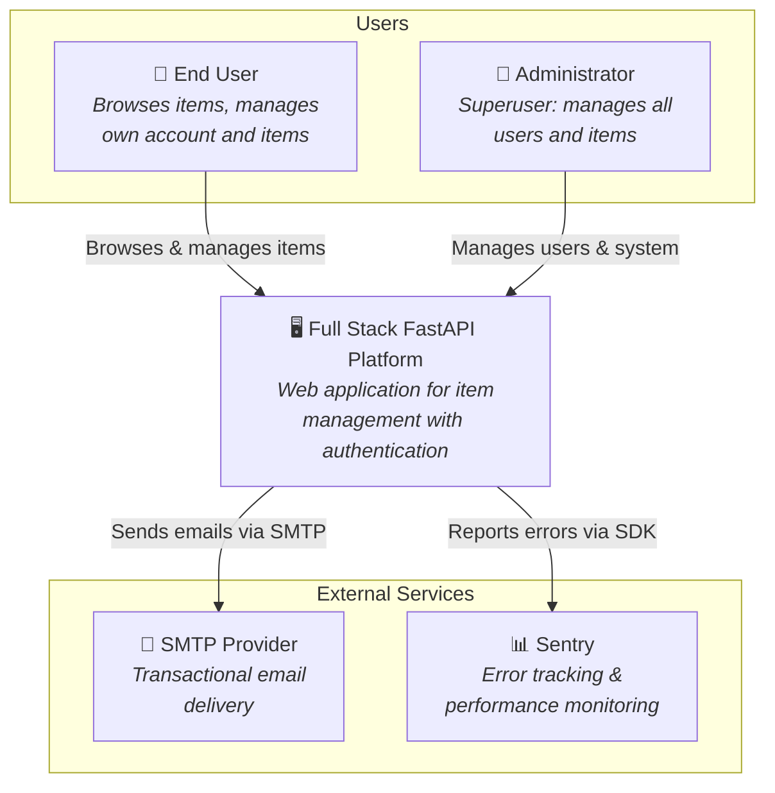
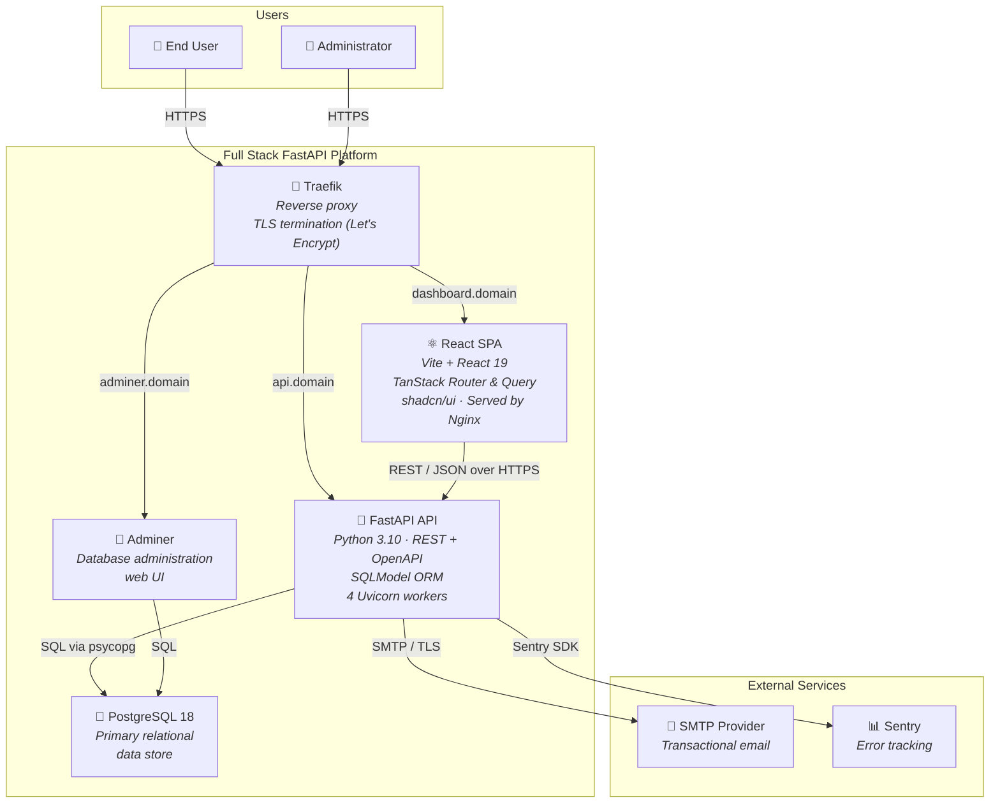
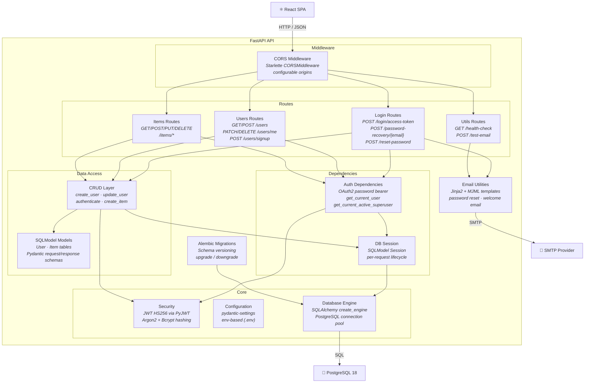
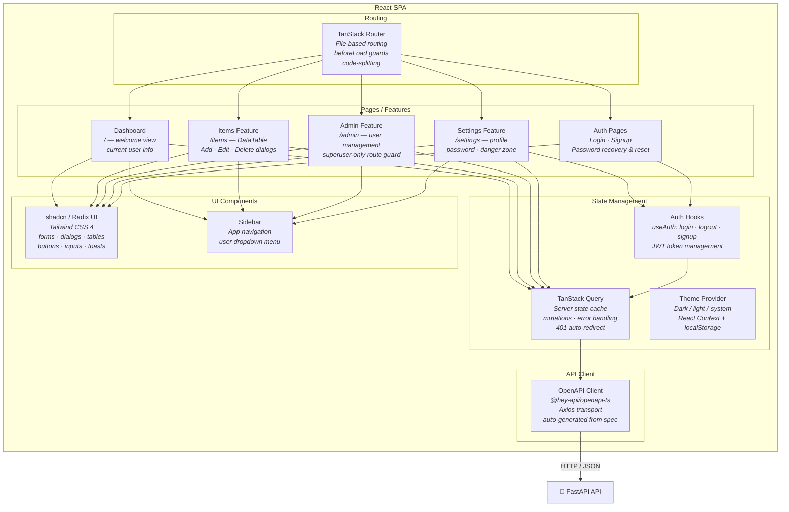

# C4 Architecture Model — Full Stack FastAPI Platform

---

## L1: System Context



---

## L2: Container



---

## L3: FastAPI API



---

## L3: React SPA



---

## Containment Map

```text
%% ═══════════════════════════════════════════════════════════════
%% CONTAINMENT MAP — Full Stack FastAPI Platform
%% ═══════════════════════════════════════════════════════════════

%% ── L1 top-level groups ─────────────────────────────────────────
users              CONTAINS [user, admin_user]
platform_boundary  CONTAINS [traefik, spa, fastapi_api, pg, adminer]
external           CONTAINS [smtp, sentry]

%% ── L2→L3 internal containment (FastAPI API) ────────────────────
fastapi_api CONTAINS [mw, routes, deps, data_layer, core, email_utils, alembic]
  mw         CONTAINS [cors_mw]
  routes     CONTAINS [login_routes, users_routes, items_routes, utils_routes]
  deps       CONTAINS [auth_deps, db_session]
  data_layer CONTAINS [crud_layer, models]
  core       CONTAINS [security, config, db_engine]

%% ── L2→L3 internal containment (React SPA) ─────────────────────
spa CONTAINS [routing, pages, state_mgmt, client_layer, ui]
  routing      CONTAINS [router]
  pages        CONTAINS [dashboard_page, items_page, admin_page, settings_page, auth_pages]
  state_mgmt   CONTAINS [query_client, theme_ctx, auth_hooks]
  client_layer CONTAINS [api_client]
  ui           CONTAINS [ui_lib, sidebar_comp]
```
