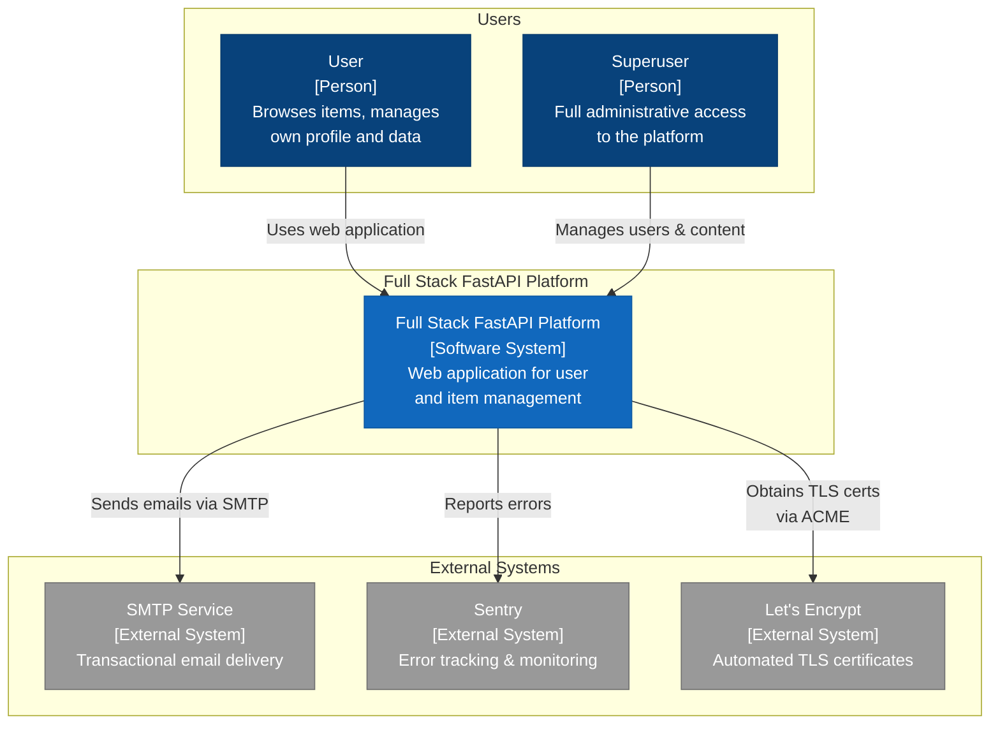
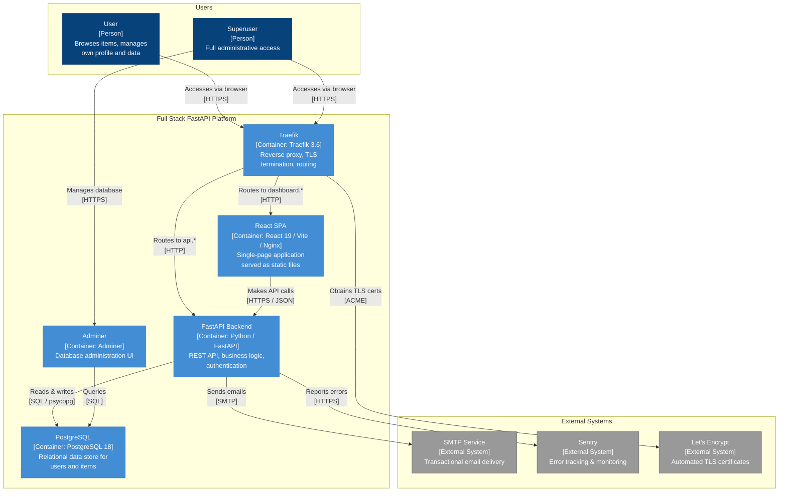
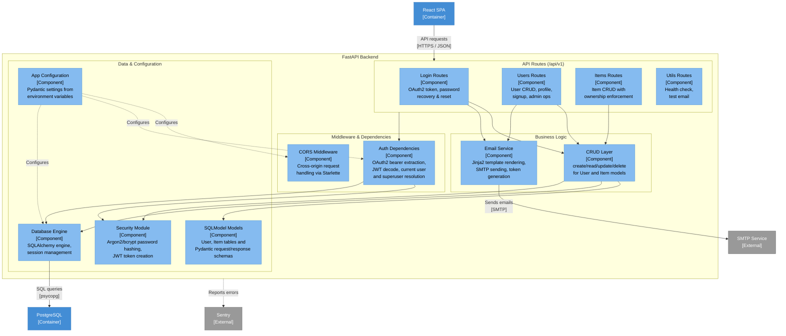
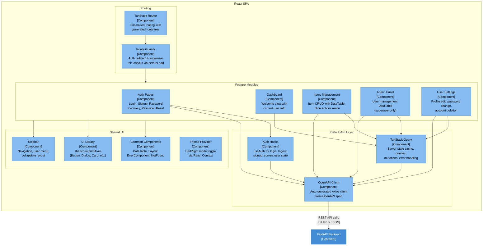

# C4 Architecture Model — Full Stack FastAPI Platform

> Auto-generated C4 model for the codebase.
> Diagrams use [Mermaid](https://mermaid.js.org/) syntax with **stable IDs** across all levels.

---

## L1: System Context



---

## L2: Container



---

## L3: FastAPI Backend



---

## L3: React SPA



---

## Containment Map

```text
%% ═══════════════════════════════════════════════════════════════════
%% CONTAINMENT MAP — Full Stack FastAPI Platform
%% Every subgraph ↔ CONTAINS entry.  Indentation = nesting depth.
%% ═══════════════════════════════════════════════════════════════════

%% ── L1 top-level groups ────────────────────────────────────────────
users              CONTAINS [user, admin_user]
platform_boundary  CONTAINS [spa, fastapi_api, pg, traefik, adminer]
external           CONTAINS [smtp, sentry, letsencrypt]

%% ── L2→L3 internal containment (FastAPI Backend) ──────────────────
fastapi_api  CONTAINS [routes, middleware, services, data_layer]
  routes       CONTAINS [login_routes, users_routes, items_routes, utils_routes]
  middleware   CONTAINS [cors_mw, auth_deps]
  services     CONTAINS [crud_layer, email_utils]
  data_layer   CONTAINS [models_layer, core_db, core_security, core_config]

%% ── L2→L3 internal containment (React SPA) ────────────────────────
spa  CONTAINS [routing, features, data_access_fe, shared]
  routing        CONTAINS [tanstack_router, route_guards]
  features       CONTAINS [auth_pages, dashboard_page, items_feature, admin_feature, settings_feature]
  data_access_fe CONTAINS [api_client, query_layer, auth_hooks]
  shared         CONTAINS [common_comp, sidebar_comp, ui_lib, theme]
```

---

## ID Cross-Reference

| Stable ID | L1 | L2 | L3 (fastapi_api) | L3 (spa) | Description |
|---|---|---|---|---|---|
| `user` | actor | actor | — | — | Regular user |
| `admin_user` | actor | actor | — | — | Superuser / admin |
| `platform` | system node | — | — | — | L1 system abstraction |
| `spa` | — | container | — | **scope boundary** | React SPA |
| `fastapi_api` | — | container | **scope boundary** | — | FastAPI Backend |
| `pg` | — | container | external ref | — | PostgreSQL database |
| `traefik` | — | container | — | — | Reverse proxy |
| `adminer` | — | container | — | — | DB admin UI |
| `smtp` | external | external | external ref | — | SMTP email service |
| `sentry` | external | external | external ref | — | Error tracking |
| `letsencrypt` | external | external | — | — | TLS certificate authority |
