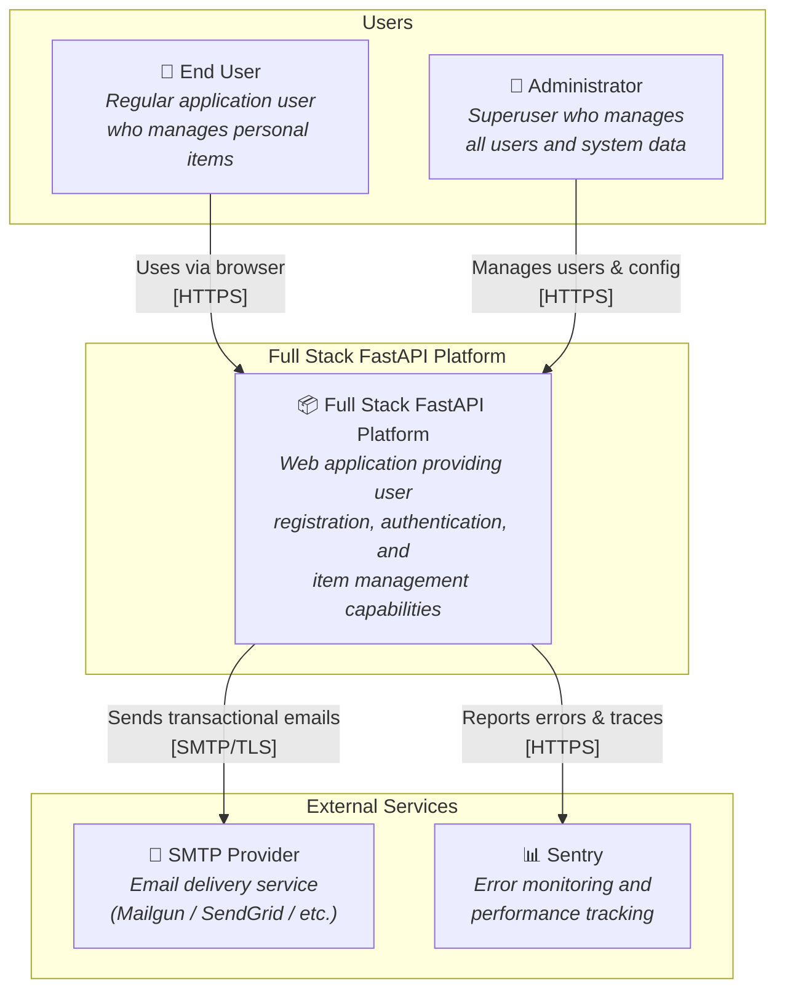
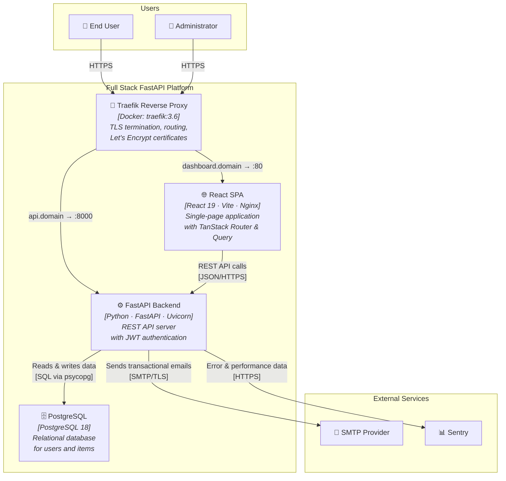
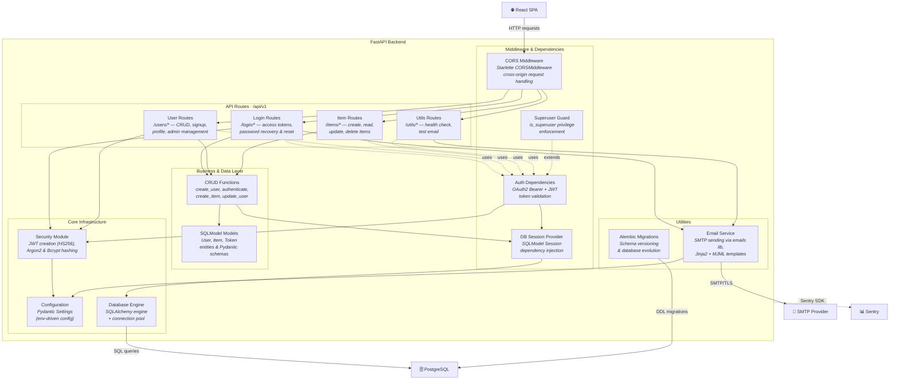
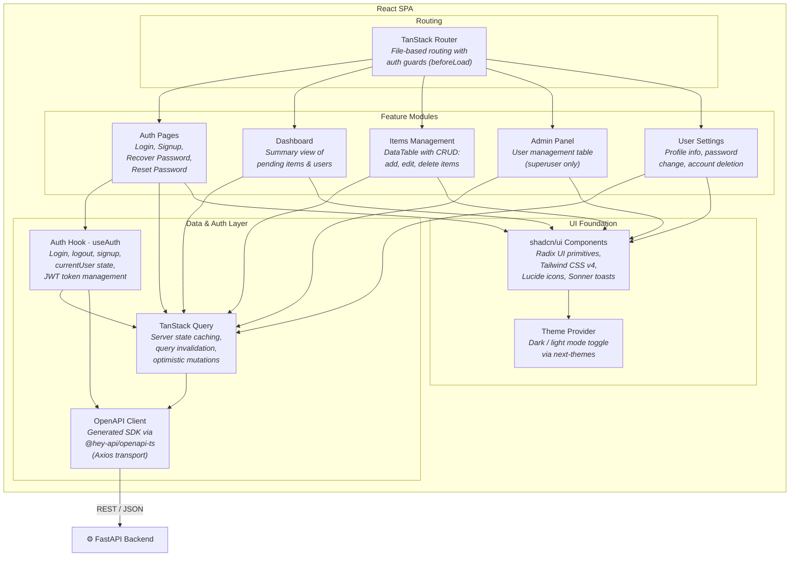

# C4 Architecture Model — Full Stack FastAPI Project

---

## L1: System Context



---

## L2: Container



---

## L3: FastAPI Backend



---

## L3: React SPA



---

## Containment Map

```text
%% ── CONTAINMENT MAP ──────────────────────────────────────────────────
%%
%% Every subgraph from every diagram is listed below.
%% Nesting is expressed by indentation.
%%
%% ── L1 top-level groups ─────────────────────────────────────────────

users              CONTAINS [end_user, admin_user]
platform_boundary  CONTAINS [platform, traefik, spa, fastapi_api, pg]
external           CONTAINS [smtp, sentry]

%% ── L2→L3 internal containment ──────────────────────────────────────

fastapi_api CONTAINS [middleware, routes, services, core, utilities]
  middleware  CONTAINS [cors_mw, auth_deps, superuser_guard, db_session]
  routes      CONTAINS [login_routes, user_routes, item_routes, utils_routes]
  services    CONTAINS [crud_layer, models_layer]
  core        CONTAINS [security_core, config_core, db_engine]
  utilities   CONTAINS [email_utils, alembic_mig]

spa CONTAINS [routing_layer, data_layer, features, ui_foundation]
  routing_layer  CONTAINS [router]
  data_layer     CONTAINS [query_client, api_client, auth_hook]
  features       CONTAINS [auth_pages, dashboard_feat, items_feat, admin_feat, settings_feat]
  ui_foundation  CONTAINS [ui_lib, theme]
```
