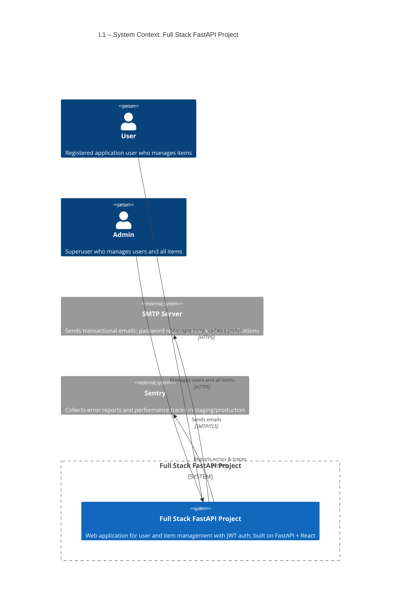
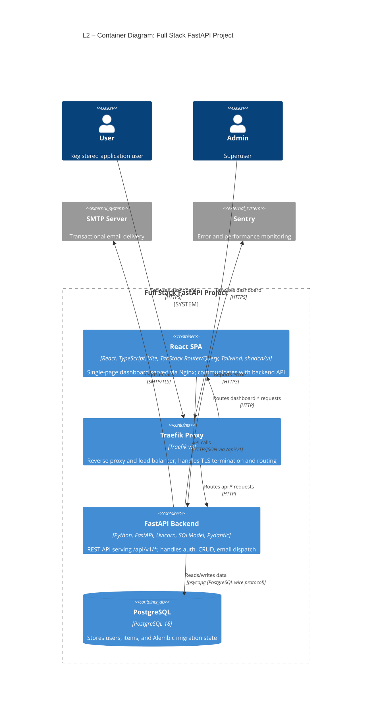
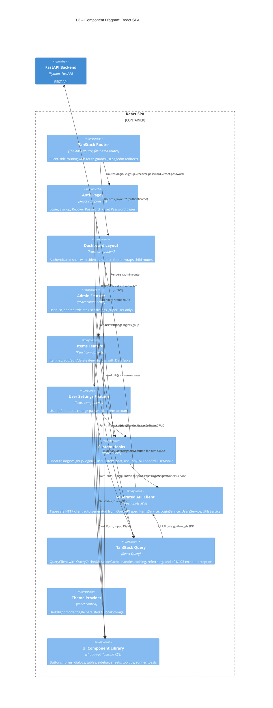
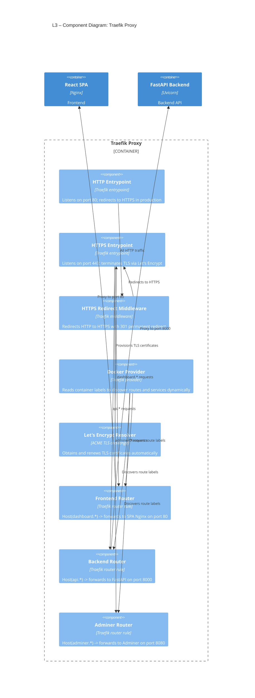

# C4 Architecture Model — Full Stack FastAPI Project

## L1: System Context



---

## L2: Container Diagram



---

## L3: FastAPI Backend (Component Diagram)

```mermaid
%% SCOPE: urn:c4:container:fastapi-backend
C4Component
    title L3 – Component Diagram: FastAPI Backend

    Container_Boundary(fastapi_backend, "FastAPI Backend") {

        %% KIND: boundary
        Component(cors_mw, "CORS Middleware", "Starlette CORSMiddleware", "Enforces allowed origins, methods, headers for cross-origin requests")

        %% KIND: router
        Component(api_router, "API Router", "FastAPI APIRouter", "Top-level /api/v1 router; mounts all sub-routers")

        %% KIND: router
        Component(login_routes, "Login Routes", "FastAPI APIRouter", "POST /login/access-token, /password-recovery, /reset-password")

        %% KIND: router
        Component(users_routes, "Users Routes", "FastAPI APIRouter", "CRUD /users, /users/me, /users/signup, /users/{id}")

        %% KIND: router
        Component(items_routes, "Items Routes", "FastAPI APIRouter", "CRUD /items, /items/{id}")

        %% KIND: router
        Component(utils_routes, "Utils Routes", "FastAPI APIRouter", "GET /utils/health-check, POST /utils/test-email")

        %% KIND: service_layer
        Component(auth_deps, "Auth Dependencies", "FastAPI Depends", "OAuth2 bearer extraction, JWT validation, current-user/superuser resolution")

        %% KIND: data_access
        Component(crud_layer, "CRUD Layer", "SQLModel Session", "create_user, update_user, get_user_by_email, authenticate, create_item")

        %% KIND: data_access
        Component(models_layer, "SQLModel Models", "SQLModel, Pydantic", "User, Item, Token, schema models for request/response validation")

        %% KIND: service_layer
        Component(security, "Security Module", "PyJWT, pwdlib", "JWT token creation (HS256), Argon2/Bcrypt password hashing and verification")

        %% KIND: service_layer
        Component(config, "Settings / Config", "Pydantic Settings", "Loads .env, validates config, computes SQLALCHEMY_DATABASE_URI and CORS origins")

        %% KIND: storage
        Component(db_engine, "DB Engine", "SQLAlchemy Engine", "Creates engine from DATABASE_URI; provides Session factory; runs init_db seeding")

        %% KIND: integration
        Component(email_utils, "Email Utilities", "python-emails, Jinja2", "Renders templates, sends transactional emails, generates/verifies password-reset tokens")
    }

    ContainerDb(pg, "PostgreSQL", "PostgreSQL 18", "User and item storage")
    System_Ext(smtp, "SMTP Server", "Email delivery")

    Rel(cors_mw, api_router, "Passes requests after CORS check")
    Rel(api_router, login_routes, "Mounts /login, /password-recovery, /reset-password")
    Rel(api_router, users_routes, "Mounts /users")
    Rel(api_router, items_routes, "Mounts /items")
    Rel(api_router, utils_routes, "Mounts /utils")

    Rel(login_routes, auth_deps, "Uses for token test")
    Rel(login_routes, crud_layer, "authenticate()")
    Rel(login_routes, security, "create_access_token()")
    Rel(login_routes, email_utils, "Password recovery emails")

    Rel(users_routes, auth_deps, "Current user / superuser guard")
    Rel(users_routes, crud_layer, "User CRUD operations")
    Rel(users_routes, email_utils, "New account notification")

    Rel(items_routes, auth_deps, "Current user guard")
    Rel(items_routes, models_layer, "Item model validation")

    Rel(utils_routes, auth_deps, "Superuser guard for test-email")
    Rel(utils_routes, email_utils, "send_email()")

    Rel(auth_deps, security, "JWT decode + verify")
    Rel(auth_deps, db_engine, "get_db() session")
    Rel(auth_deps, models_layer, "User lookup")

    Rel(crud_layer, models_layer, "Validates and persists models")
    Rel(crud_layer, security, "verify_password, get_password_hash")
    Rel(crud_layer, db_engine, "Session operations")

    Rel(db_engine, pg, "SQL queries", "psycopg")
    Rel(db_engine, config, "Reads SQLALCHEMY_DATABASE_URI")

    Rel(security, config, "Reads SECRET_KEY")

    Rel(email_utils, smtp, "Sends email", "SMTP/TLS")
    Rel(email_utils, config, "Reads SMTP and email settings")
    Rel(email_utils, security, "JWT for password-reset tokens")
```



---

## L3: React SPA (Component Diagram)



---

## L3: Traefik Proxy (Component Diagram)



---

## Containment Map

```text
%% ══════════════════════════════════════════════════════════════════
%% CONTAINMENT MAP — Full Stack FastAPI Project
%% Every subgraph and node from every diagram level.
%% Nesting expressed by indentation.
%% ══════════════════════════════════════════════════════════════════

%% ── L1 top-level groups ─────────────────────────────────────────
users            CONTAINS [user, admin]
system_boundary  CONTAINS [fullstack_system]
external         CONTAINS [smtp, sentry]

%% ── L2 system boundary → containers ─────────────────────────────
system_boundary  CONTAINS [spa, traefik, fastapi_backend, pg]

%% ── L3: FastAPI Backend → components ────────────────────────────
fastapi_backend  CONTAINS [cors_mw, api_router, login_routes, users_routes, items_routes, utils_routes, auth_deps, crud_layer, models_layer, security, config, db_engine, email_utils]
  api_router       CONTAINS [login_routes, users_routes, items_routes, utils_routes]
  auth_deps        CONTAINS []
  crud_layer       CONTAINS []
  models_layer     CONTAINS []
  security         CONTAINS []
  config           CONTAINS []
  db_engine        CONTAINS []
  email_utils      CONTAINS []
  cors_mw          CONTAINS []

%% ── L3: React SPA → components ──────────────────────────────────
spa              CONTAINS [tanstack_router, auth_pages, dashboard_layout, admin_feature, items_feature, settings_feature, hooks_layer, api_client, query_layer, theme_provider, ui_components]
  tanstack_router  CONTAINS [auth_pages, dashboard_layout]
  dashboard_layout CONTAINS [admin_feature, items_feature, settings_feature]
  auth_pages       CONTAINS []
  admin_feature    CONTAINS []
  items_feature    CONTAINS []
  settings_feature CONTAINS []
  hooks_layer      CONTAINS []
  api_client       CONTAINS []
  query_layer      CONTAINS []
  theme_provider   CONTAINS []
  ui_components    CONTAINS []

%% ── L3: Traefik Proxy → components ──────────────────────────────
traefik          CONTAINS [entrypoint_http, entrypoint_https, https_redirect_mw, docker_provider, le_resolver, frontend_router, backend_router, adminer_router]
  entrypoint_http    CONTAINS []
  entrypoint_https   CONTAINS []
  https_redirect_mw  CONTAINS []
  docker_provider    CONTAINS []
  le_resolver        CONTAINS []
  frontend_router    CONTAINS []
  backend_router     CONTAINS []
  adminer_router     CONTAINS []

%% ── Cross-level ID consistency table ────────────────────────────
%% ID                 | L1              | L2                | L3 (scope boundary)
%% ─────────────────────────────────────────────────────────────────
%% user               | Person          | Person            | —
%% admin              | Person          | Person            | —
%% fullstack_system   | System          | (expanded)        | —
%% spa                | —               | Container         | Container_Boundary (L3: React SPA)
%% fastapi_backend    | —               | Container         | Container_Boundary (L3: FastAPI Backend)
%% traefik            | —               | Container         | Container_Boundary (L3: Traefik Proxy)
%% pg                 | —               | ContainerDb       | External in L3: FastAPI Backend
%% smtp               | System_Ext      | System_Ext        | External in L3: FastAPI Backend
%% sentry             | System_Ext      | System_Ext        | —
```
