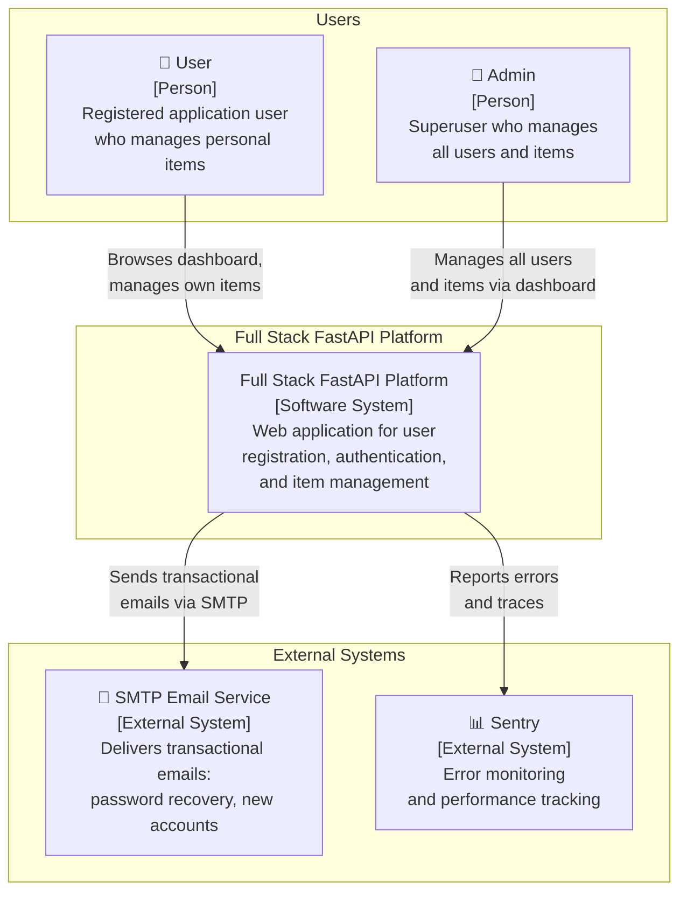
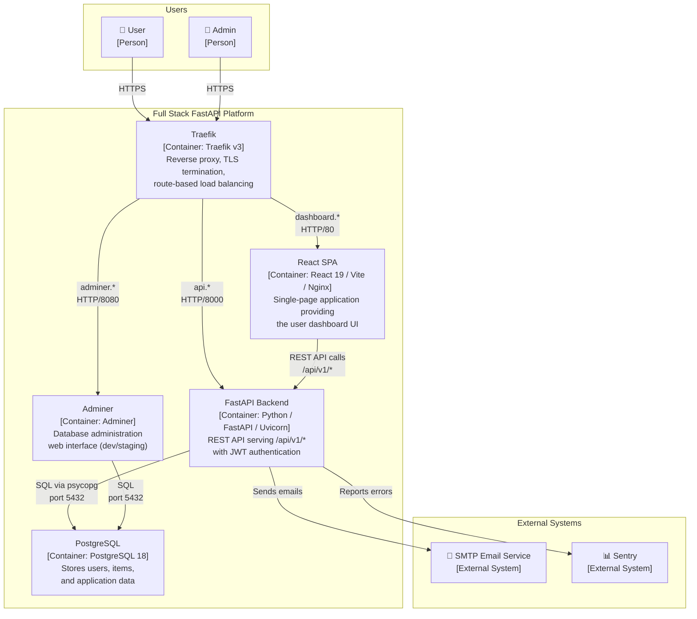
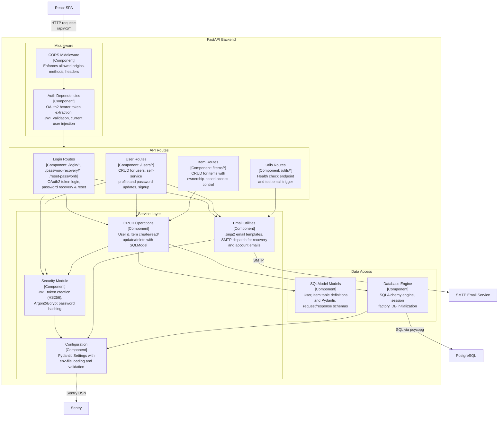
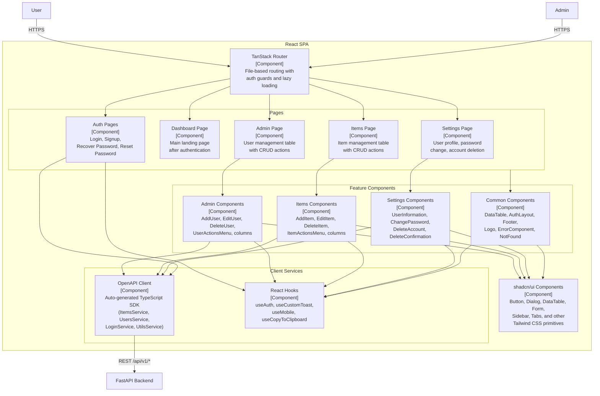
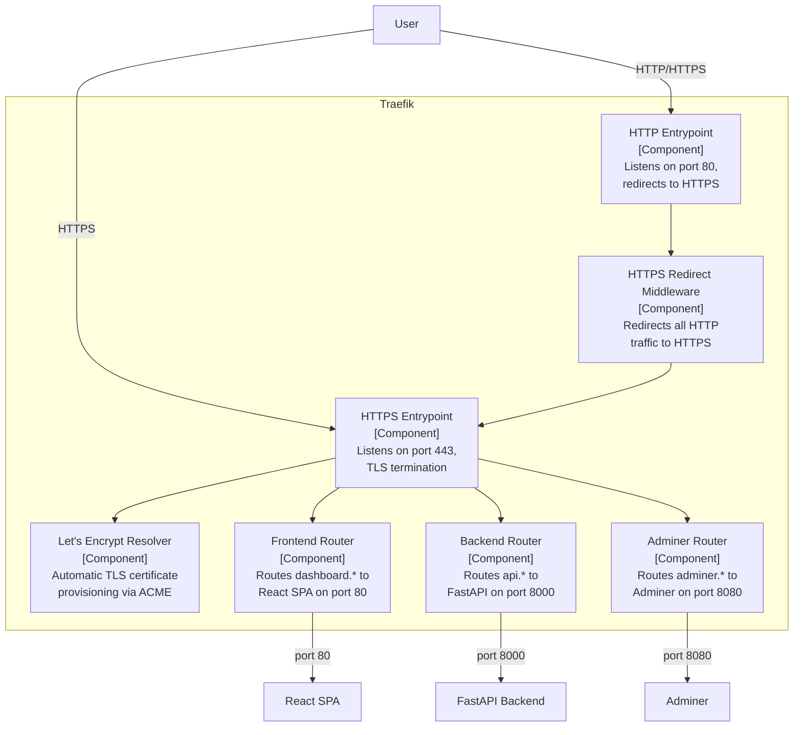

# C4 Architecture Model — Full Stack FastAPI Template

> Auto-generated C4 architecture model covering L1 (System Context), L2 (Container),
> and L3 (Component) diagrams for the Full Stack FastAPI Template project.

---

## L1: System Context

Shows actors, the platform as a whole, and external dependencies.



---

## L2: Container Diagram

Zooms into the platform boundary to show all deployable containers and their interactions.



---

## L3: FastAPI Backend — Component Diagram

Zooms into the FastAPI Backend container to show its internal components.



---

## L3: React SPA — Component Diagram

Zooms into the React SPA container to show its internal components.



---

## L3: Traefik — Component Diagram

Zooms into the Traefik reverse proxy container.



---

## Containment Map

Every subgraph and node across all levels, expressed as parent CONTAINS children.
Indentation shows nesting depth.

```text
%% ── L1 top-level groups ─────────────────────────────────────────────
users              CONTAINS [user, admin]
platform_boundary  CONTAINS [traefik, spa, fastapi_backend, pg, adminer]
external           CONTAINS [smtp, sentry]

%% ── L2→L3 internal containment ──────────────────────────────────────
fastapi_backend    CONTAINS [middleware, routes, services, data_access]
  middleware         CONTAINS [cors_mw, auth_deps]
  routes             CONTAINS [login_routes, user_routes, item_routes, utils_routes]
  services           CONTAINS [crud_layer, security_mod, email_utils, config_mod]
  data_access        CONTAINS [models_layer, db_engine]

spa                CONTAINS [routing, pages, features, services_layer, ui_layer]
  pages              CONTAINS [auth_pages, dashboard_page, admin_page, items_page, settings_page]
  features           CONTAINS [admin_features, items_features, settings_features, common_features]
  services_layer     CONTAINS [api_client, hooks_layer]

traefik            CONTAINS [entrypoint_http, entrypoint_https, https_redirect, cert_resolver, frontend_router, backend_router, adminer_router]
```

---

## Node ID Cross-Reference

Stable IDs used across all diagram levels:

| Stable ID            | L1 | L2 | L3 Scope            | Description                        |
|----------------------|----|----|---------------------|------------------------------------|
| `user`               | ✓  | ✓  | —                   | Regular application user           |
| `admin`              | ✓  | ✓  | —                   | Superuser / administrator          |
| `spa`                | —  | ✓  | `spa` (scope)       | React SPA frontend                 |
| `fastapi_backend`    | —  | ✓  | `fastapi_backend` (scope) | FastAPI REST API backend     |
| `pg`                 | —  | ✓  | referenced          | PostgreSQL database                |
| `traefik`            | —  | ✓  | `traefik` (scope)   | Traefik reverse proxy              |
| `adminer`            | —  | ✓  | referenced          | Adminer DB admin tool              |
| `smtp`               | ✓  | ✓  | referenced          | External SMTP email service        |
| `sentry`             | ✓  | ✓  | referenced          | External error monitoring          |
| `fullstack_platform` | ✓  | —  | —                   | System-level node (L1 only)        |
