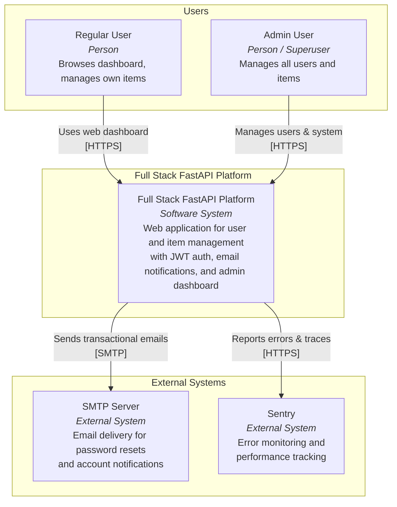
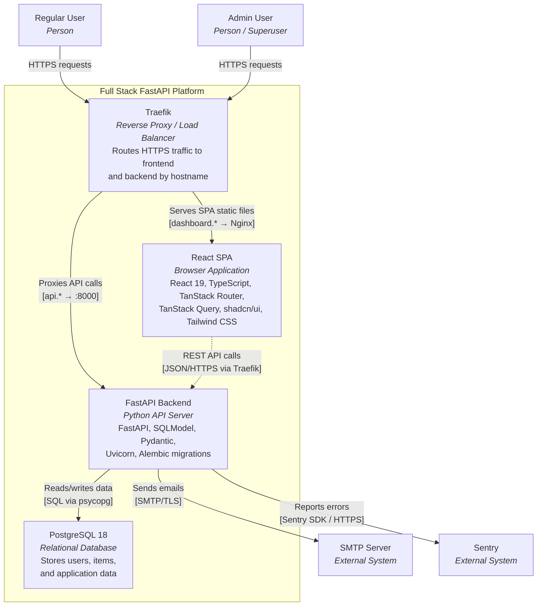
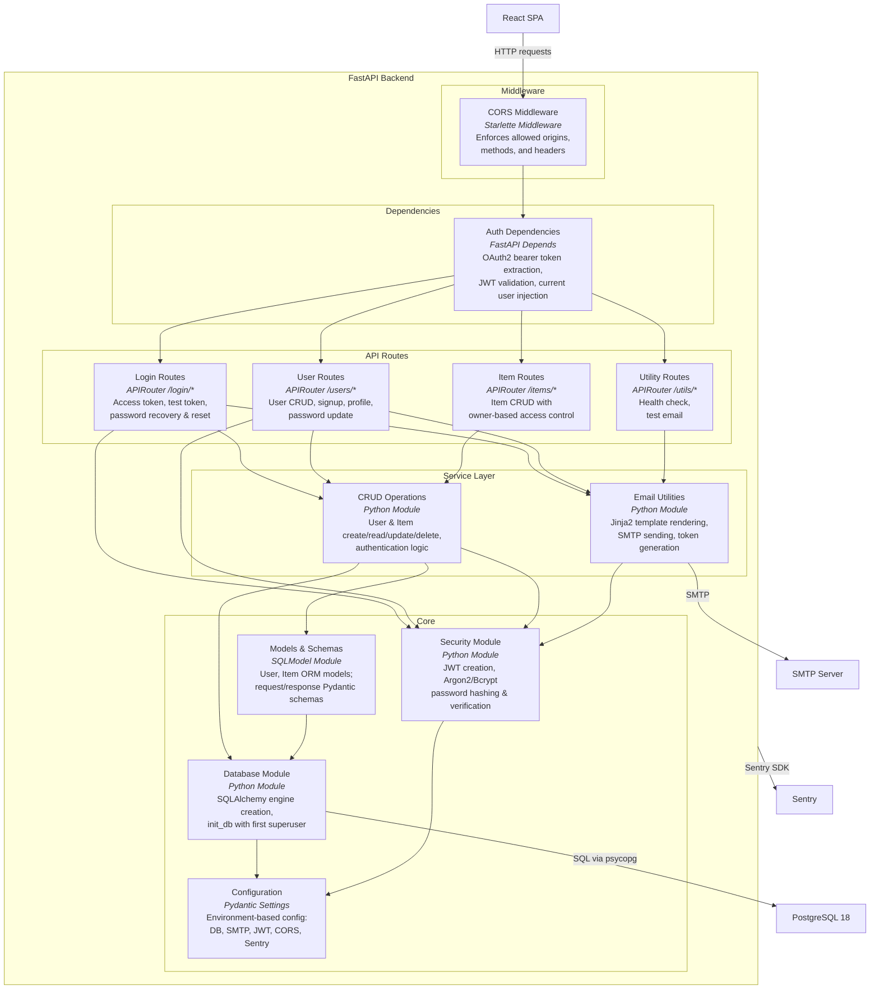
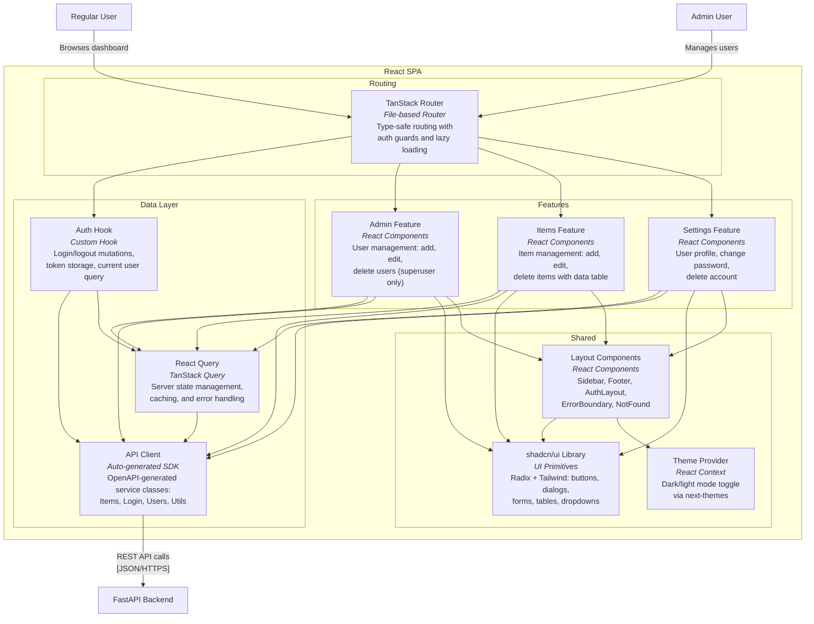

# C4 Architecture Model — Full Stack FastAPI Platform

---

## L1: System Context



---

## L2: Container Diagram



---

## L3: FastAPI Backend — Component Diagram



---

## L3: React SPA — Component Diagram



---

## Containment Map

```text
%% ── L1 top-level groups ─────────────────────────────────────────
users            CONTAINS [user, admin_user]
system_boundary  CONTAINS [traefik, spa, fastapi_api, pg]
external         CONTAINS [smtp, sentry]

%% ── L2 → L3 internal containment ────────────────────────────────
fastapi_api  CONTAINS [middleware, deps, routes, services, core]
  middleware   CONTAINS [cors_mw]
  deps         CONTAINS [auth_deps]
  routes       CONTAINS [login_routes, user_routes, item_routes, util_routes]
  services     CONTAINS [crud_layer, email_utils]
  core         CONTAINS [security_mod, db_mod, config_mod, models_layer]

spa          CONTAINS [routing, data_layer, features, shared]
  routing      CONTAINS [tanstack_router]
  data_layer   CONTAINS [api_client, query_client, auth_hook]
  features     CONTAINS [admin_feature, items_feature, settings_feature]
  shared       CONTAINS [common_layout, ui_lib, theme_provider]
```
