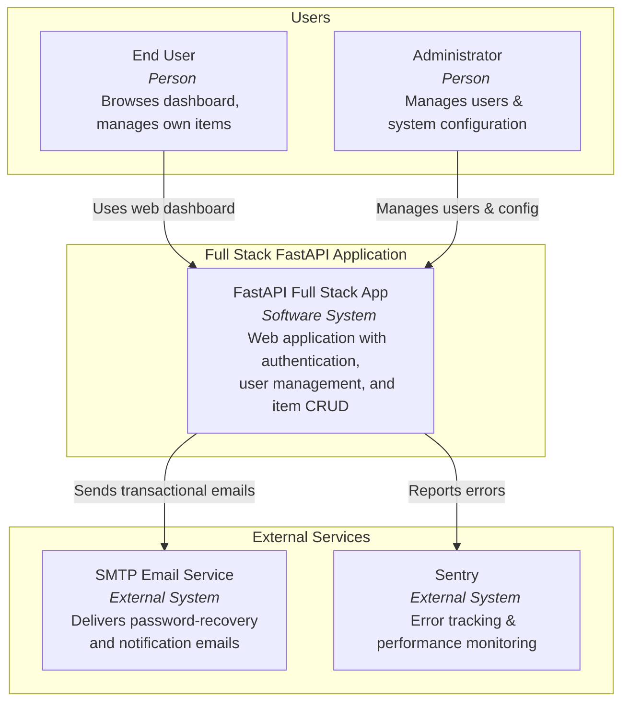
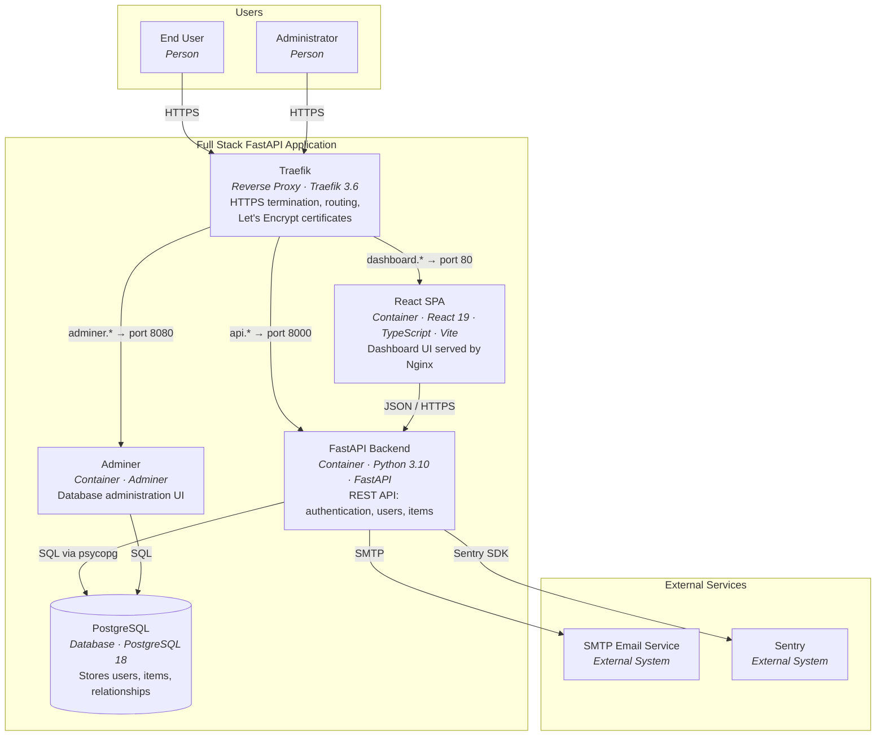
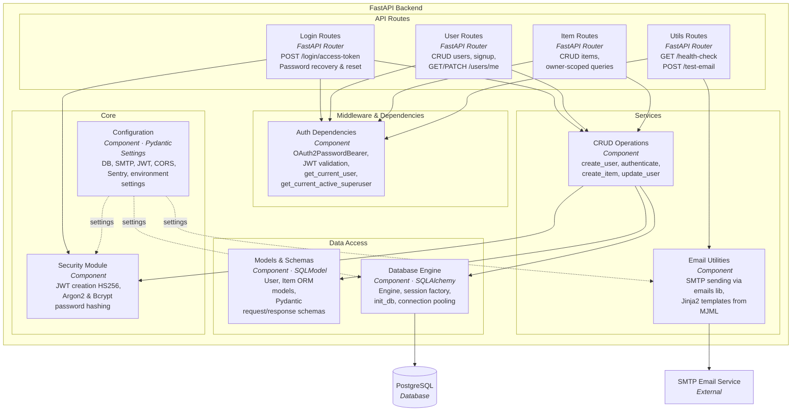
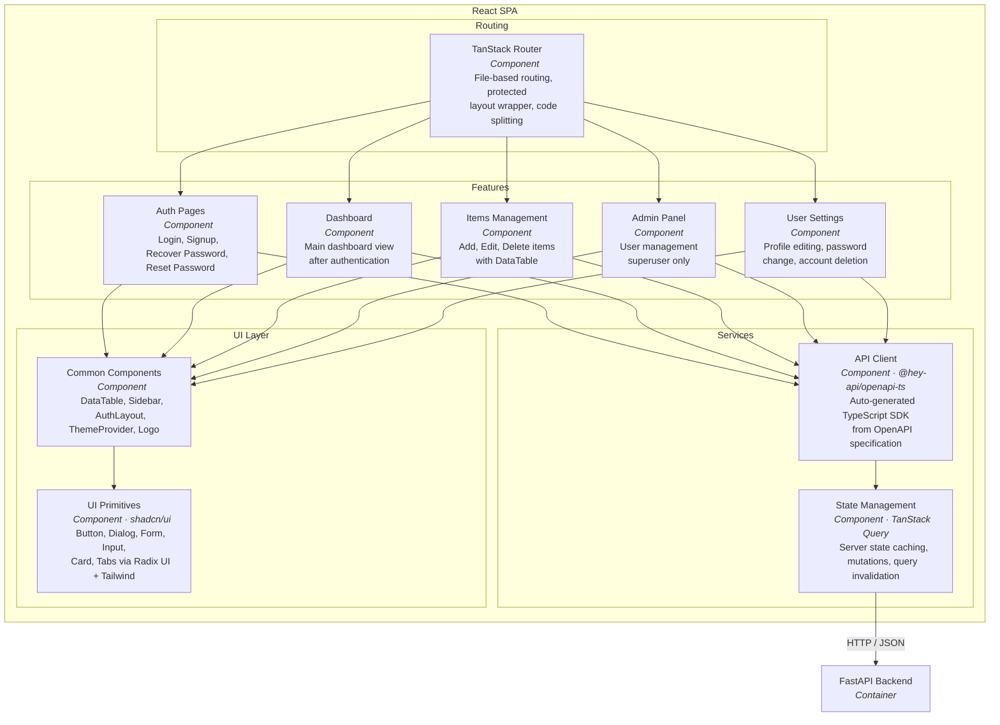

# C4 Architecture Model — Full Stack FastAPI Application

> C4 model for the [Full Stack FastAPI Template](https://github.com/fastapi/full-stack-fastapi-template).
> Covers L1 (System Context), L2 (Container), and L3 (Component) views.

---

## L1: System Context



---

## L2: Container Diagram



---

## L3: FastAPI Backend



---

## L3: React SPA



---

## Containment Map

```text
%% ═══════════════════════════════════════════════════════════════════
%% CONTAINMENT MAP — Full Stack FastAPI Application
%% Every subgraph from every diagram appears as a CONTAINS entry.
%% Indentation denotes nesting depth.
%% ═══════════════════════════════════════════════════════════════════

%% ── L1 top-level groups ──────────────────────────────────────────
users            CONTAINS [user, admin]
system_boundary  CONTAINS [traefik, spa, fastapi, pg, adminer]
external         CONTAINS [smtp, sentry]

%% ── L2 → L3 internal containment ────────────────────────────────
fastapi CONTAINS [middleware_group, routes_group, services_group, data_access_group, core_group]
  middleware_group  CONTAINS [auth_deps]
  routes_group      CONTAINS [login_routes, user_routes, item_routes, utils_routes]
  services_group    CONTAINS [crud, email_util]
  data_access_group CONTAINS [models, db_engine]
  core_group        CONTAINS [security, config]

spa CONTAINS [routing_group, features_group, services_layer, ui_layer]
  routing_group  CONTAINS [router]
  features_group CONTAINS [auth_pages, dashboard, items_feat, admin_feat, settings_feat]
  services_layer CONTAINS [api_client, query_mgmt]
  ui_layer       CONTAINS [common_ui, ui_lib]
```

---

## Stable ID Reference

| ID | Name | Level(s) | Type |
|---|---|---|---|
| `user` | End User | L1, L2 | Person |
| `admin` | Administrator | L1, L2 | Person |
| `system_node` | FastAPI Full Stack App | L1 | System |
| `traefik` | Traefik | L2 | Reverse Proxy |
| `spa` | React SPA | L2, L3 scope | Container |
| `fastapi` | FastAPI Backend | L2, L3 scope | Container |
| `pg` | PostgreSQL | L2, L3-FastAPI | Database |
| `adminer` | Adminer | L2 | Container |
| `smtp` | SMTP Email Service | L1, L2, L3-FastAPI | External System |
| `sentry` | Sentry | L1, L2 | External System |
| `auth_deps` | Auth Dependencies | L3-FastAPI | Component |
| `login_routes` | Login Routes | L3-FastAPI | Component |
| `user_routes` | User Routes | L3-FastAPI | Component |
| `item_routes` | Item Routes | L3-FastAPI | Component |
| `utils_routes` | Utils Routes | L3-FastAPI | Component |
| `crud` | CRUD Operations | L3-FastAPI | Component |
| `email_util` | Email Utilities | L3-FastAPI | Component |
| `models` | Models & Schemas | L3-FastAPI | Component |
| `db_engine` | Database Engine | L3-FastAPI | Component |
| `security` | Security Module | L3-FastAPI | Component |
| `config` | Configuration | L3-FastAPI | Component |
| `router` | TanStack Router | L3-SPA | Component |
| `auth_pages` | Auth Pages | L3-SPA | Component |
| `dashboard` | Dashboard | L3-SPA | Component |
| `items_feat` | Items Management | L3-SPA | Component |
| `admin_feat` | Admin Panel | L3-SPA | Component |
| `settings_feat` | User Settings | L3-SPA | Component |
| `api_client` | API Client | L3-SPA | Component |
| `query_mgmt` | State Management | L3-SPA | Component |
| `common_ui` | Common Components | L3-SPA | Component |
| `ui_lib` | UI Primitives | L3-SPA | Component |
