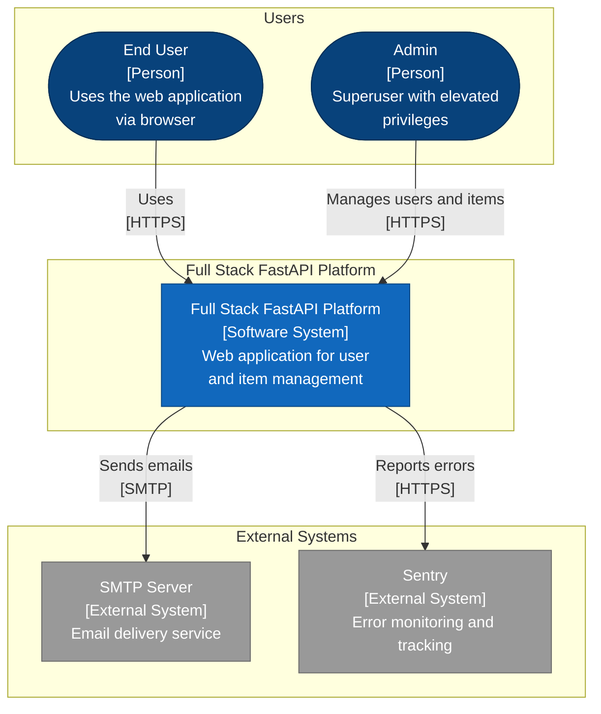
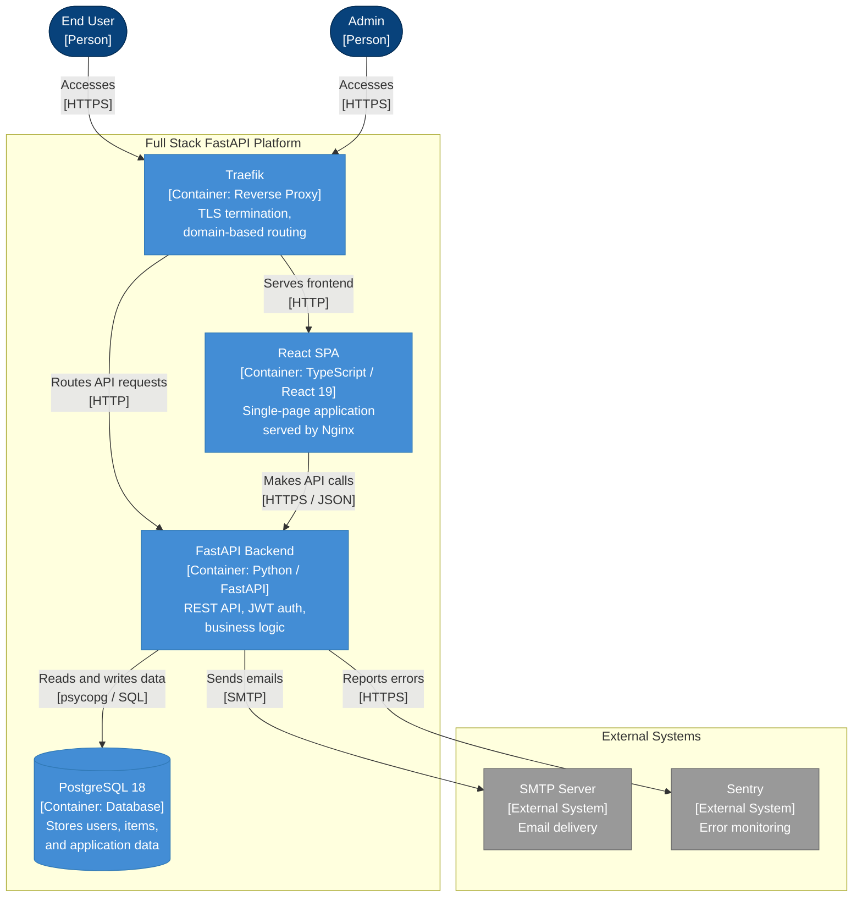
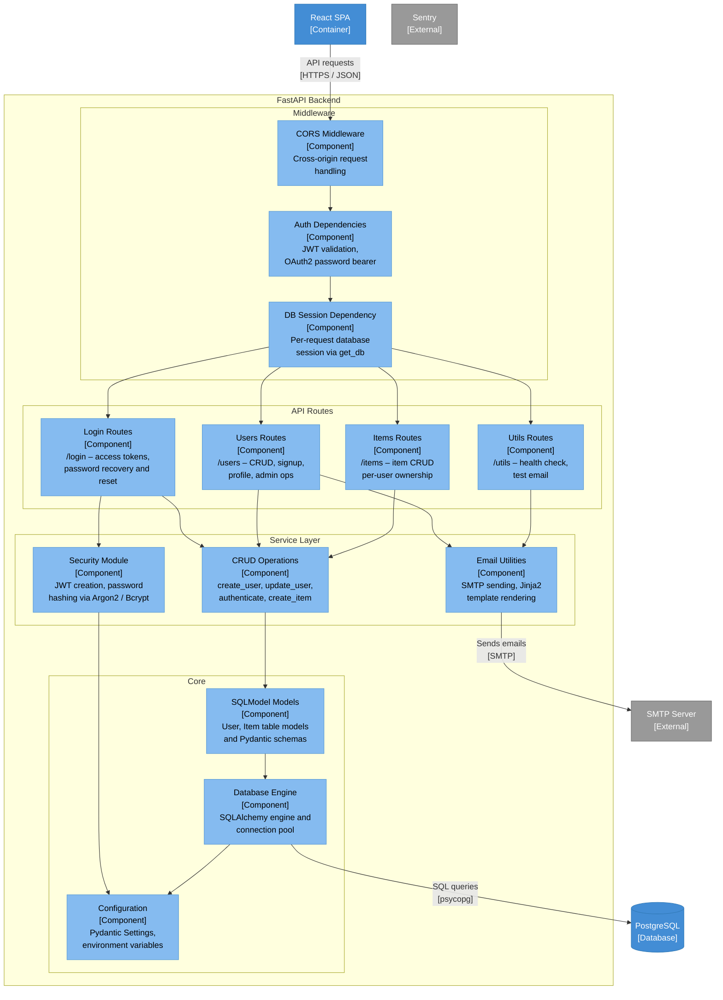
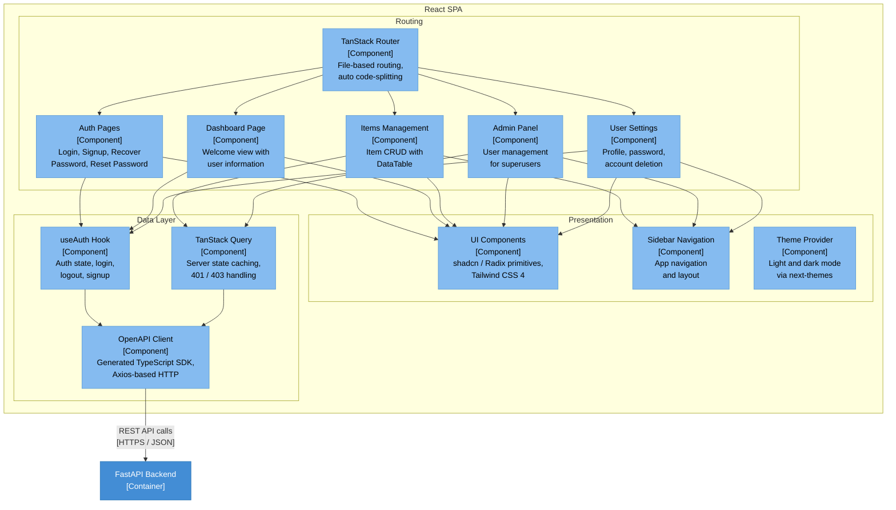

# C4 Architecture Model – Full Stack FastAPI Platform

> Auto-generated C4 model for the Full Stack FastAPI Template codebase.

---

## L1: System Context



---

## L2: Container



---

## L3: FastAPI Backend



---

## L3: React SPA



---

## Containment Map

```text
%% ── L1 top-level groups ─────────────────────────────────────────
users             CONTAINS [user, admin_user]
platform_boundary CONTAINS [platform, traefik_proxy, spa, fastapi_api, pg]
external          CONTAINS [smtp, sentry]

%% ── L2→L3 internal containment: FastAPI Backend ─────────────────
fastapi_api CONTAINS [middleware, routes, services, core]
  middleware  CONTAINS [cors_mw, auth_dep, session_dep]
  routes      CONTAINS [login_routes, users_routes, items_routes, utils_routes]
  services    CONTAINS [crud_layer, email_utils, security_mod]
  core        CONTAINS [config_mod, db_engine, models_layer]

%% ── L2→L3 internal containment: React SPA ───────────────────────
spa CONTAINS [routing, presentation, data_layer]
  routing       CONTAINS [tanstack_router, auth_pages, dashboard_page, items_page, admin_page, settings_page]
  presentation  CONTAINS [ui_components, sidebar_component, theme_provider]
  data_layer    CONTAINS [auth_hook, api_client, query_client]
```
