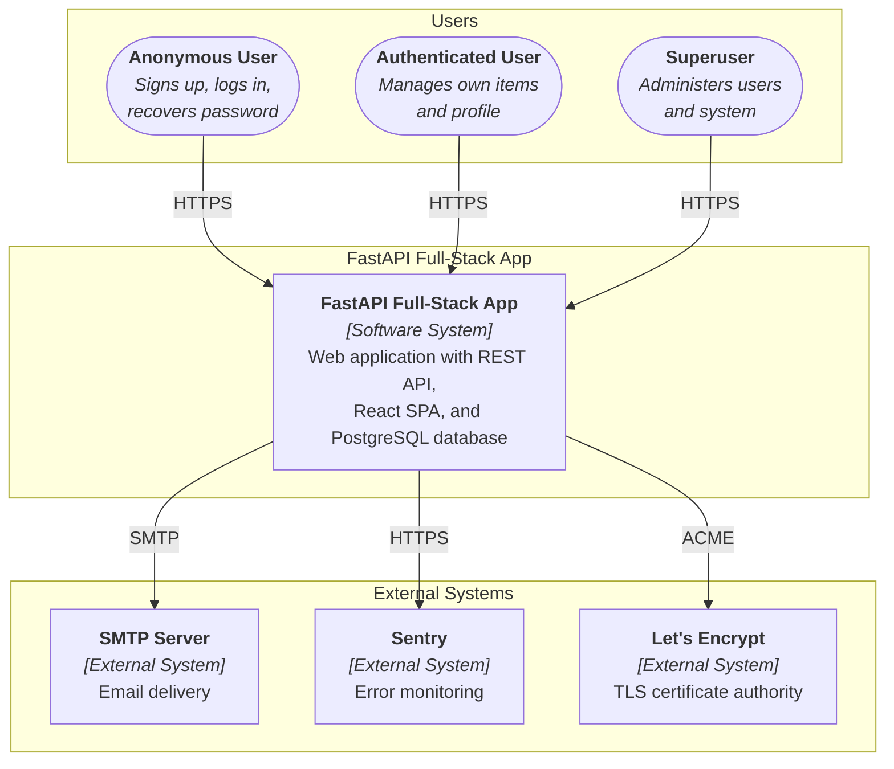
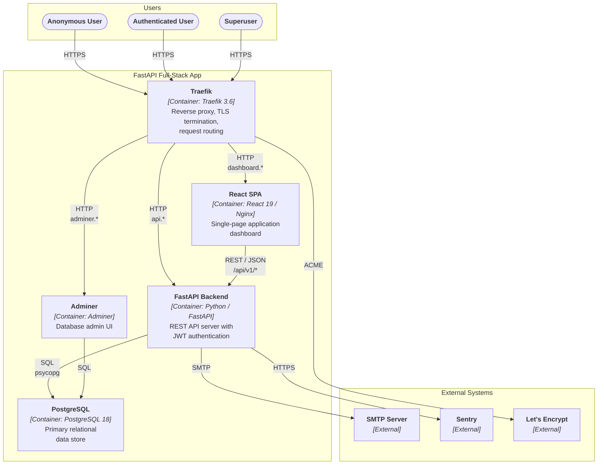
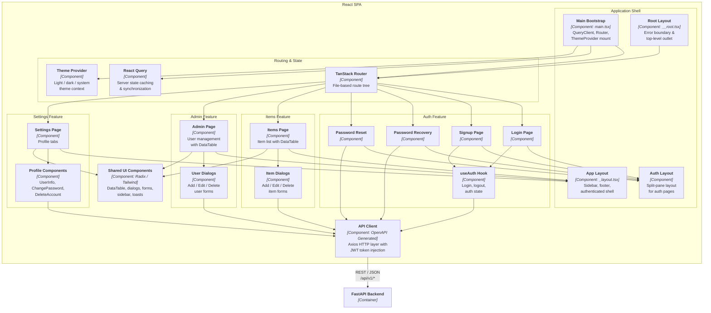

# C4 Architecture Model — FastAPI Full-Stack Template

---

## L1: System Context



---

## L2: Container



---

## L3: FastAPI Backend

```mermaid
%% SCOPE: urn:c4:container:fastapi-backend
flowchart TB

    spa["<b>React SPA</b><br/><i>[Container]</i>"]
    pg["<b>PostgreSQL</b><br/><i>[Container]</i>"]
    smtp["<b>SMTP Server</b><br/><i>[External]</i>"]
    sentry["<b>Sentry</b><br/><i>[External]</i>"]

    subgraph fastapi_backend["FastAPI Backend"]

        subgraph middleware["Middleware"]
            %% KIND: boundary
            cors_mw["<b>CORS Middleware</b><br/><i>[Component]</i><br/>Cross-origin request<br/>handling"]
            %% KIND: integration
            sentry_mw["<b>Sentry Integration</b><br/><i>[Component]</i><br/>Error tracking SDK"]
        end

        subgraph routes["API Routes"]
            %% KIND: router
            api_router["<b>API Router</b><br/><i>[Component: api/main.py]</i><br/>Route aggregation<br/>under /api/v1"]
            %% KIND: router
            login_routes["<b>Login Routes</b><br/><i>[Component]</i><br/>POST /login/access-token<br/>Password recovery"]
            %% KIND: router
            users_routes["<b>Users Routes</b><br/><i>[Component]</i><br/>User CRUD &amp; profile<br/>GET/POST/PATCH/DELETE /users"]
            %% KIND: router
            items_routes["<b>Items Routes</b><br/><i>[Component]</i><br/>Item CRUD<br/>GET/POST/PUT/DELETE /items"]
            %% KIND: router
            utils_routes["<b>Utils Routes</b><br/><i>[Component]</i><br/>Health check &amp;<br/>test email"]
            %% KIND: router
            private_routes["<b>Private Routes</b><br/><i>[Component]</i><br/>Local-only dev<br/>endpoints"]
        end

        subgraph auth_deps["Auth &amp; Dependencies"]
            %% KIND: boundary
            oauth2_dep["<b>OAuth2 Bearer</b><br/><i>[Component]</i><br/>Token extraction from<br/>Authorization header"]
            %% KIND: boundary
            session_dep["<b>DB Session Provider</b><br/><i>[Component]</i><br/>Request-scoped<br/>SQLAlchemy session"]
            %% KIND: boundary
            current_user_dep["<b>Current User Resolver</b><br/><i>[Component]</i><br/>JWT decode &amp;<br/>user load"]
            %% KIND: boundary
            superuser_dep["<b>Superuser Guard</b><br/><i>[Component]</i><br/>Admin authorization<br/>check"]
        end

        %% KIND: service_layer
        crud_layer["<b>CRUD Layer</b><br/><i>[Component: crud.py]</i><br/>User &amp; item persistence<br/>authenticate, get_by_email"]
        %% KIND: data_access
        models_layer["<b>Models</b><br/><i>[Component: SQLModel]</i><br/>ORM entities &amp; Pydantic<br/>schemas (User, Item)"]
        %% KIND: service_layer
        security_mod["<b>Security Module</b><br/><i>[Component: core/security.py]</i><br/>JWT encoding, Argon2<br/>password hashing"]
        %% KIND: data_access
        db_mod["<b>DB Module</b><br/><i>[Component: core/db.py]</i><br/>SQLAlchemy engine,<br/>init_db seeding"]
        %% KIND: service_layer
        config_mod["<b>Config</b><br/><i>[Component: Pydantic Settings]</i><br/>Environment-based<br/>application settings"]
        %% KIND: service_layer
        email_utils["<b>Email Utils</b><br/><i>[Component: utils.py]</i><br/>Jinja2 templates &amp;<br/>SMTP sending"]
        %% KIND: data_access
        alembic_mig["<b>Alembic Migrations</b><br/><i>[Component]</i><br/>Database schema<br/>versioning"]
    end

    spa -->|"REST / JSON"| api_router

    api_router --> login_routes
    api_router --> users_routes
    api_router --> items_routes
    api_router --> utils_routes
    api_router --> private_routes

    login_routes --> auth_deps
    users_routes --> auth_deps
    items_routes --> auth_deps
    utils_routes --> auth_deps

    login_routes --> crud_layer
    login_routes --> email_utils
    users_routes --> crud_layer
    users_routes --> email_utils
    items_routes --> crud_layer
    utils_routes --> email_utils

    current_user_dep --> oauth2_dep
    superuser_dep --> current_user_dep
    current_user_dep --> security_mod
    current_user_dep --> session_dep
    session_dep --> db_mod

    crud_layer --> models_layer
    crud_layer --> security_mod
    db_mod --> models_layer

    db_mod -->|"SQL / psycopg"| pg
    alembic_mig -->|"SQL / psycopg"| pg

    email_utils --> security_mod
    email_utils -->|"SMTP"| smtp
    sentry_mw -->|"HTTPS"| sentry

    config_mod -.->|"configures"| cors_mw
    config_mod -.->|"configures"| sentry_mw
    config_mod -.->|"configures"| db_mod
    config_mod -.->|"configures"| email_utils
    config_mod -.->|"configures"| security_mod
```



---

## L3: React SPA



---

## Containment Map

```text
%% ══════════════════════════════════════════════════════════════════
%% CONTAINMENT MAP
%% ══════════════════════════════════════════════════════════════════

%% ── L1 top-level groups ─────────────────────────────────────────
users              CONTAINS [anonymous_user, auth_user, superuser]
fullstack_boundary CONTAINS [traefik, spa, fastapi_backend, pg, adminer]
external           CONTAINS [smtp, sentry, letsencrypt]

%% ── L2 → L3: FastAPI Backend ───────────────────────────────────
fastapi_backend CONTAINS [middleware, routes, auth_deps, crud_layer, models_layer, security_mod, db_mod, config_mod, email_utils, alembic_mig]
  middleware   CONTAINS [cors_mw, sentry_mw]
  routes       CONTAINS [api_router, login_routes, users_routes, items_routes, utils_routes, private_routes]
  auth_deps    CONTAINS [oauth2_dep, session_dep, current_user_dep, superuser_dep]

%% ── L2 → L3: React SPA ────────────────────────────────────────
spa CONTAINS [app_shell, routing, auth_feature, items_feature, admin_feature, settings_feature, api_client, shared_ui]
  app_shell        CONTAINS [main_bootstrap, root_layout, auth_layout_cmp, app_layout]
  routing          CONTAINS [router, query_client, theme_provider]
  auth_feature     CONTAINS [login_page, signup_page, recover_page, reset_page, use_auth]
  items_feature    CONTAINS [items_page, item_dialogs]
  admin_feature    CONTAINS [admin_page, user_dialogs]
  settings_feature CONTAINS [settings_page, profile_components]
```
