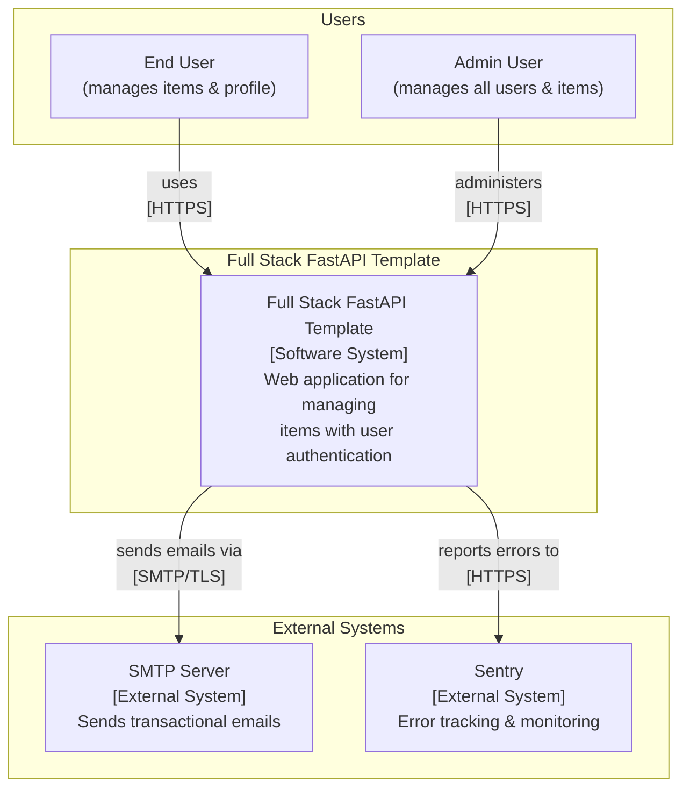
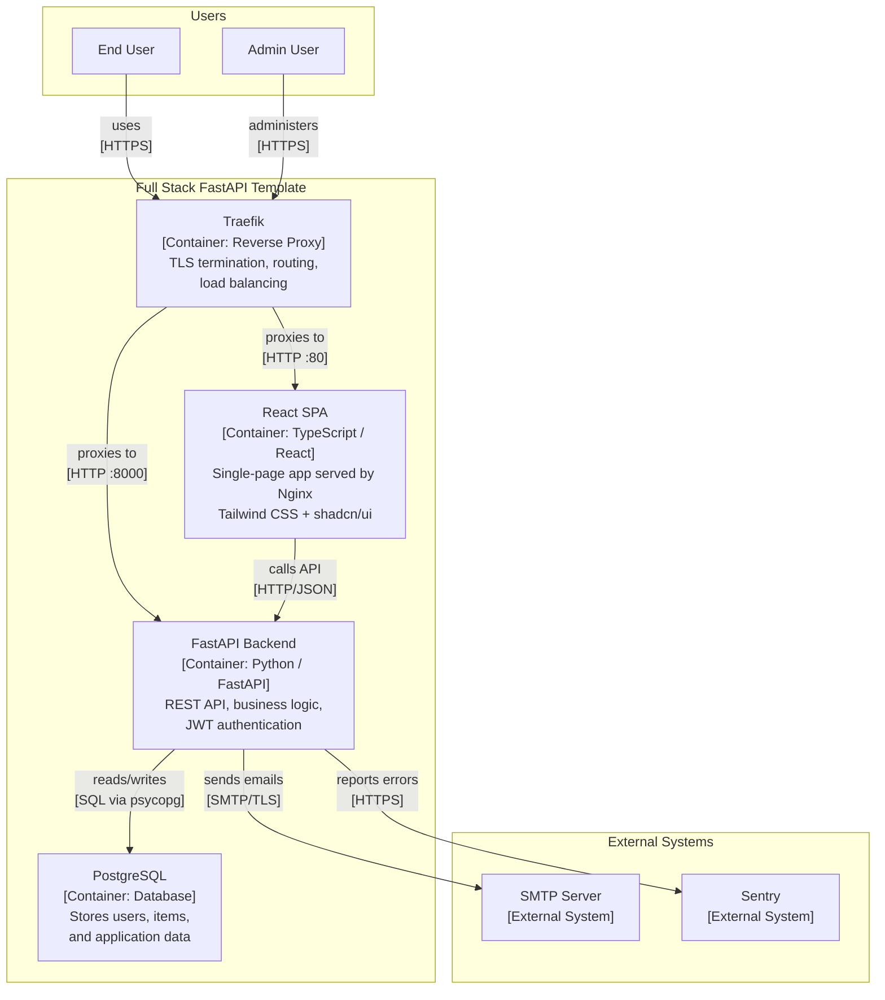
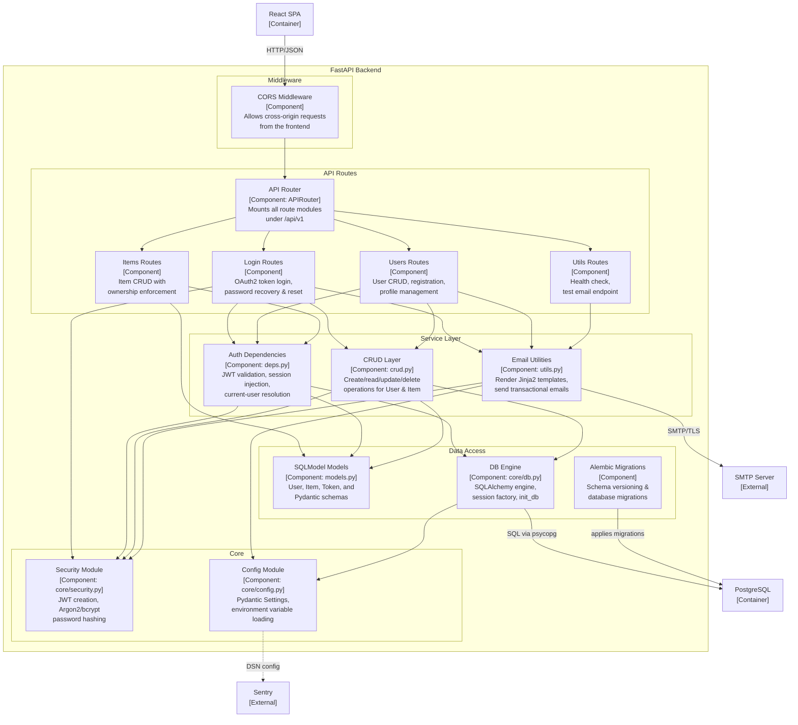
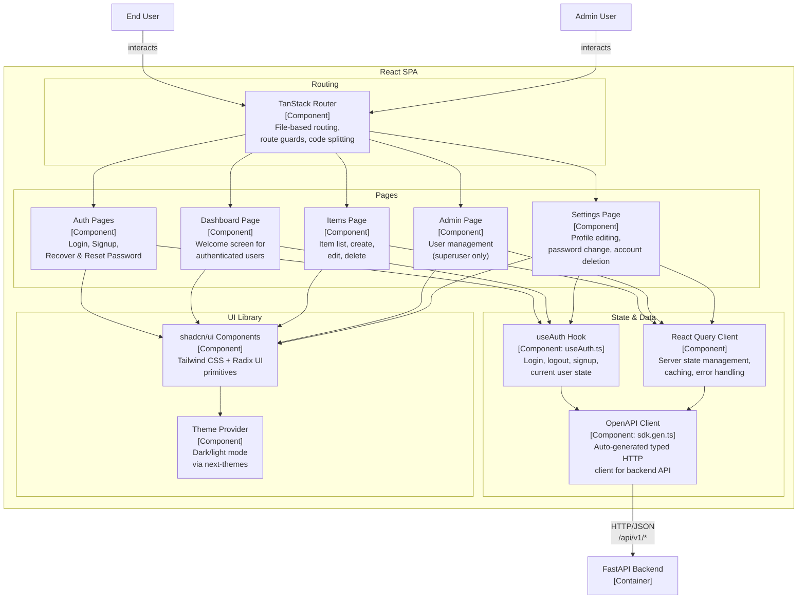
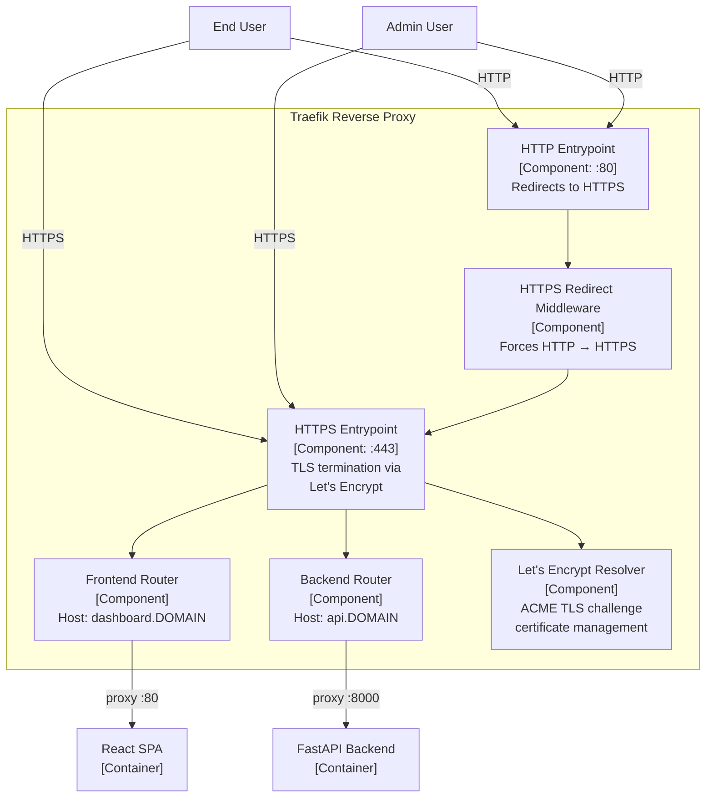
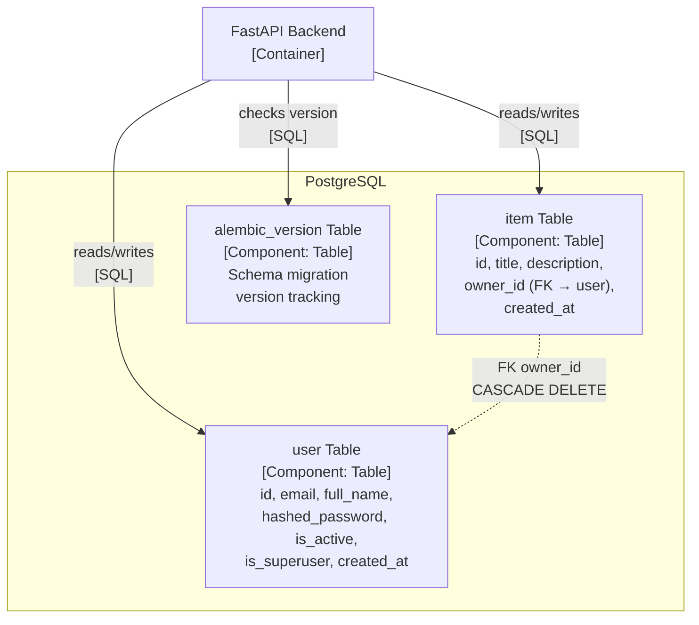

# C4 Architecture Model — Full Stack FastAPI Template

This document describes the architecture of the Full Stack FastAPI Template
using the [C4 model](https://c4model.com/) expressed as Mermaid diagrams.

> **Stable IDs** are used across all levels so that the same logical element
> keeps the same Mermaid node ID everywhere it appears.

---

## L1: System Context



---

## L2: Container Diagram



---

## L3: FastAPI Backend — Component Diagram



---

## L3: React SPA — Component Diagram



---

## L3: Traefik — Component Diagram



---

## L3: PostgreSQL — Component Diagram



---

## Containment Map

```text
%% ════════════════════════════════════════════════════════════════
%% CONTAINMENT MAP — Full Stack FastAPI Template
%% Every subgraph and node from every diagram is listed here.
%% Indentation expresses nesting: child is indented under parent.
%% ════════════════════════════════════════════════════════════════

%% ── L1 top-level groups ─────────────────────────────────────────
users            CONTAINS [end_user, admin_user]
system_boundary  CONTAINS [fastapi_fullstack, traefik, react_spa, fastapi_backend, pg]
external         CONTAINS [smtp_server, sentry]

%% ── L2 system_boundary internals ────────────────────────────────
system_boundary  CONTAINS [traefik, react_spa, fastapi_backend, pg]

%% ── L3: fastapi_backend ────────────────────────────────────────
fastapi_backend  CONTAINS [middleware, routes, services, data_access, core]
  middleware     CONTAINS [cors_mw]
  routes         CONTAINS [api_router, login_routes, users_routes, items_routes, utils_routes]
  services       CONTAINS [auth_deps, crud_layer, email_utils]
  data_access    CONTAINS [models_layer, db_engine, alembic_mig]
  core           CONTAINS [security_mod, config_mod]

%% ── L3: react_spa ──────────────────────────────────────────────
react_spa        CONTAINS [routing, state_mgmt, pages, ui_layer]
  routing        CONTAINS [tanstack_router]
  state_mgmt     CONTAINS [query_client, api_client, auth_hook]
  pages          CONTAINS [auth_pages, dashboard_page, items_page, admin_page, settings_page]
  ui_layer       CONTAINS [ui_lib, theme_prov]

%% ── L3: traefik ────────────────────────────────────────────────
traefik          CONTAINS [http_entrypoint, https_entrypoint, https_redirect, frontend_router, backend_router, le_resolver]

%% ── L3: pg ─────────────────────────────────────────────────────
pg               CONTAINS [user_table, item_table, alembic_version]
```
