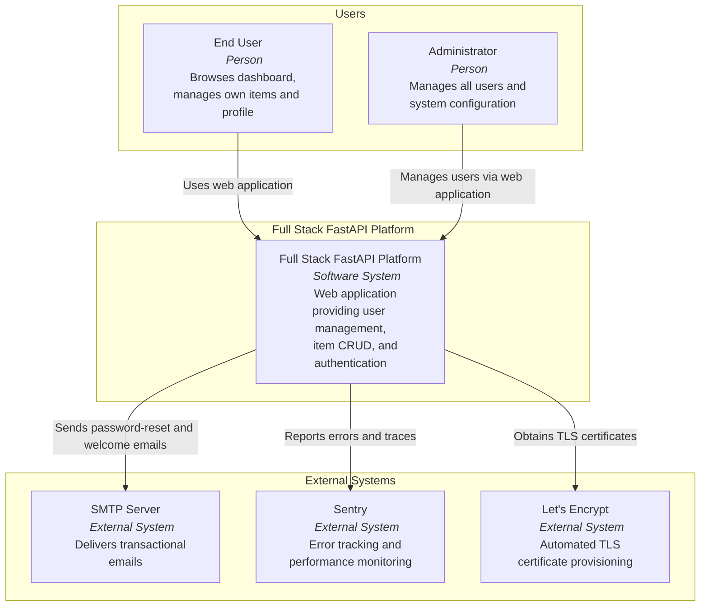
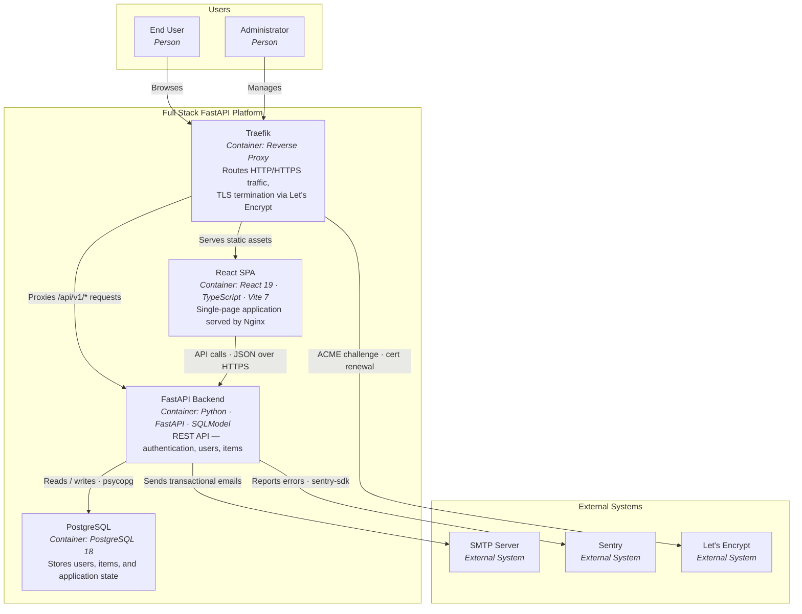
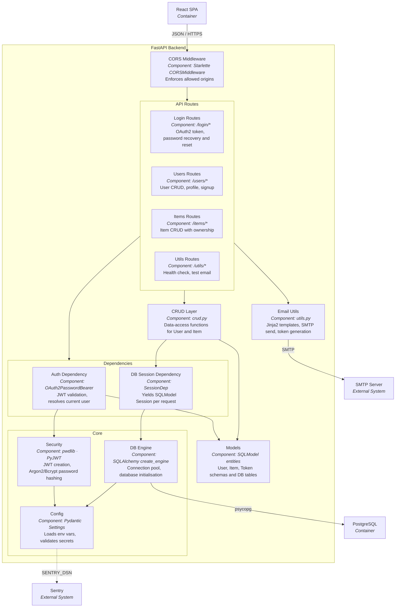
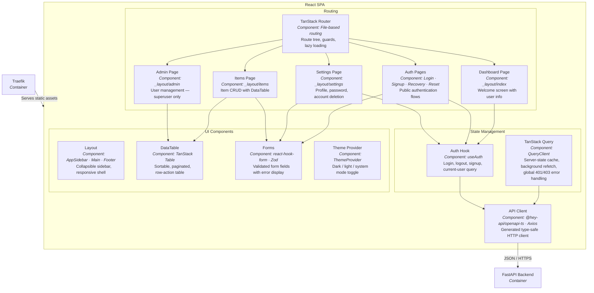
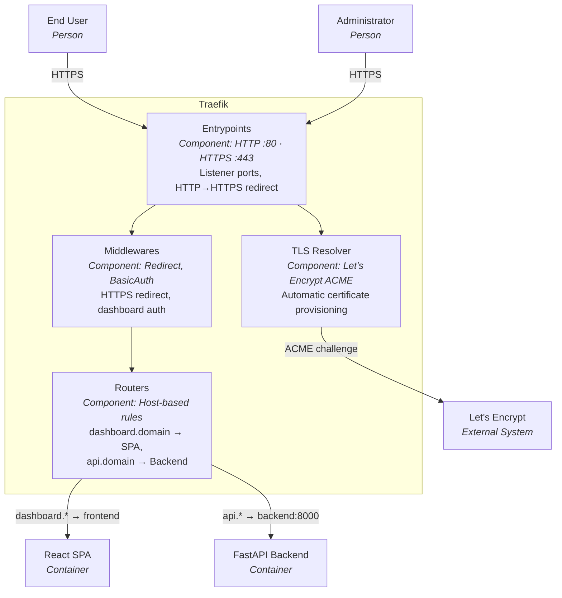
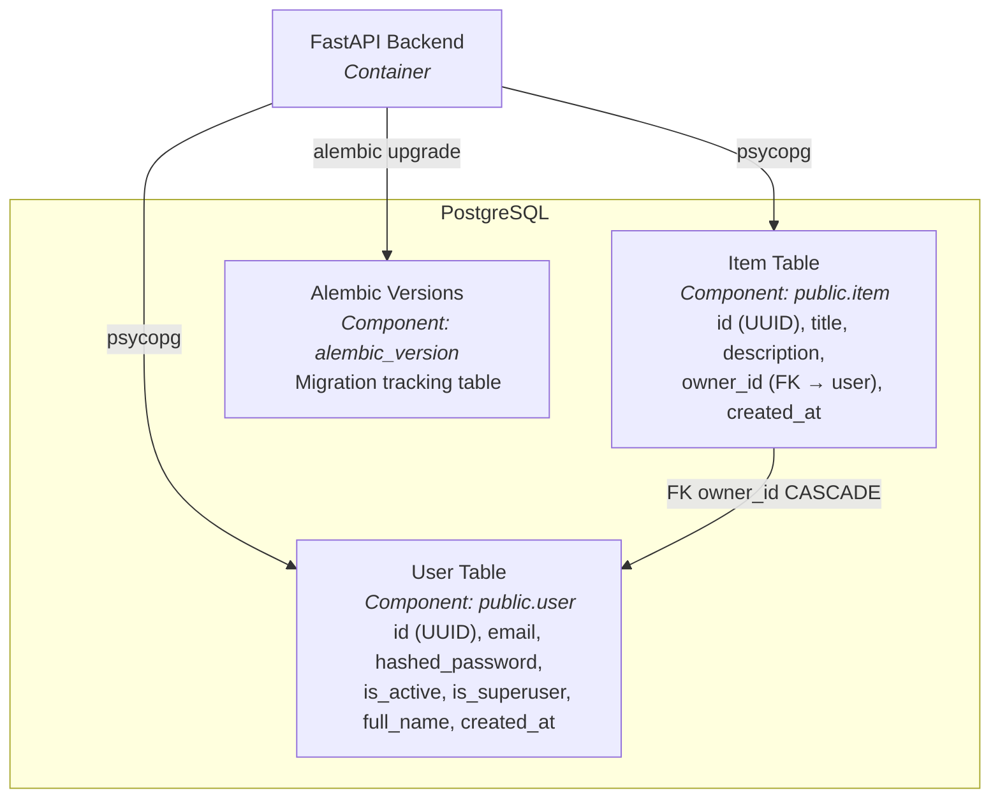

# C4 Architecture Model — Full Stack FastAPI Platform

---

## L1: System Context



---

## L2: Container



---

## L3: FastAPI Backend



---

## L3: React SPA



---

## L3: Traefik



---

## L3: PostgreSQL



---

## Containment Map

```text
%% ── L1 top-level groups ─────────────────────────────────────────
users              CONTAINS [user, admin_user]
platform_boundary  CONTAINS [traefik, spa, fastapi_api, pg]
external           CONTAINS [smtp, sentry, letsencrypt]

%% ── L2 → L3 internal containment ────────────────────────────────

%% FastAPI Backend
fastapi_api  CONTAINS [cors_mw, routes, deps, core, crud, models, email_utils]
  routes     CONTAINS [login_routes, users_routes, items_routes, utils_routes]
  deps       CONTAINS [auth_dep, db_dep]
  core       CONTAINS [config, security, db_engine]

%% React SPA
spa          CONTAINS [routing, state, api_client, ui]
  routing    CONTAINS [router, auth_pages, dashboard_page, items_page, admin_page, settings_page]
  state      CONTAINS [query_client, auth_hook]
  ui         CONTAINS [layout_components, data_table, forms, theme_provider]

%% Traefik
traefik      CONTAINS [entrypoints, routers, tls_resolver, middlewares]

%% PostgreSQL
pg           CONTAINS [user_table, item_table, alembic_versions]
```
