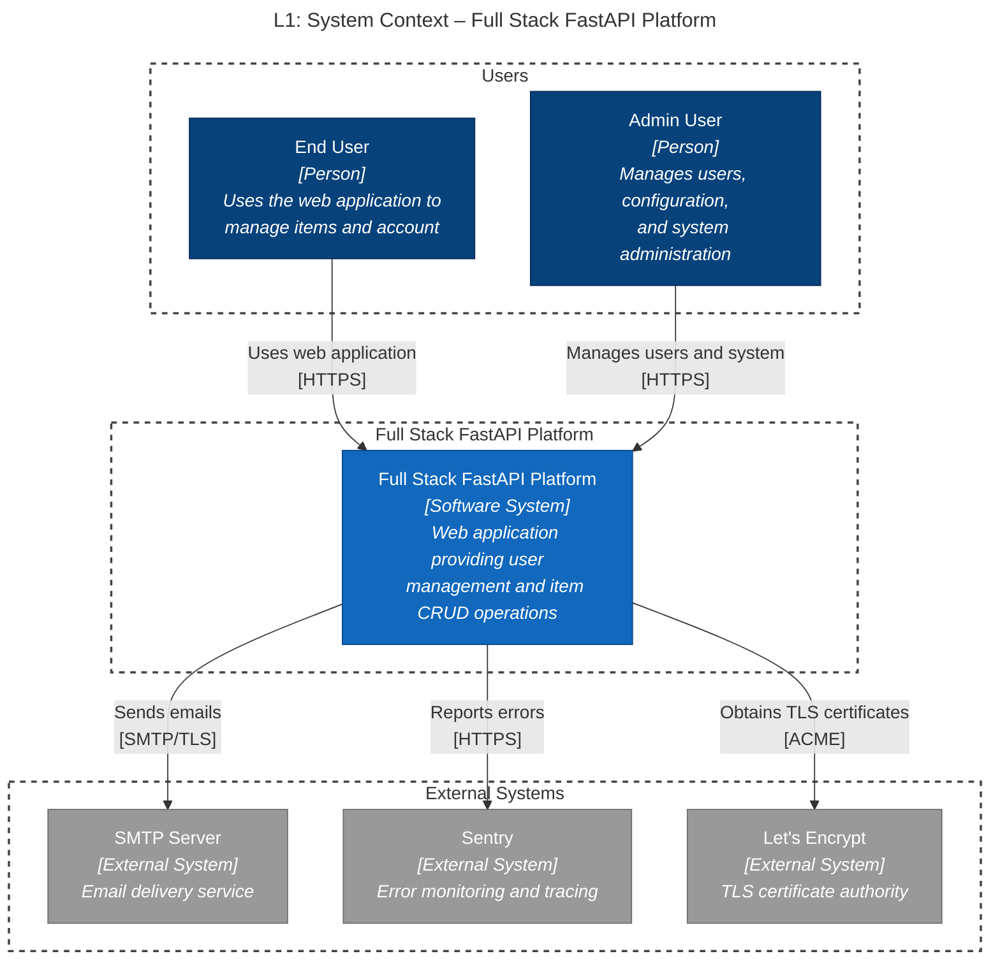
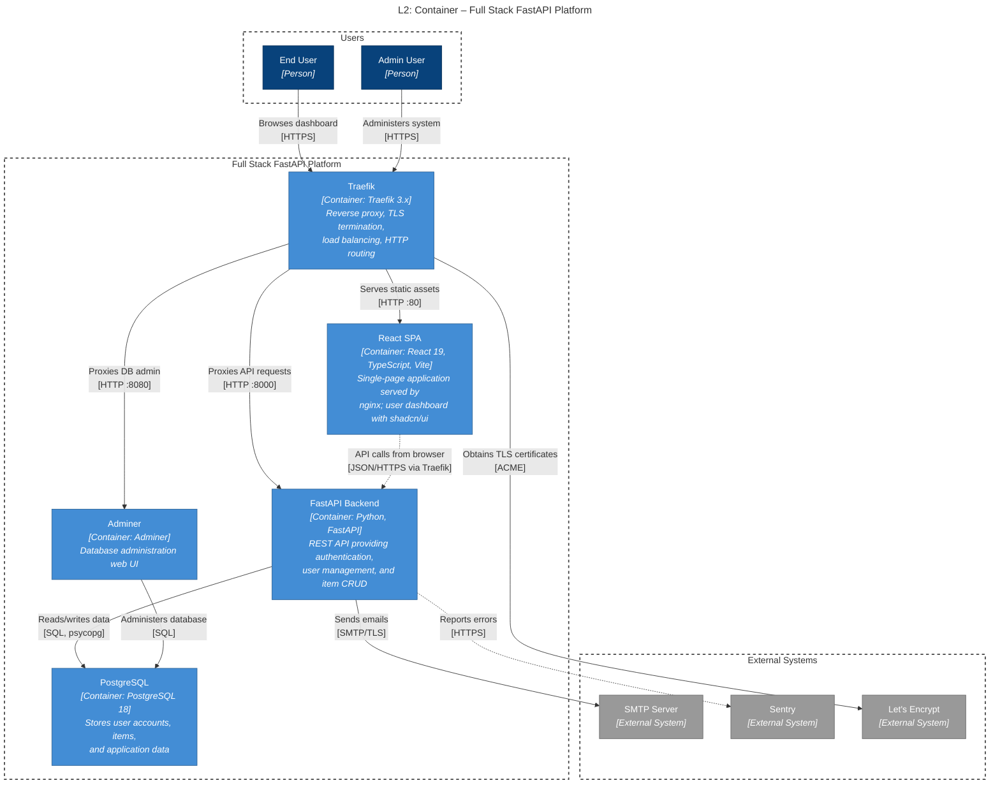
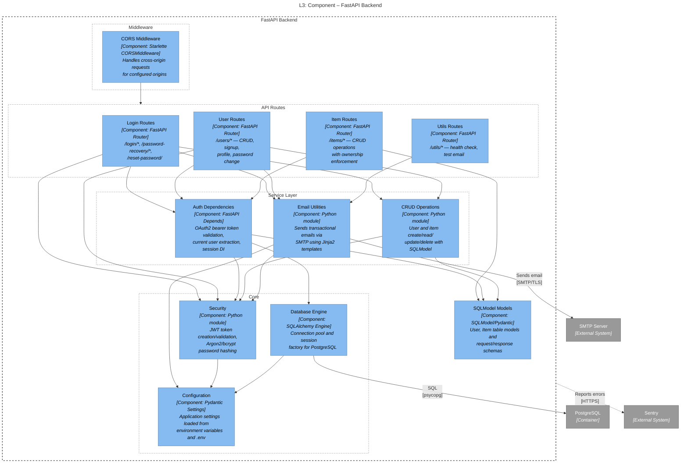
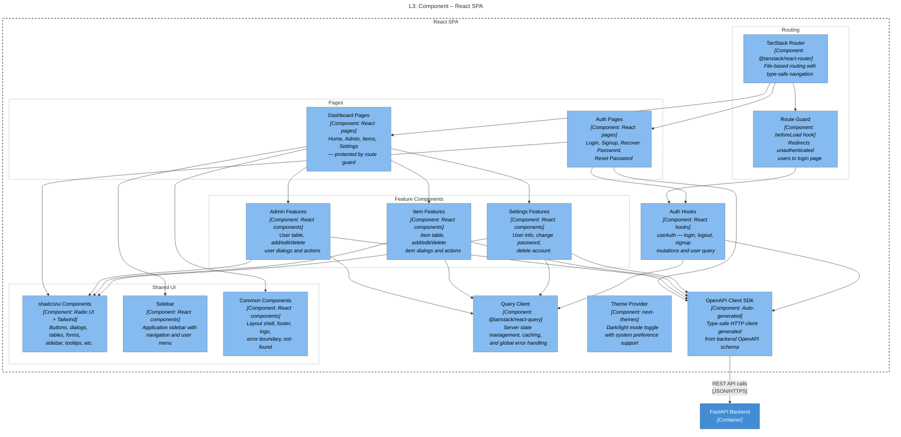

# C4 Architecture Model – Full Stack FastAPI Platform

## L1: System Context



---

## L2: Container Diagram



---

## L3: FastAPI Backend



---

## L3: React SPA



---

## Containment Map

```text
%% ── L1 top-level groups ────────────────────────────────────────────
users              CONTAINS [end_user, admin_user]
platform_boundary  CONTAINS [traefik, spa, fastapi_api, pg, adminer]
external           CONTAINS [smtp, sentry, letsencrypt]

%% ── L2→L3 internal containment ─────────────────────────────────────
fastapi_api  CONTAINS [mw, routes, services, core, models_layer]
  mw         CONTAINS [cors_mw]
  routes     CONTAINS [login_routes, user_routes, item_routes, util_routes]
  services   CONTAINS [auth_deps, crud_layer, email_utils]
  core       CONTAINS [security_mod, config_mod, db_engine]

spa          CONTAINS [routing, pages, features, shared, api_client, auth_hooks, query_client, theme_provider]
  routing    CONTAINS [tanstack_router, route_guard]
  pages      CONTAINS [auth_pages, dashboard_pages]
  features   CONTAINS [admin_features, item_features, settings_features]
  shared     CONTAINS [ui_lib, sidebar_comp, common_comp]
```
