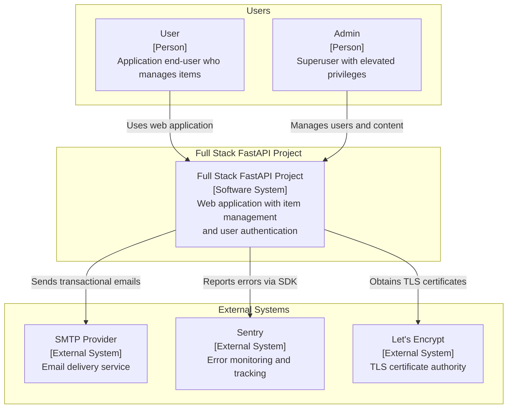
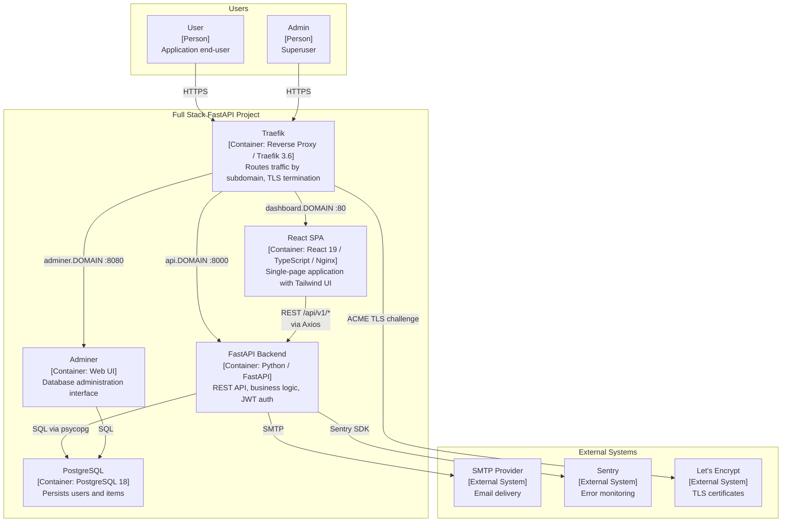
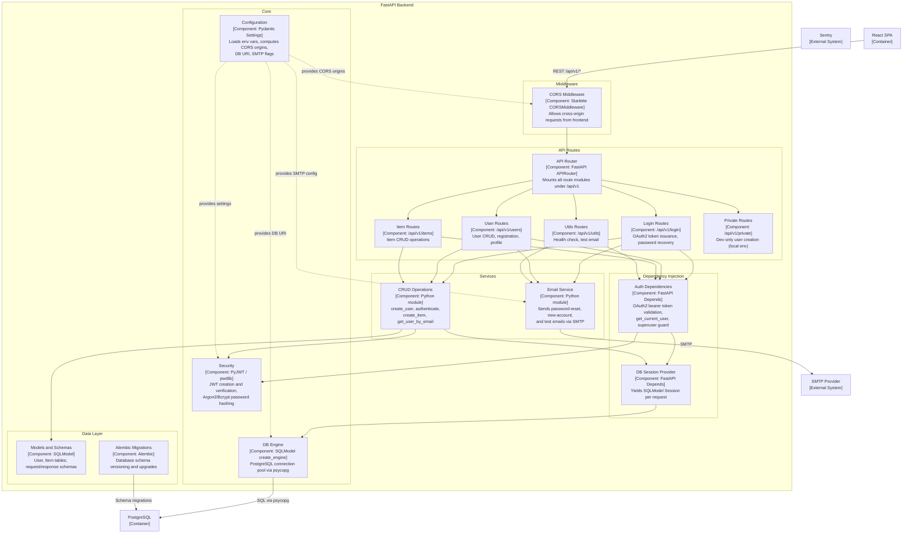
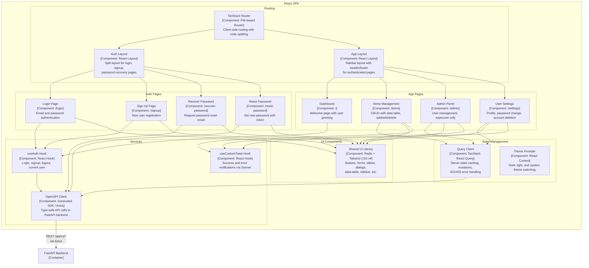

# C4 Architecture Model — Full Stack FastAPI Project

<!-- Auto-generated from source code and configuration files. -->

---

## L1: System Context



---

## L2: Container



---

## L3: FastAPI Backend



---

## L3: React SPA



---

## Containment Map

```text
%% ═══════════════════════════════════════════════════════════════════
%% CONTAINMENT MAP — covers L1, L2, and all L3 diagrams
%% Every subgraph and its direct children are listed.
%% Indentation denotes nesting depth.
%% ═══════════════════════════════════════════════════════════════════

%% ── L1 / L2 top-level groups ───────────────────────────────────────
users              CONTAINS [user, admin]
system_boundary    CONTAINS [traefik, spa, fastapi_backend, pg, adminer]
external           CONTAINS [smtp_provider, sentry, letsencrypt]

%% ── L3: FastAPI Backend (urn:c4:container:fastapi_backend) ─────────
fastapi_backend    CONTAINS [mw, routes, deps, services, core, data_layer]
  mw               CONTAINS [cors_mw]
  routes           CONTAINS [api_router, login_routes, user_routes, item_routes, utils_routes, private_routes]
  deps             CONTAINS [auth_deps, db_session]
  services         CONTAINS [crud_layer, email_svc]
  core             CONTAINS [config, security, db_engine]
  data_layer       CONTAINS [models_layer, alembic_migrations]

%% ── L3: React SPA (urn:c4:container:spa) ───────────────────────────
spa                CONTAINS [routing, auth_pages, app_pages, services_layer, state_mgmt, ui_layer]
  routing          CONTAINS [router, auth_layout, app_layout]
  auth_pages       CONTAINS [login_page, signup_page, recover_page, reset_page]
  app_pages        CONTAINS [dashboard_page, items_feature, admin_feature, settings_feature]
  services_layer   CONTAINS [api_client, auth_hook, toast_hook]
  state_mgmt       CONTAINS [query_client, theme_provider]
  ui_layer         CONTAINS [ui_components]
```
