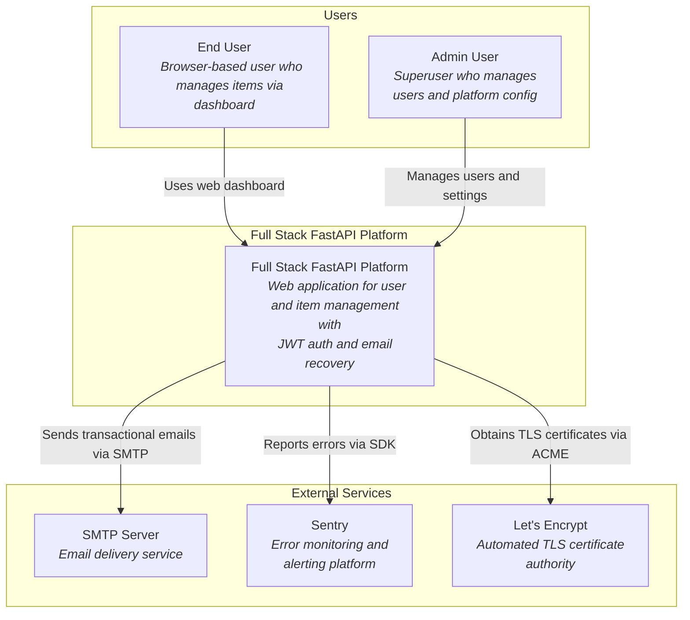
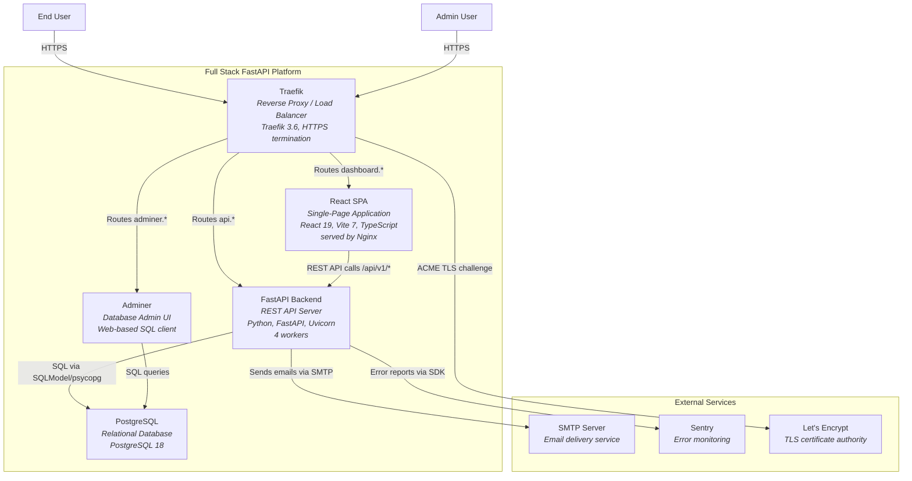
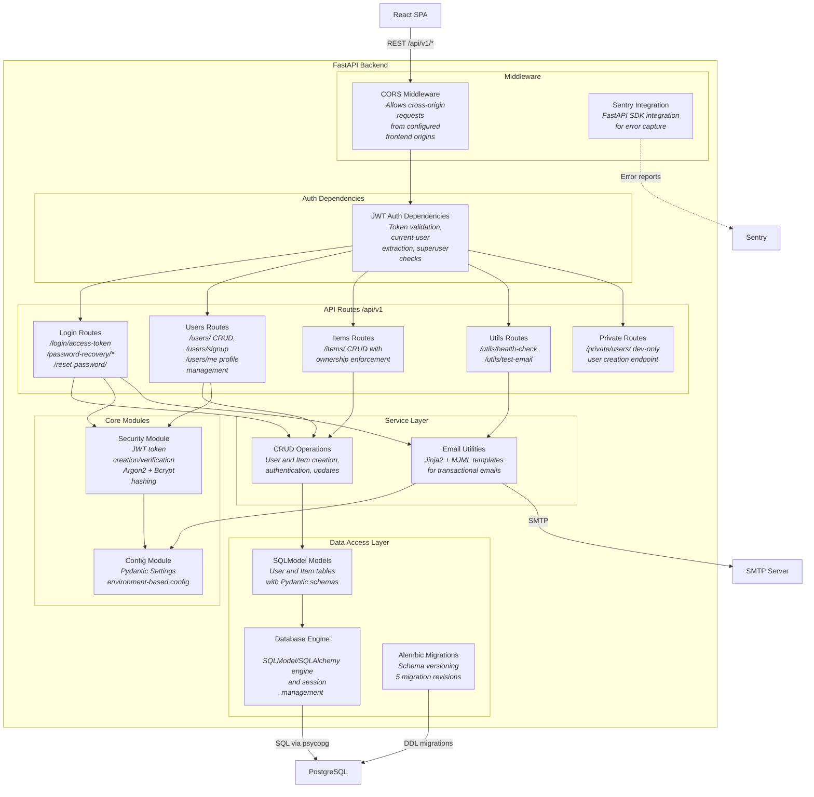
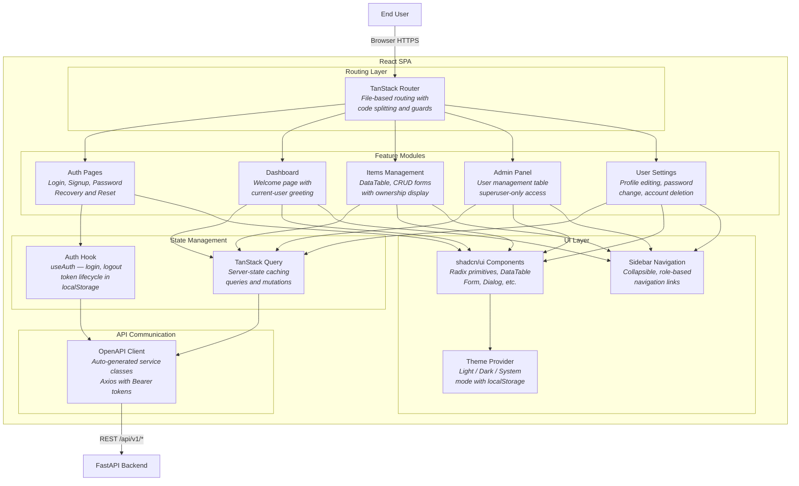
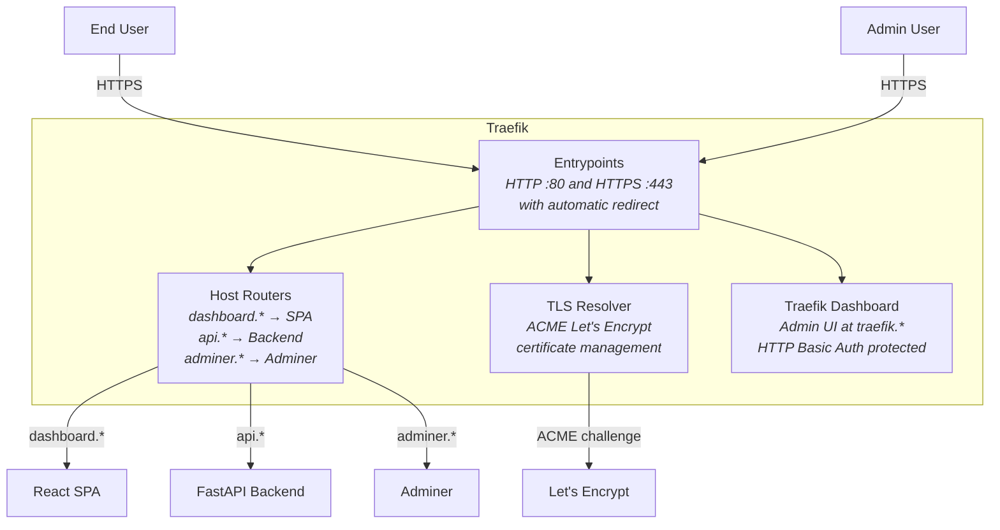

# C4 Architecture — Full Stack FastAPI Project

## L1: System Context



## L2: Container



## L3: FastAPI Backend



## L3: React SPA



## L3: Traefik Reverse Proxy



---

## Containment Map

```text
%% ── L1 top-level groups ─────────────────────────────────────────
users              CONTAINS [user, admin_user]
platform_boundary  CONTAINS [platform]
external           CONTAINS [smtp, sentry, letsencrypt]

%% ── L2 container level ──────────────────────────────────────────
platform_boundary  CONTAINS [traefik, spa, fastapi_backend, pg, adminer]
external           CONTAINS [smtp, sentry, letsencrypt]

%% ── L3: fastapi_backend internals ───────────────────────────────
fastapi_backend    CONTAINS [middleware, auth, routes, services, core, data_access]
  middleware       CONTAINS [cors_mw, sentry_sdk]
  auth             CONTAINS [auth_deps]
  routes           CONTAINS [login_routes, users_routes, items_routes, utils_routes, private_routes]
  services         CONTAINS [crud_layer, email_utils]
  core             CONTAINS [security_mod, config_mod]
  data_access      CONTAINS [models_layer, db_engine, alembic]

%% ── L3: spa internals ──────────────────────────────────────────
spa                CONTAINS [routing, state, api_layer, features, ui]
  routing          CONTAINS [router]
  state            CONTAINS [auth_hook, query_client]
  api_layer        CONTAINS [api_client]
  features         CONTAINS [auth_pages, dashboard_page, items_feature, admin_feature, settings_feature]
  ui               CONTAINS [ui_components, theme_provider, sidebar]

%% ── L3: traefik internals ──────────────────────────────────────
traefik            CONTAINS [entrypoints, routers, tls_resolver, traefik_dashboard]
```
