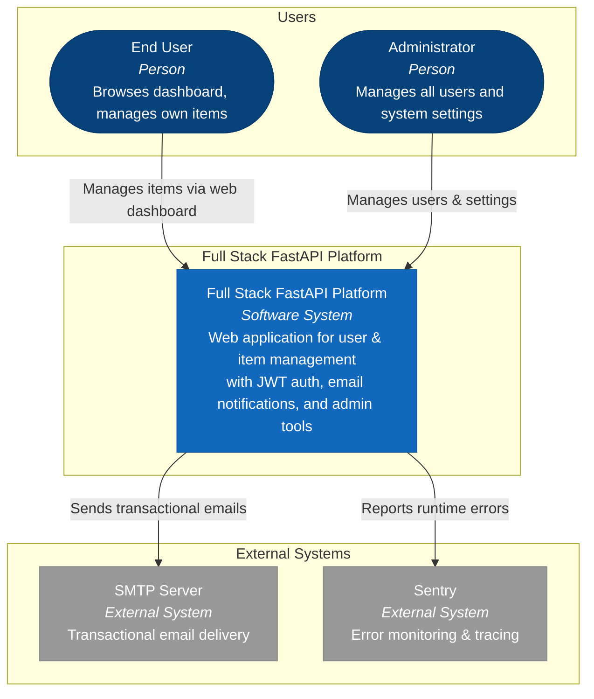
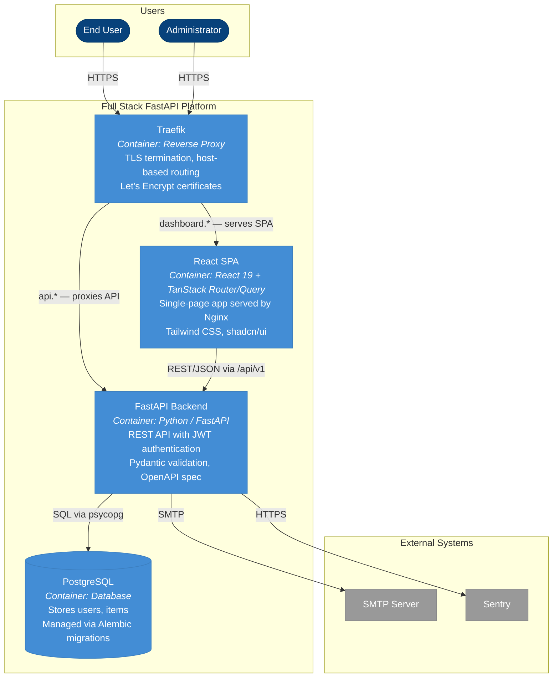
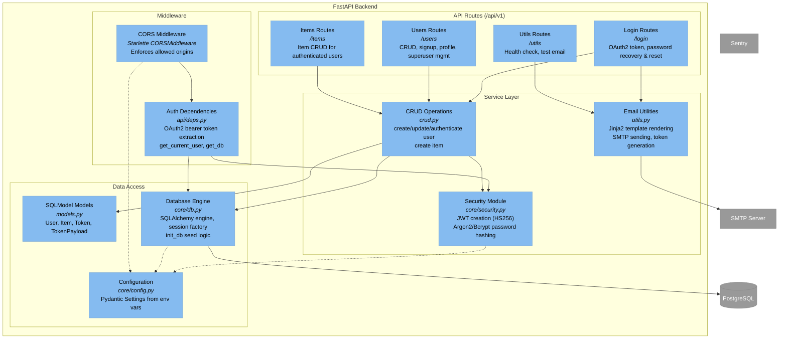
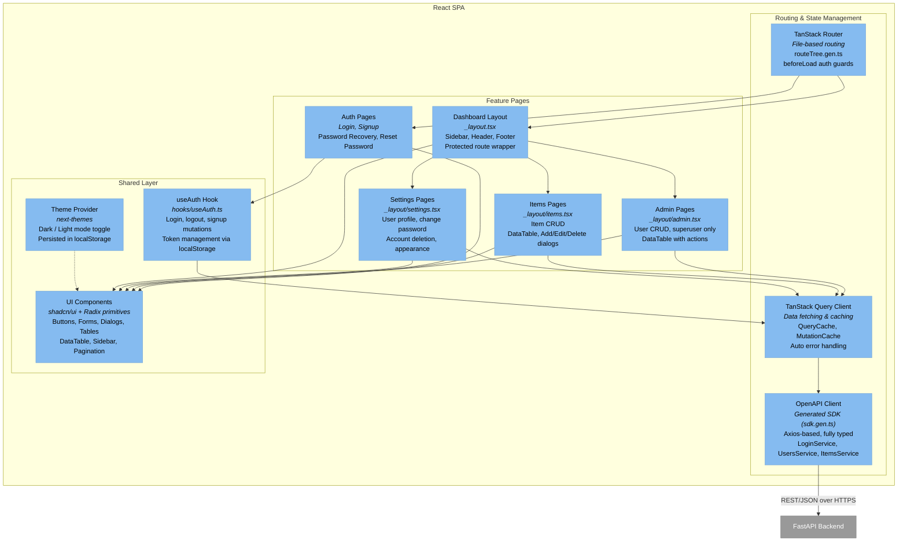

# C4 Architecture — Full Stack FastAPI Platform

> Auto-generated C4 model. Node IDs are **stable** across all diagram levels.
> Each diagram declares its scope element via a `%% SCOPE:` comment.

---

## L1: System Context



---

## L2: Container



---

## L3: FastAPI Backend



---

## L3: React SPA



---

## Containment Map

```text
%% ═══════════════════════════════════════════════════════════════════
%% CONTAINMENT MAP — covers L1, L2, and all L3 diagrams
%% ═══════════════════════════════════════════════════════════════════

%% ── L1 top-level groups ────────────────────────────────────────────
users             CONTAINS [user, admin_user]
platform_boundary CONTAINS [spa, fastapi_backend, pg, traefik]
external          CONTAINS [smtp, sentry]

%% ── L2 containers (platform_boundary expanded) ────────────────────
%%   traefik        (leaf — no internal structure)
%%   pg             (leaf — no internal structure)
%%   fastapi_backend → decomposed in L3
%%   spa             → decomposed in L3

%% ── L3: fastapi_backend internal containment ──────────────────────
fastapi_backend   CONTAINS [mw, routes, services, data_access]
  mw              CONTAINS [cors_mw, auth_deps]
  routes          CONTAINS [login_routes, users_routes, items_routes, utils_routes]
  services        CONTAINS [crud_layer, security_mod, email_utils]
  data_access     CONTAINS [models_layer, db_engine, config]

%% ── L3: spa internal containment ──────────────────────────────────
spa               CONTAINS [routing, features, shared]
  routing         CONTAINS [router, query_client, api_client]
  features        CONTAINS [auth_pages, dashboard_layout, admin_pages, items_pages, settings_pages]
  shared          CONTAINS [auth_hook, ui_components, theme_provider]
```
