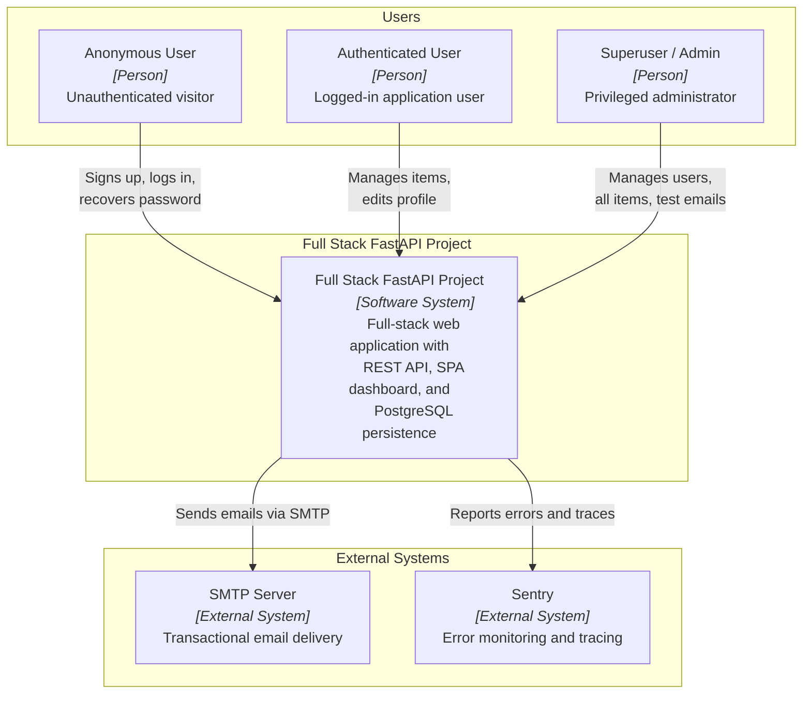
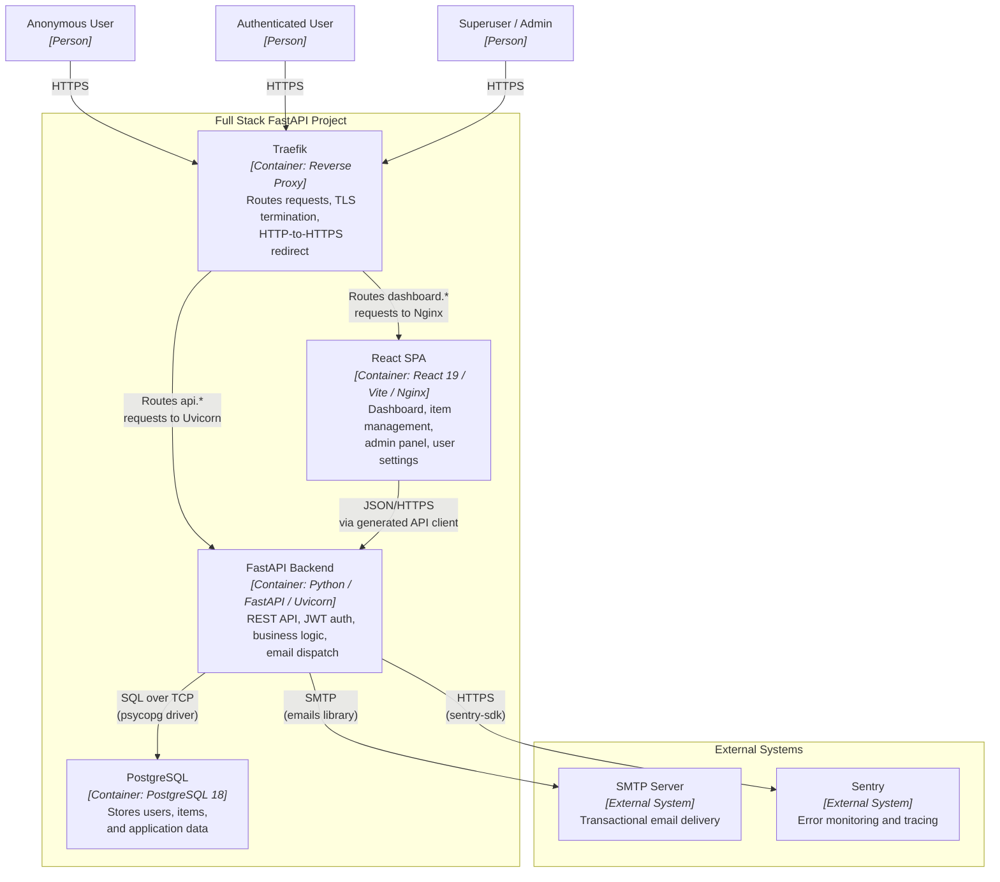
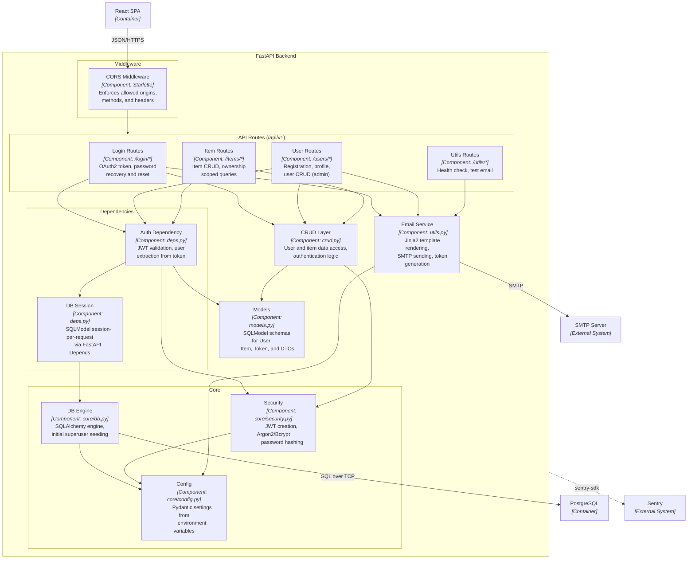
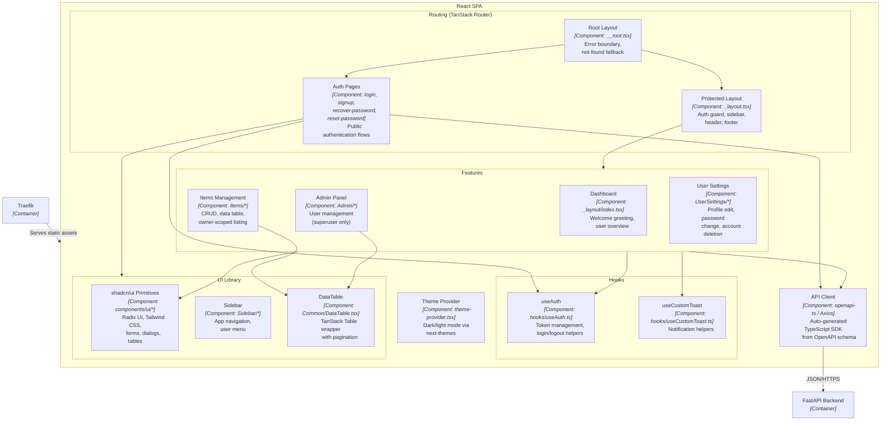

# C4 Architecture Model — Full Stack FastAPI Project

> Auto-generated C4 model covering L1 (System Context), L2 (Container),
> and L3 (Component) diagrams for the Full Stack FastAPI Project.

---

## L1: System Context



---

## L2: Container



---

## L3: FastAPI Backend



---

## L3: React SPA



---

## Containment Map

```text
%% ══════════════════════════════════════════════════════════════════
%% CONTAINMENT MAP — Full Stack FastAPI Project
%% Every subgraph and its direct children across all diagrams.
%% ══════════════════════════════════════════════════════════════════

%% ── L1 top-level groups ─────────────────────────────────────────
users            CONTAINS [anon_user, auth_user, admin_user]
system_boundary  CONTAINS [system]
external         CONTAINS [smtp, sentry]

%% ── L2 system boundary (containers) ─────────────────────────────
system_boundary  CONTAINS [traefik, spa, fastapi_backend, pg]

%% ── L3: FastAPI Backend ─────────────────────────────────────────
fastapi_backend  CONTAINS [mw, routes, deps, crud_layer, core, email_svc, models_layer]
  mw             CONTAINS [cors_mw]
  routes         CONTAINS [login_routes, user_routes, item_routes, util_routes]
  deps           CONTAINS [auth_dep, db_session_dep]
  core           CONTAINS [security_mod, config_mod, db_engine]

%% ── L3: React SPA ──────────────────────────────────────────────
spa              CONTAINS [routing, features, api_client, hooks, ui_lib, theme_provider]
  routing        CONTAINS [root_layout, protected_layout, auth_pages]
  features       CONTAINS [dashboard_page, items_feature, admin_feature, settings_feature]
  hooks          CONTAINS [auth_hook, toast_hook]
  ui_lib         CONTAINS [shadcn_components, sidebar_component, data_table]
```
