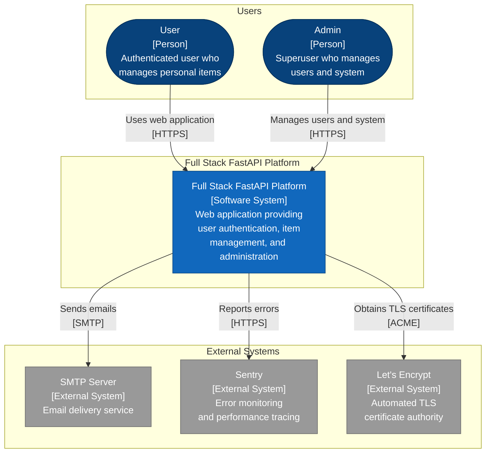
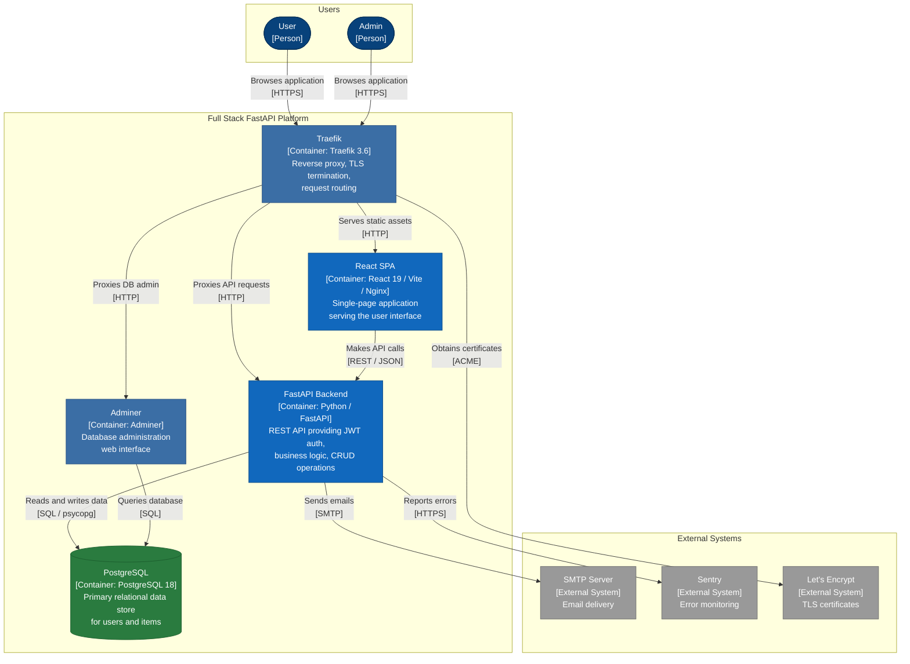
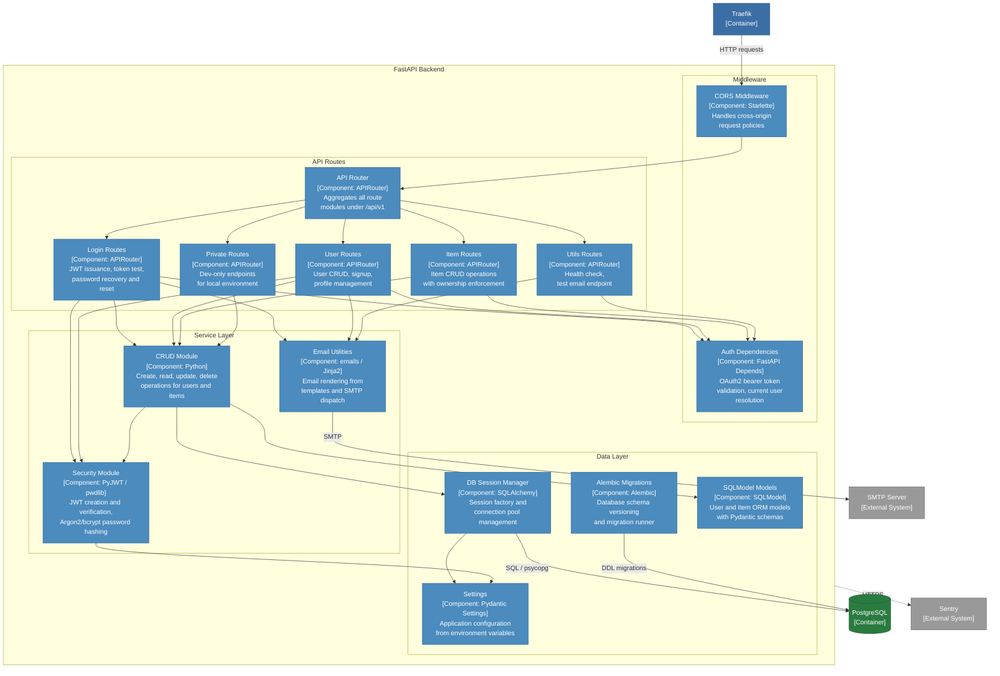
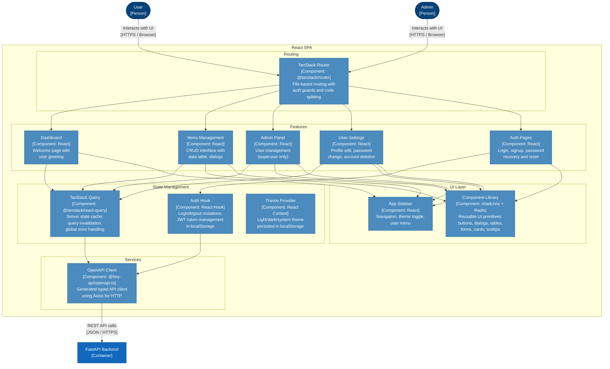

# C4 Architecture Model — Full Stack FastAPI Platform

---

## L1: System Context



---

## L2: Container Diagram



---

## L3: FastAPI Backend



---

## L3: React SPA



---

## Containment Map

```text
%% ══════════════════════════════════════════════════════════════════
%% CONTAINMENT MAP
%% ══════════════════════════════════════════════════════════════════

%% ── L1 top-level groups ─────────────────────────────────────────
%% users              CONTAINS [user, admin_user]
%% platform_boundary  CONTAINS [traefik, spa, fastapi, pg, adminer]
%% external           CONTAINS [smtp, sentry, letsencrypt]

%% ── L2 containers (within platform_boundary) ────────────────────
%% traefik            (leaf — no internal structure)
%% pg                 (leaf — no internal structure)
%% adminer            (leaf — no internal structure)

%% ── L3: FastAPI Backend ─────────────────────────────────────────
%% fastapi            CONTAINS [mw, routes, services, data_layer]
%%   mw               CONTAINS [cors_mw, auth_deps]
%%   routes            CONTAINS [api_router, login_routes, user_routes, item_routes, util_routes, private_routes]
%%   services          CONTAINS [crud, security, email_utils]
%%   data_layer        CONTAINS [models_layer, db_core, config, alembic_mig]

%% ── L3: React SPA ──────────────────────────────────────────────
%% spa                CONTAINS [routing, contexts, features, services_layer, ui]
%%   routing           CONTAINS [router]
%%   contexts          CONTAINS [query_client, auth_hook, theme_ctx]
%%   features          CONTAINS [dashboard_feat, items_feat, admin_feat, settings_feat, auth_pages]
%%   services_layer    CONTAINS [api_client]
%%   ui                CONTAINS [ui_lib, app_sidebar]
```
