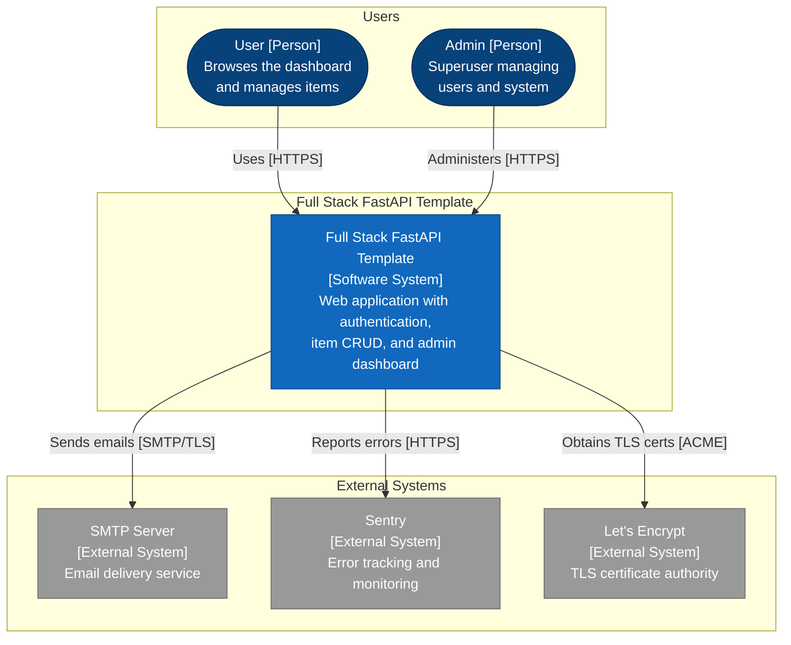
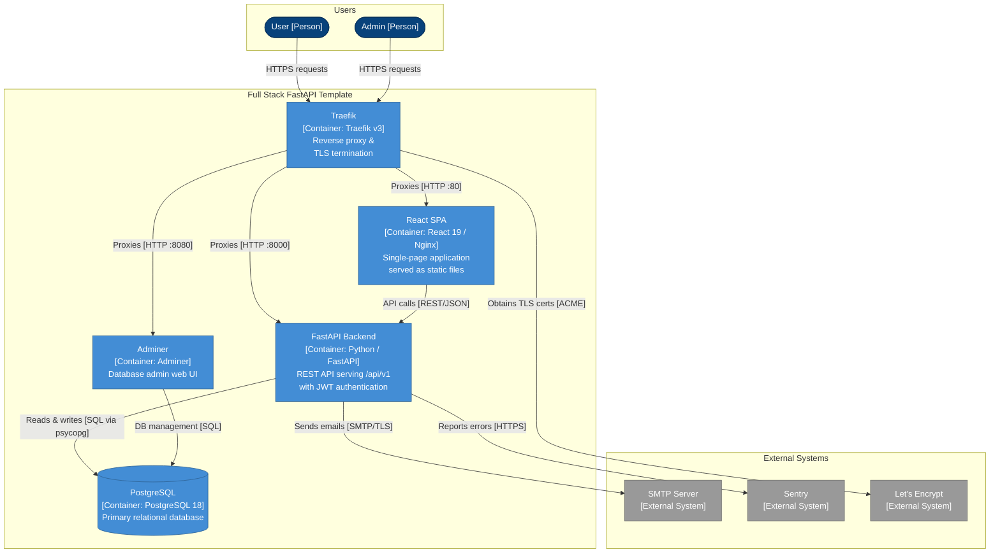
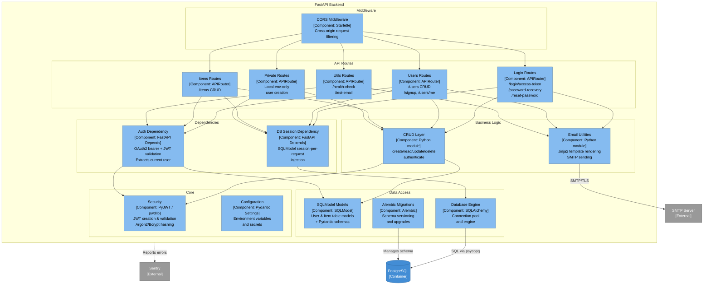
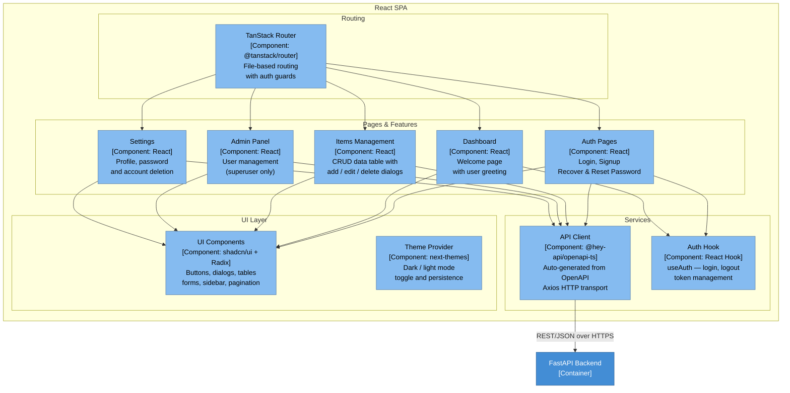

# C4 Architecture Model — Full Stack FastAPI Template

> Auto-generated C4 model describing the system at L1 (context),
> L2 (container), and L3 (component) levels.

---

## L1: System Context



---

## L2: Container



---

## L3: FastAPI Backend



---

## L3: React SPA



---

## Containment Map

```text
%% ── L1 top-level groups ─────────────────────────────────────────
users            CONTAINS [user, admin_user]
system_boundary  CONTAINS [system]
external         CONTAINS [smtp, sentry, letsencrypt]

%% ── L2 system decomposition ─────────────────────────────────────
system_boundary  CONTAINS [traefik_proxy, spa, fastapi_api, pg, adminer]

%% ── L3: FastAPI Backend internal containment ────────────────────
fastapi_api      CONTAINS [middleware, deps, routes, business, data_layer, core]
  middleware     CONTAINS [cors_mw]
  deps           CONTAINS [auth_dep, db_dep]
  routes         CONTAINS [login_routes, users_routes, items_routes, utils_routes, private_routes]
  business       CONTAINS [crud_layer, email_utils]
  data_layer     CONTAINS [models_layer, db_engine, alembic_mig]
  core           CONTAINS [security_core, config_core]

%% ── L3: React SPA internal containment ──────────────────────────
spa              CONTAINS [routing, features, services_layer, ui_layer]
  routing        CONTAINS [router_layer]
  features       CONTAINS [auth_pages, dashboard_page, items_feature, admin_feature, settings_feature]
  services_layer CONTAINS [api_client, auth_hook]
  ui_layer       CONTAINS [ui_components, theme_provider]
```
