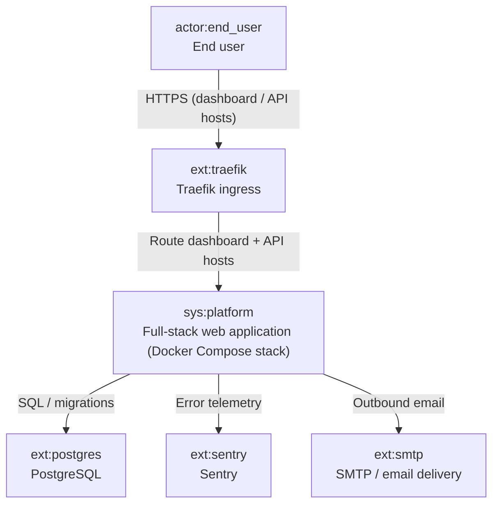
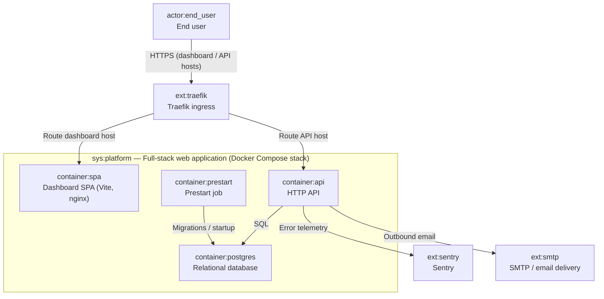
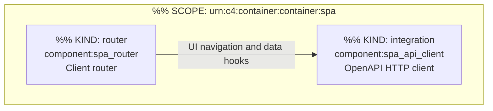
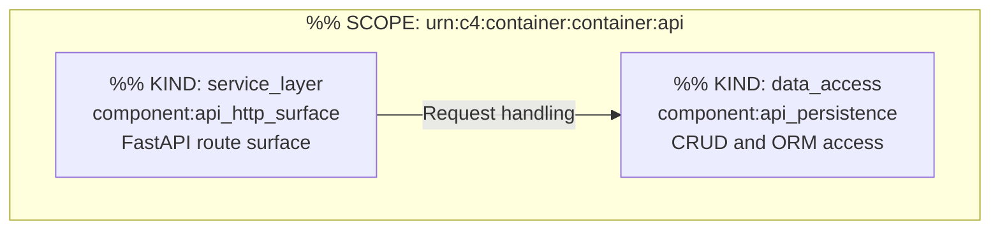
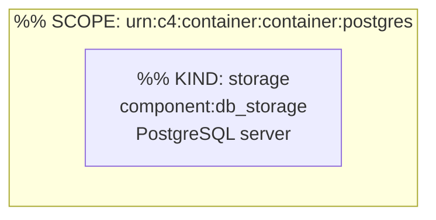
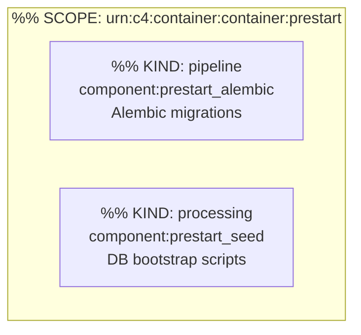

# C4 Architecture

Projected from `docs/c4-events.ndjson` (append-only stream). Pass 4 applies label refinements only.

## L1 — System context



## L2 — Container diagram



## L3 — Components (selected containers)

### container:spa



### container:api



### container:postgres



### container:prestart



## Containment Map

```json
{
  "parentToChildren": {
    "sys:platform": [
      "container:spa",
      "container:api",
      "container:postgres",
      "container:prestart"
    ],
    "container:spa": [
      "component:spa_router",
      "component:spa_api_client"
    ],
    "container:api": [
      "component:api_http_surface",
      "component:api_persistence"
    ],
    "container:postgres": [
      "component:db_storage"
    ],
    "container:prestart": [
      "component:prestart_alembic",
      "component:prestart_seed"
    ]
  },
  "childToParent": {
    "container:spa": "sys:platform",
    "container:api": "sys:platform",
    "container:postgres": "sys:platform",
    "container:prestart": "sys:platform",
    "component:spa_router": "container:spa",
    "component:spa_api_client": "container:spa",
    "component:api_http_surface": "container:api",
    "component:api_persistence": "container:api",
    "component:db_storage": "container:postgres",
    "component:prestart_alembic": "container:prestart",
    "component:prestart_seed": "container:prestart"
  }
}
```
