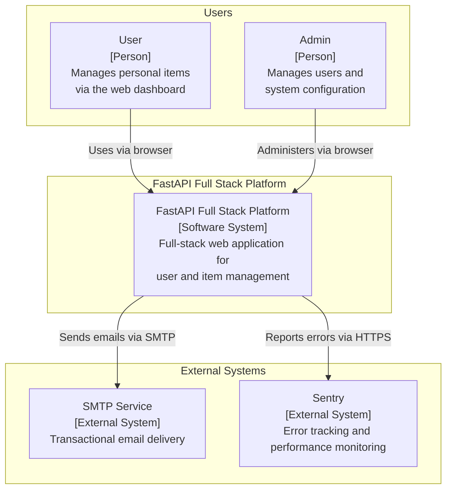
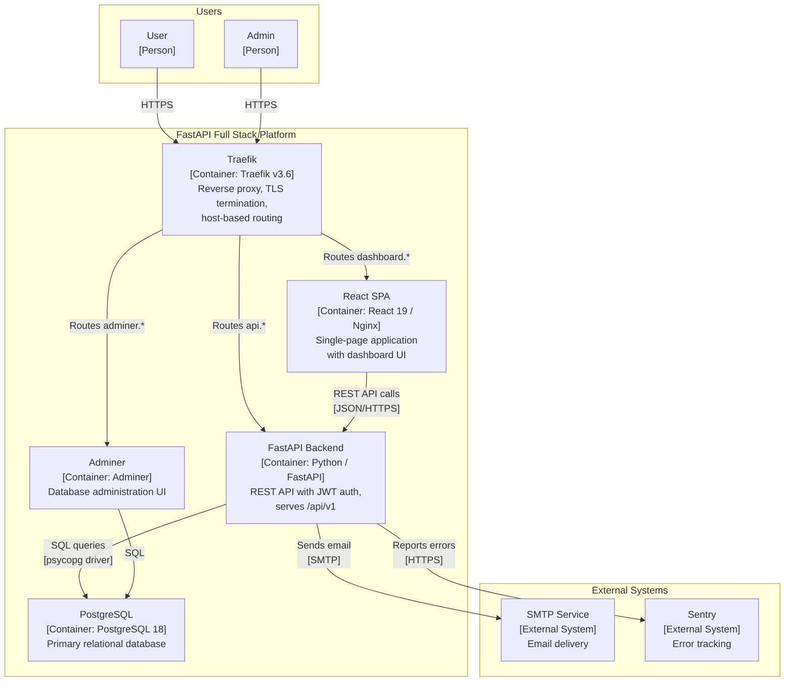
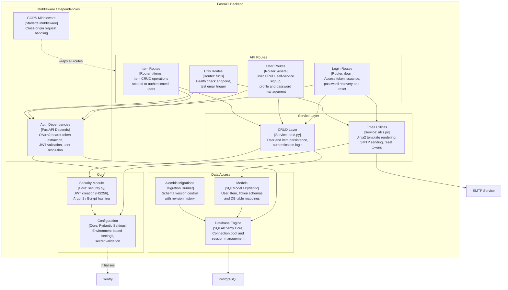
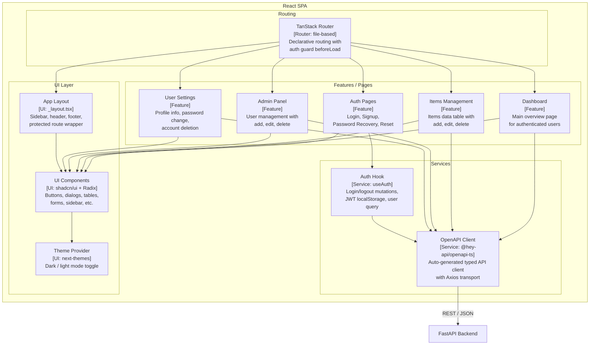

# C4 Architecture Model — FastAPI Full Stack Platform

> Auto-generated C4 model covering L1 (System Context), L2 (Container),
> and L3 (Component) diagrams for the FastAPI Full Stack Template.

---

## L1: System Context



---

## L2: Container



---

## L3: FastAPI Backend



---

## L3: React SPA



---

## Containment Map

```text
%% ── L1 top-level groups ─────────────────────────────────────────
users             CONTAINS [user, admin_user]
platform_boundary CONTAINS [platform, traefik, spa, fastapi_backend, pg, adminer]
external          CONTAINS [smtp_ext, sentry_ext]

%% ── L2→L3 internal containment ──────────────────────────────────
fastapi_backend CONTAINS [mw, routes, services, data_access, core]
  mw            CONTAINS [cors_mw, auth_deps]
  routes        CONTAINS [login_routes, user_routes, item_routes, utils_routes]
  services      CONTAINS [crud_layer, email_utils]
  data_access   CONTAINS [models_layer, db_engine, alembic_mig]
  core          CONTAINS [security_mod, config_mod]

spa CONTAINS [routing, features, services_layer, ui_layer]
  routing        CONTAINS [router]
  features       CONTAINS [auth_pages, dashboard_page, items_feature, admin_feature, settings_feature]
  services_layer CONTAINS [api_client, auth_hook]
  ui_layer       CONTAINS [ui_components, theme_provider, layout_shell]
```
