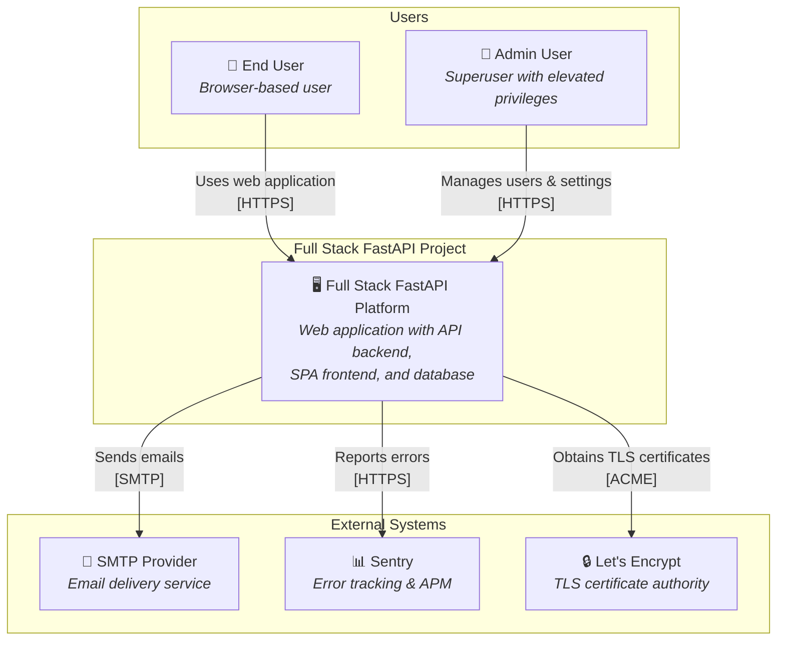
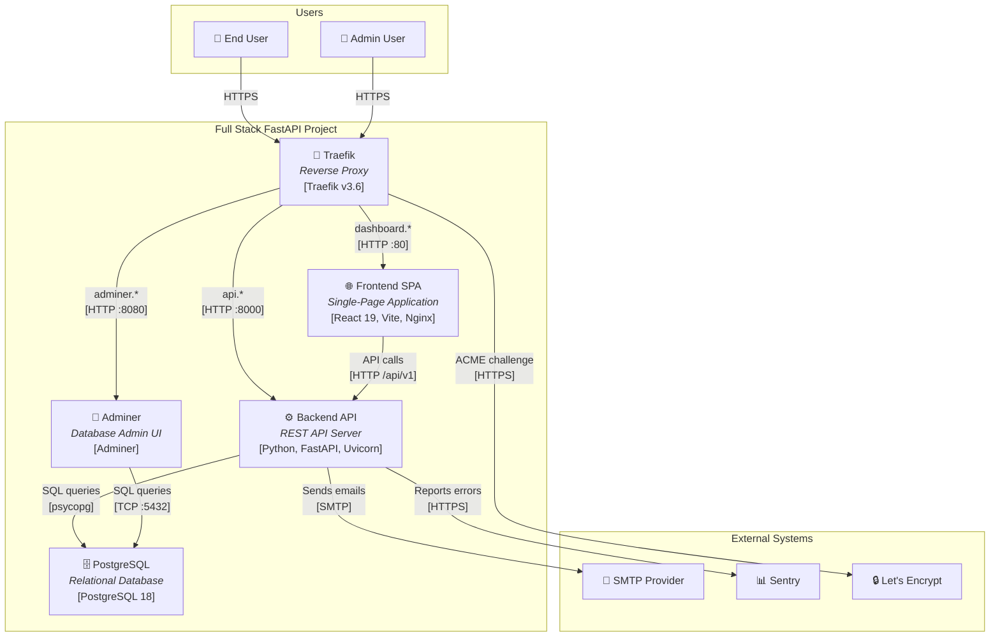
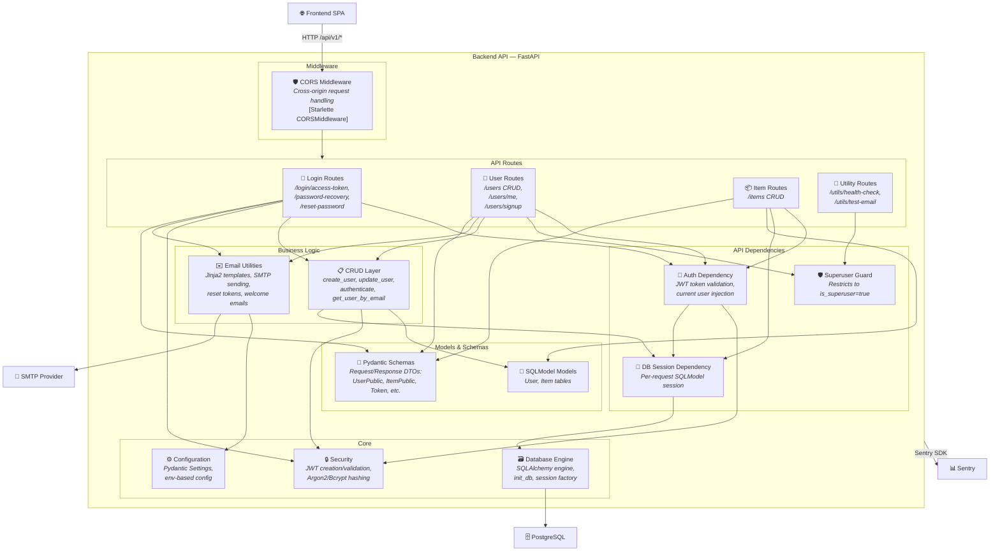
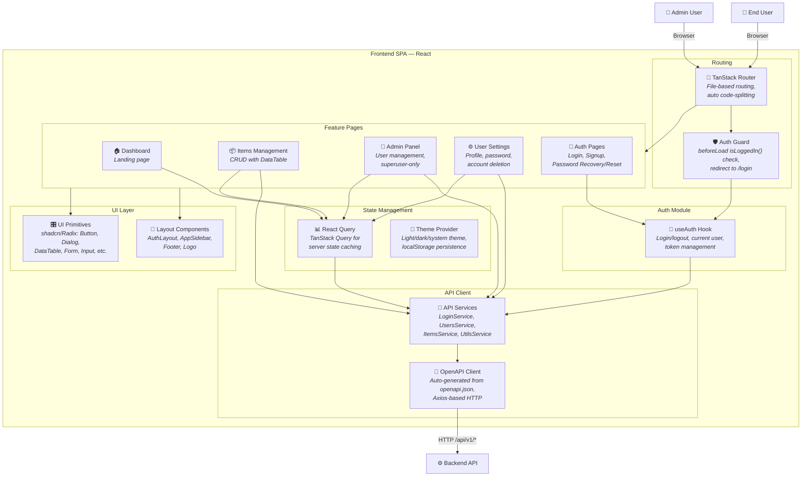

# C4 Architecture Model — Full Stack FastAPI Project

> Auto-generated C4 architecture diagrams using Mermaid.
> Covers L1 (System Context), L2 (Container), and L3 (Component) levels.

---

## L1: System Context



---

## L2: Container Diagram



---

## L3: Backend API (FastAPI)



---

## L3: Frontend SPA (React)



---

## Containment Map

```text
%% ══════════════════════════════════════════════════════════════════════
%% CONTAINMENT MAP — covers all levels (L1 → L2 → L3)
%% Every subgraph and its children from every diagram above.
%% ══════════════════════════════════════════════════════════════════════

%% ── L1 top-level groups ─────────────────────────────────────────────
users              CONTAINS [user, admin_user]
platform_boundary  CONTAINS [platform]
external           CONTAINS [smtp, sentry, letsencrypt]

%% ── L2 container-level ──────────────────────────────────────────────
platform_boundary  CONTAINS [traefik, spa, fastapi, pg, adminer]

%% ── L3: Backend API (fastapi) ───────────────────────────────────────
fastapi            CONTAINS [middleware, api_deps, routes, services, core, models_layer]
  middleware       CONTAINS [cors_mw]
  api_deps         CONTAINS [auth_dep, db_session_dep, superuser_dep]
  routes           CONTAINS [login_routes, user_routes, item_routes, util_routes]
  services         CONTAINS [crud_layer, email_utils]
  core             CONTAINS [core_config, core_security, core_db]
  models_layer     CONTAINS [models, schemas]

%% ── L3: Frontend SPA (spa) ──────────────────────────────────────────
spa                CONTAINS [routing, api_client, auth_module, state_mgmt, features, ui_layer]
  routing          CONTAINS [router, auth_guard]
  api_client       CONTAINS [openapi_client, api_services]
  auth_module      CONTAINS [use_auth]
  state_mgmt       CONTAINS [query_client, theme_provider]
  features         CONTAINS [dashboard_page, items_page, admin_page, settings_page, auth_pages]
  ui_layer         CONTAINS [layout_cmp, ui_cmp]
```
